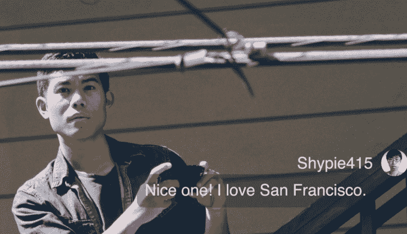

# 公民的有争议的犯罪追踪器扩展到旧金山，从红杉获得 1200 万美元

> 原文：<https://web.archive.org/web/https://techcrunch.com/2017/09/19/citizen-app-crime-sequoia-san-francisco-12-million-series-a/>

以前被称为义警的应用程序不会消失。今天在 TechCrunch Disrupt SF 上，犯罪追踪器[现在被称为公民](https://web.archive.org/web/20230225050218/https://techcrunch.com/2017/03/10/banned-crime-reporting-app-vigilante-returns-as-citizen-says-its-report-incident-feature-will-be-pulled/)宣布其母公司 Sp0n 已经筹集了由红杉资本牵头的 1200 万美元的 A 轮融资。与融资新闻相配合的是，以前只属于纽约市的“公民”将开放其关注犯罪的地理门[到三藩市](https://web.archive.org/web/20230225050218/https://medium.com/@CrimeNoMore/cd9979b0bacc)。

你可能听说过公民。根据苹果公司今年早些时候在[媒体上的一篇帖子](https://web.archive.org/web/20230225050218/https://medium.com/@CrimeNoMore/154c7ebc9bc6)，该应用因“违反苹果应用商店审查指南，关注用户安全”而被下架。但本月早些时候，一位公司发言人告诉我，“出于更多的技术原因，Vigilante 被从 App Store 下架，以处理地理限制和开发者技术问题”，并说“以上是谣言，不准确，”这一声明显然与该公司此前对该事件的描述直接冲突。

当时，我们的网站和许多其他网站表达了对该应用鼓励私刑主义、种族貌相和普遍不安全行为[的担忧。VoIP 初创公司 Ooma](https://web.archive.org/web/20230225050218/https://techcrunch.com/2016/11/02/controversial-crime-reporting-app-vigilante-banned-from-app-store/) 的联合创始人、创始人安德鲁·弗雷姆(Andrew Frame)认为这种反弹是一个学习的机会，尽管他学到了什么并不完全清楚。该应用程序删除了其最具争议的功能，并发展成为现在众所周知的公民，于今年 3 月重新推出。“名字变了，但任务没有变，”弗雷姆在电话中告诉我。然而，该公司似乎仍然感到被误解了。

[vimeo 234537138 w=640 h=360]

在他的愿景中，公民警报创建了一个由公民驱动的公共安全网络，以对抗旁观者效应——这个术语因围绕基蒂·吉诺维斯谋杀案的[现已被揭穿的神话](https://web.archive.org/web/20230225050218/http://nymag.com/scienceofus/2016/04/how-the-false-story-of-kitty-genovese-s-murder-went-viral.html)而流行，这是一个警世故事，Frame 引用它作为灵感。Frame 承认这个问题是“复杂的”,并指出这种复杂性是如何导致该应用程序最初的争议的。

尽管如此，Frame 认为，对他的应用程序的最大误解之一是关于信息的类型，这些信息都来自公共数据，它会推送警报。

“有一套政策来决定什么可以进入应用程序，什么不可以，”Frame 说。主要标准是信息需要引起公共安全关注。除此之外，某些类型的事件被排除在外。Frame 告诉我，Citizen 不会报告可疑包裹、可疑人员、家庭暴力或火警等情况。根据我的测试经验，它确实报告了一些事情:一起正在进行的自行车盗窃案，一对男女在麦当劳前打架，“一名男子在五楼向某人吐口水”，以及“关于纽约圣马克广场发生枪击事件的虚假报告”，还有很多很多人挥舞着刀。Citizen 告诉我，通过其应用发布的推送提醒实际上是由一个 12 人的分析团队筛选的。

公民筛选的另一件事是官员的安全。Frame 告诉我，Citizen 已经与 NYPD 进行了“数月”的对话，但该公司没有以任何方式与警方协调。

“当你说坐标的时候，没有真的没有。我们并不真正与他们协调……我们没有官方关系。”Frame 解释说，在交谈中，NYPD 表达了对该应用程序潜在风险的担忧，公民现在编辑某些信息以保护警察。

当我问“公民”是否只是一个美化了的警察记事簿时，它的创始人发表了一个强有力的辩护，似乎对这个问题很生气。“绝对不是，这是完全不同的，”Frame 说，并指出记事本不会发送地理定位更新，并解释说，与 Citizen，“相关性非常高。”这是真的，但是如果你在大城市之外的任何地方跟踪一个社区犯罪观察账户或当地警方的扫描仪，它确实会向你发送地理定位更新。尽管如此，Citizen 提供了这些相关的更新，而不要求用户搜索这些订阅源，所以对于任何出于任何原因痴迷于接收即时区域实时安全通知的人来说，这是一个优势。这也是朝着该公司在其宣传视频中想象的由日常打击犯罪的公民组成的众包圆形监狱的愿景迈出的有意义的一步。

在回答了我的警察记事簿问题后，Frame 开始了一系列控制不太好的实验，研究 Citizen 发送本地警报的速度比类似 Twitter 账户的东西快多少。他非常非常关注这些警报的速度，所有这些都是从公开数据中挑选出来的。

值得称赞的是，一个及时的警告可能会挽救一条生命，尽管在这一点上，公民的影响是净积极而不是净消极的所有证据都来自于孤立的感觉良好的轶事，如 Frame 对一名男子利用公民从一辆炎热的汽车中救出一名婴儿的敬畏描述——这一事件我不会在这里详细叙述，只是说公民似乎很高兴庆祝公民干预的事件，只要结果是积极的。

Citizen 和其他服务的真正区别在于，Citizen 根据用户的位置锁定这些警报，这一点很有意义。关于那些讨厌的人，Frame 认为人们在没有看到应用程序如何影响他们的生活的情况下就妄下结论。

对他来说，Frame 真的很有信心，这款应用程序通过将公开可用的数据汇集到地理过滤器中，并非常快速地再次分发，提供了一种独特而卓越的服务。他似乎对这款应用的出色表现感到满意，除了 Citizen 含糊不清的“安全和意识”目标之外，他没有真正研究更深层次的影响。该公司似乎不关心其在传播早期犯罪现场细节中的作用的影响，这些细节后来可能是不正确的，考虑到用户仍可能受到启发而干预，这是一个危险的游戏。该公司告诉我，它的警报比其他渠道发布的犯罪信息更准确，但这一论点也是由轶事支持的。

我用了几天这款应用，在《旧金山公民》的预发布版本中，窥探我周围正在发生的危机。从技术上来说，这款应用速度很快，用户界面非常流畅，设计也很简洁。用户可以滑动以查看趋势事件，当用户在现场直播时，直播流会在顶部实时弹出。一些视频之后会留在故事模块中。如果你来这里是为了 Disrupt，你可以亲自看看，因为这款应用程序[今天在旧金山](https://web.archive.org/web/20230225050218/https://medium.com/@CrimeNoMore/154c7ebc9bc6)在 [iOS](https://web.archive.org/web/20230225050218/https://itunes.apple.com/app/apple-store/id1039889567?mt=8) 和 [Android](https://web.archive.org/web/20230225050218/https://play.google.com/store/apps/details?id=sp0n.citizen) 上发布。

通过这种方式，尽管《公民》脱离了私刑主义，但它继续鼓励用户前往犯罪现场(字面上的意思)，以便进行直播，并有可能通过用户互动获得奖励——一个令人惊讶的表情按钮，当你点击它时，它会说“哇”。可以说，对于脸书直播或 Periscope 或任何其他直播服务来说也是如此，但对于 Citizen 来说，地理定位紧急用例就是全部。

Citizen 现在更加谨慎地做出众多免责声明，比如“需要明确的是，Citizen 不允许用户干扰活跃的犯罪现场或扰乱执法，”以及“事件报告和现场视频不会证实有罪或暗示与应用程序中描述的任何人有关联。”

那些在晚间新闻中对当地犯罪进行报道的人可能会喜欢《公民》。灾难学家或任何对全球灾难加速发展感兴趣的人也会如此。在高度警惕状态下茁壮成长的隔壁爱好者会有宾至如归的感觉。

尽管有快速行动和打破常规的记录，但 Frame 认为他的公司是谨慎的，甚至是有条不紊的。认知失调很有意思。“我们不是一家成长型公司——我们在这个过程中处于非常早期的阶段，”Frame 说。“我们只是想让这款应用变得安全，让它成为一个好的体验，倾听我们的客户，学习，不要走得太快，而是要小心翼翼。”

在这个世界上，推送警报是毁灭世界的核战争的先兆，当我在酒店房间里准备睡觉时，我可以收到关于半英里外一名女子被袭击的消息，这是有道理的。有用吗？在许多情况下，我发现事实并非如此。这让我感觉好点了吗？当然不是。但《公民》在一件事上是对的:忽视我们周围世界发生的恐怖是行不通的——它们只会慢慢地让我们离家越来越近。