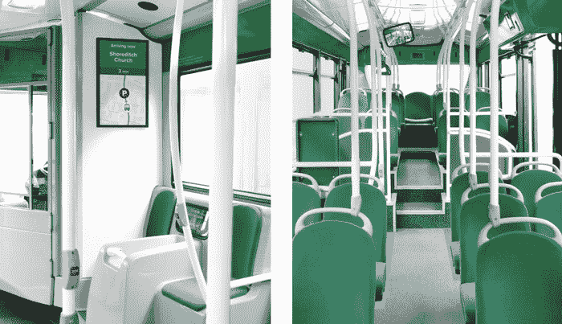
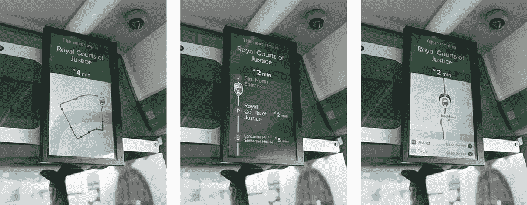

# Citymapper 将于今年在伦敦提供真正的付费公交服务

> 原文：<https://web.archive.org/web/https://techcrunch.com/2017/07/20/citymapper-will-offer-actual-paid-bus-service-in-london-this-year/>

由于其应用程序，Citymapper 长期以来一直是在主要城市中心导航的首选，但现在它更接近问题的核心——通过运营自己的公交车,从伦敦的第一条商业公交路线开始。首条线路是夜间线路，在伦敦东部周末晚上 9 点至凌晨 5 点之间运行，Citymapper 使用其应用程序和数据分析工具发现，目前的公共交通选项服务不足。

该应用程序制造商发现，虽然伦敦交通局(TfL)在白天为它将要运行的路线提供了良好的服务，但在晚上却没有得到很好的支持，因为晚上的乘客数量一直在稳步增加。根据一个考虑了许多因素的评分系统，包括有哪些替代方案可用以及它们有多受欢迎，Citymapper 选定了这条路线作为其第一个商业服务产品，并着手获得适当的许可——现在已经通过了

Citymapper 的巴士是真正的巴士——该公司开玩笑说，对于硅谷来说，称它们为“社交超本地多乘客拼车”也无妨。但它们很快就能被认出是大型城市巴士，穿着 Citymapper 的品牌专用绿色。然而，在内部，它们非常不同，有一系列旨在让服务运营商、司机和乘客获得更好体验的技术。

【T2

运行路线的一部分将包括通过车载平板电脑管理公交车，平板电脑可以运行各种应用程序，Citymapper 将在行驶中更新和优化这些应用程序。他们试图解决的一个问题是“公交拥挤”，即连续四辆公交车，其中最后三辆几乎是空的，然后在接下来的 20 分钟内一辆也没有。

整个内部的智能显示器还将向乘客显示沿途的进展情况、下一站信息、到达未来目的地需要多长时间以及中转服务的状态，包括延误通知。Citymapper 还希望通过其应用程序向潜在用户提供关于机上乘客数量的实时信息，让乘客知道是否以及何时有座位。

支付通过非接触式 tap 处理，这在大多数英国借记卡或信用卡上可用，也可以通过 Apple Pay 和 Android Pay 处理。Citymapper 也在评估通过其应用提供应用内支付，但押注非接触式支付是更合理的选择。作为对乘客的额外便利，座椅将集成 USB 端口，便于充电，这是一个很好的东西，尤其是在晚上外出后。

这条名为 CM2 的新线路将与 Citymapper 的应用程序和路线数据完全集成，它将显示来自公交车的实时信息，以及车站的到达时间。它将与其他交通应用程序和网站公开共享数据，这是公平的，因为这是它对城市和公共交通机构的要求。

这是一个广泛的实验，可能对 Citymapper 的业务有很多潜在的影响-你可以看到它如何利用许多不同的机会，包括作为一个平台运营商，帮助城市交通当局通知部署和路线管理。总的来说，这听起来是一个非常酷的项目——我很有兴趣看看他们如何处理呕吐物，然而，老实说，这基本上是伦敦狂欢者的派对后巴士。