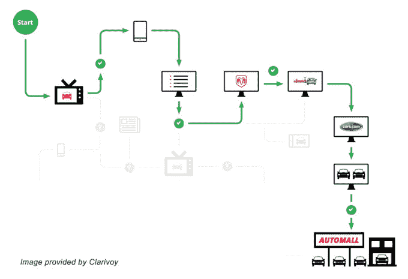

# Clarivoy 的线下广告归因模型旨在帮助品牌优先考虑广告支出 

> 原文：<https://web.archive.org/web/https://techcrunch.com/2016/03/22/clarivoys-offline-advertising-attribution-model-aims-to-help-brands-prioritize-ad-spend/>

尽管利润丰厚，但我通常觉得广告技术/营销技术公司很无聊。然而， [Clarivoy 的](https://web.archive.org/web/20221210065757/http://www.clarivoy.com/)有趣的概念在充斥着行话的营销技术海洋中引起了我的注意。这家俄亥俄州哥伦布市的初创公司最近在 12 月完成了一轮 137 万美元的融资，由 [Rev1 Ventures](https://web.archive.org/web/20221210065757/https://www.rev1ventures.com/) 牵头。这伴随着他们从俄亥俄州创新贷款基金获得的 75 万美元贷款。

作为一个*归属平台*，Clarivoy 旨在将线下广告(如电视上的广告)、观看线下广告的消费者的多渠道数字身份(例如，他们在社交媒体、电子邮件和其他数字财产上是谁)以及随后发生的在线和线下购买联系起来。

换句话说，如果你在一个特定的商店买东西，Clarivoy 可以告诉你电视广告导致你购买它的可能性。你可能会问自己“这怎么可能？”我也问过同样的问题。

据首席执行官史蒂夫·怀特称，Clarivoy 正在使用一种本土技术，该技术结合了 cookie IDs、社交图监控、IP 地址监控和设备 id 的使用。他们还创建了一个专有的评分算法和一些其他秘密的知识产权(他们不会谈论太多)，以实现这种级别的客户旅程可见性。

怀特认为，一种思考方式是考虑购车客户的旅程。在这种情况下，通过与特定品牌或经销商的直接合作，Clarivoy 将跟踪三个领域:

*   特定品牌电视广告在何时何地播放
*   消费者的多渠道数字身份，根据他们的位置和在线反应，他们可能会接触到这些广告
*   这些相同的多渠道身份采取的线下活动，即这些个人身份与购买的相关性。

这似乎是不可能的，但根据怀特的说法，如果你以相反的顺序而不是实时地思考，你就可以开始理解他们是如何做到的。

汽车经销商与 Clarivoy 共享实际购买汽车的人的姓名。然后，Clarivoy 的秘密酱 IP 能够将这些人与他们的数字身份(社交媒体等)匹配起来。Clarivoy 可以检查他们的数字活动，并将其与离线广告的时间结合起来，然后使用他们的算法可以得出一个概率得分，即他们是否接触了离线广告，以及他们是否对此做出了反应。

通过这种方式，经销商能够判断线下广告是否有效以及有效到什么程度。这使得他们可以用效果数据来审查和优先考虑他们的广告预算。

> “利用我们的技术，我们将 35%的(线下)销售与数字互动联系起来。”
> 
> –clari voy 首席执行官史蒂夫·怀特

虽然离线属性是我最感兴趣的，似乎也是最新颖的，但该公司也提醒我，他们仍然有一个整体的产品，包括重新定位、付费搜索、第三方网站、电子邮件、社交等。当他们跟踪的分析完全在数字领域内时，他们可以确定性地测量，而不是概率性地测量。

我只听说过一些公司试图解决离线归属问题，比如 Nomi 或 Datalogix。

无论如何，Clarivoy 希望利用这项技术来帮助品牌和公司更好地优先考虑他们的广告费用。到目前为止，他们已经与几家汽车经销商合作，但计划扩大业务。