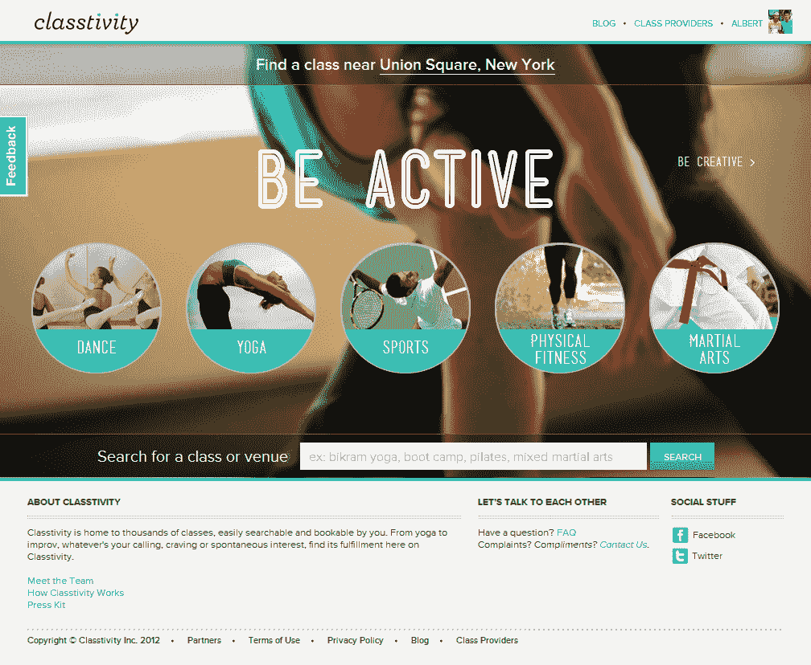
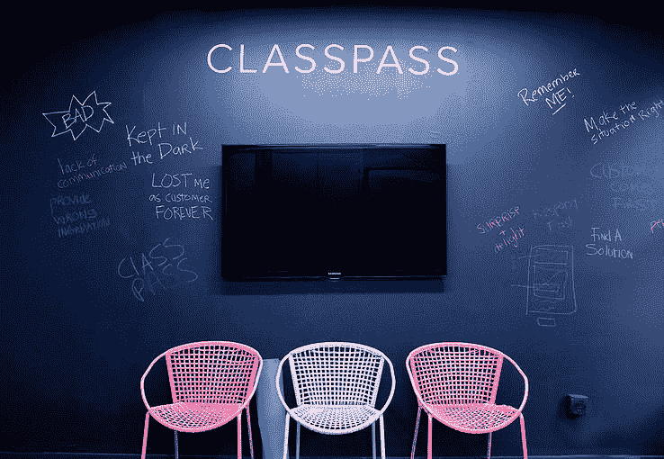

# Classpass 正在进行 4000 万美元的 B 轮融资 

> 原文：<https://web.archive.org/web/https://techcrunch.com/2015/01/15/classpass-is-in-session-with-40-million-in-series-b/>

总部位于纽约的公司 class pass 以每月 99 美元的价格在 2000 个不同的工作室和精品健身房提供无限量的健身课程，该公司已经完成了由[General Catalyst](https://web.archive.org/web/20221226053411/https://www.crunchbase.com/organization/general-catalyst-partners)和[Thrive Capital](https://web.archive.org/web/20221226053411/https://www.crunchbase.com/organization/thrive-capital)领投的 4000 万美元的 B 轮融资，天使投资人和之前的投资人也参与了融资。

三个多月前，这家初创公司在首轮融资中筹集了 1200 万美元，在同样长的时间里，它从 7 个市场发展到了 20 个市场。截至 2014 年 9 月，该公司通过该平台进行了总计 50 万次预订。如今，预订量高达 150 万，而且没有放缓的迹象。

但创始人 Payal Kadakia 和 Classpass 并不总是扩张计划和曲棍球棒图。

我记得我第一次见到她是在 2012 年的 TechStars 简报会上。她很小，很安静，她的共同创始人 Sanjiv Sanghavi 更安静，但她一点也不胆小。当时，该网站名为 Classtivity，仅作为聚合健身课程的搜索工具。但是，当帕亚尔解释她坚持自己舞蹈根基的决心时，这个想法引起了我的共鸣。

她看起来很确定会成功，我也相信她。

时间快进到 2015 年 1 月，我走进麦迪逊广场公园附近的 Classpass 办公室。我完全不知道该先找谁。至少有 25 个人挤在我面前的小空间里，两三个人一张桌子，其他人挤在沙发上，还有一些人弯腰查看图表、电子邮件或其他人电脑上的设计原型。他们中的一些人在打电话。声音很大。我们面试的那天，纽约 33 度，下着雨，但我已经在流汗了。不知所措，我考虑只是喊她的名字。

“帕亚尔！”我会说，刚刚超过熙熙攘攘的房间的集体音量水平。“帕亚尔！你在外面吗？”

就在我准备把我的手放到嘴边的时候，她出现了，穿过旋转椅和邮差包，热情地和我打招呼。

“我们真的很快就要搬到另一个地方了，”她说，原因显而易见，接着她提供了一些不太明显的信息:“这里有 35 名员工，街对面有 16 名，附近还有 20 名。”

我们找到了通向后面一间异常宽敞的会议室的路(我敢肯定主房间里的一些多余的人就是在这里工作的)，然后坐下来。我们聊起了融资的事情——亚当·瓦尔金(Adam Valkin)在 GCV 方面处理了这笔交易，T2 的克里斯·派克(Chris Paik)和 T4 的乔希·库什纳(Josh Kushner)领导了 Thrive——我试着快速计算了一下增长、定价、潜在收入，以及 A 轮融资 1200 万美元和 b 轮融资 4000 万美元之间的时间

“你还在七城？”我问。

“二十！”她大声说，笑着看着我，好像她自己都不敢相信。四个月十三个城市，我心里想。*该死。*

## 上课前

Payal Kadakia 是第一代美国人，她的父母都是来自印度的移民。2005 年，她从波士顿的麻省理工学院毕业，直接进入贝恩公司(Bain and Co .)担任顾问。从麻省理工学院到贝恩公司(甚至更远)，Payal 都在跳舞。她在校园里创办了印度舞蹈团(至今仍然活跃)，然后开始为一家名为宝莱坞 Axion 的公司跳舞。

“我的生活就是工作和跳舞，”她说。但是在这两种生活中周旋了大约三年之后，她开始感到有些抵触。“当我跳舞时，我开始感到不好或内疚，好像我在找时间和精力做一些我不应该做的事情。但这让我很开心。”

她有一个选择:她可以继续在贝恩工作，或者去读 MBA，或者她可以做一些让她追逐舞蹈的事情。“我不想只做一件事，”她解释道。

她决定离开贝恩，加入华纳音乐集团，她称这是一个公司职位，但它给了她跳舞的机会。她创办了自己的舞蹈团 Sa，一个现代印度舞蹈团。尽管在 Sa 和华纳音乐取得了成功，Payal 仍然对如何集中精力感到不安。

## 第一节

2009 年夏天，她设法引起了通常专注于传统舞蹈形式的印度-美国艺术委员会印度舞蹈节的馆长的注意，给了 Sa 舞蹈团一个在节日中的位置。这场演出不仅成功，而且他们最终成为《纽约时报》艺术版头版的[。](https://web.archive.org/web/20221226053411/http://www.nytimes.com/2009/08/22/arts/dance/22borders.html?pagewanted=all&_r=1&)

“那时我就知道了，”帕亚尔回忆道。“当时，我正在准备参加 GMAT 考试，就在我看到 NYT 的文章后，我回到房间，扔掉了我的 GMAT 书籍。”

接下来的一年，帕亚尔在华纳公司工作，建立了一个由其他表演者、Spotify 等科技客户组成的网络，并维持着她在贝恩公司时建立的关系。她还致力于将 Sa 发展成为一家舞蹈公司，不仅销售她自己的节目，还帮助其他艺术家和朋友销售他们的节目。

【YouTube https://www.youtube.com/watch?v=9fYUUno9Zs0&w=640&h=360]

就在她在印度-美国艺术委员会音乐节上的出色表演一年后，她飞往旧金山参加一个朋友的生日聚会。身处硅谷，周围都是培养思想、为颠覆行业的共同目标而联系在一起的人，她受到了启发。Payal 认为她也可以这样做。

## 第二阶段

“我想，‘我有主意了。我很有创造力。我只是不明白，既然我已经知道自己有能力承担风险，为什么还要把自己放在商界或留在美国企业界，”她告诉我，显然仍对她四年多前的一个想法感到兴奋。她给自己两周的时间来想出一个她喜欢的主意，在两天的时间里，她想出了一个计划。

她回来后的那个星期二，她花了一上午的时间寻找一个舞蹈班，以便在当天晚些时候参加。她在互联网上四处搜索，一无所获，并意识到附近没有找到课程的中心资源。阶级划分诞生了。

## 休息

“事实上，”她准确地打断了自己，“那时候它被称为‘浅尝辄止’。”在与值得信赖的朋友和导师交谈后，Payal 在几天内就制定了一份商业计划，并开始为人生的巨大变化做准备。“实际上是我妈妈让我退出华纳的。她看到了萨发生的事情，希望我去争取。”

2011 年 1 月，差不多就在这次采访的四年前，Payal 给她在华纳音乐集团的同事发了一封告别邮件。在这封电子邮件中，她提到了时任华纳音乐战略和运营副总裁的迈克尔·弗莱舍，他立即回复并邀请帕亚尔去他的办公室，想谈谈她的下一步计划。他最终成为了她的第一个投资者，并将她与大卫·蒂施联系起来，这最终导致 Classtivity 被 TechStars 加速器项目接受。我正要第一次见到她。用 Payal 的话说，她“关上了一扇门，却打开了更多的门。”

## 学习期间

在 Payal 和联合创始人 Sanjiv Sanghavi 为 TechStars 做准备的第二年，Classtivity 一直处于测试阶段。

“第一年，我在很多方面都做了工作，而这些工作可能不是……”她等待着，似乎对自己的错误心存感激。“我们在做什么……”她再次等待。“这是我们的孵化阶段，”她说，因为她发现了它。"我们正在和工作室开会，汇编一个详细的数据库."

分类是一个非常好的想法、乏味的数据聚集和输入以及相对困难的搜索技术的副产品。用户可以登录，基于各种类型的标准(时间、日期、价格、位置等)搜索任何类型的健身课程。)并直接从网站上预订。

“我的假设是，人们已经有动力去健身班了，”帕亚尔说。“我就是这样的人。我已经准备好去上课了。我只需要一个搜索工具。但事实证明，人们需要的不仅仅是这些，这就是健身房会员存在的原因。”

## 第三阶段

Classtivity 继续提供健身超级搜索，并于 2012 年 3 月参加了 TechStars 课程，计划于 2012 年 6 月毕业并公开发布。

“那个版本的网站在两年多的时间里甚至没有达到 100 个预订，”她说，似乎为这个错误的教训感到自豪。

我回想起我和她的第一次见面，清楚地记得她的信念和我的顺从。

Payal 描述了 6 月份在 tech stars 上发布的[，并期待看到更多的预订。他们没来。9 月，他们聘请玛丽·比金斯帮助营销。到了 10 月份，他们开始修改用户界面。](https://web.archive.org/web/20221226053411/https://techcrunch.com/2012/06/14/classtivity-makes-sure-finding-a-class-isnt-more-difficult-than-taking-one/)

## 考试

“我们移动按钮，改变颜色，然后我们认为我们可能需要投入一些营销，”她说，几乎是在嘲笑自己。“我们试图通过‘买一送一’的交易来开展这项活动，然后我们开始尝试免费提供课程……仍然是蟋蟀。”

了解了 Classpass 今天的状态，当她讲述她一生中最困难的几个月时，很容易和她一起大笑。随着喧闹的办公室的声音吸引着我的注意力，我试图想象我已经偏离了三条独立的道路，所有这些道路都将使我获得成功，在过去的两年里几乎没有取得任何进展。

无论是过去还是现在，我都没有感觉到她的恐惧，她也没有。“经历了这一切，我不记得害怕过，我也从未想过我会没钱，”Payal 说。“失败不是一个选项。”

2012 年的冬天是一个寒冷的冬天，但 Payal 已经考虑了一段时间，想推出一款 Passport 产品，让人们每月购买一定数量的课程，并作为健身房和工作室的忠诚度工具。最终，这违背了 Payal 的理念，即唯一应该决定你的健身方案的是你自己，而不是你购买的课程数量。然而，她知道免费发放第一本护照会让人们开始使用该平台，该团队相信护照会创造出专注、积极、忠诚的用户。

## (天下没有免费的)午餐

电影公司也相信护照。许多在该平台上工作的健身房和工作室免费赠送了第一批课程，为 Classpass 提供了难以置信的利润。

“它最终成了健身课的团购网站，”帕亚尔和蔼地说。“我们没有看到我们预期的忠诚度，这本来可以很好地工作，但不是长期的。”

在联合创始人 Sanjeev Sanghavi 的领导下，这项服务仍在向新的城市扩展，Classtivity Passport 于 2013 年 1 月推出，一次性提供 10 门课程，每月 49 美元，旨在反馈到 classivity 基于搜索的模式，其中课程费用在 20 美元至 25 美元之间。(有趣的事实:在他们关闭之前，这个版本的产品在八个不同的城市有售。)Passport 没有兑现向电影公司承诺的忠诚度，用户正积极试图通过重新购买一次性 Passport 来欺骗 Classtivity 和电影公司。

这是一个有明显解决方案的问题，至少事后看来是这样。

“我们 99%的用户说他们想重复 Passport 的体验，”Payal 说，好像这是一个显而易见的问题，“所以到 2013 年 6 月，我有了我需要的所有信念。我们决定转向订阅业务，于是[推出了 Classpass](https://web.archive.org/web/20221226053411/https://techcrunch.com/2013/09/18/classtivity-pivots-to-subscription-model-so-you-actually-work-out/) ，10 节课每月 99 美元。

## 第四阶段

我问了类似的利润率，但她小心翼翼地不给我任何关于公司过去、现在或预期收入的信息。然而，她解释说，Classpass 从工作室获得网站上所有课程的折扣，并且只支付每堂课的费用。

我在脑子里算了一下。如果一节课的平均价格是 24 美元(为了保持平衡)，我们给了 Classpass 健身房 50%的折扣，那么她为这门课支付了 12 美元。如果一个用户在 Classpass 上花费 99 美元，并且每个月去上他们所有的 10 节课，那么 Classpass 就是在赔钱。

让我们假设一个更高的折扣，因为 24 美元来自于单个类的价格，当类被打包购买时，这个价格会显著降低。在 75%的折扣下，Classpass 的价格是每节课 6 美元。超级用户参加了这个月的所有 10 节课，花费 class pass 60 美元。这是一个不错的差距。

根据 Payal 的说法，普通人(不是普通的 Classpass 用户——她也很小心地不谈论这些指标)每月锻炼 4 到 6 次，所以每周一次。你把同样的假设折扣应用到平均每个月 4 到 6 次锻炼的人类行为中，你就有了一个极好的生意。

## 第五节课

这就是为什么没有花那么长时间就转向无限制课程的原因。

“事实上，每月 10 节课更像是一个入学障碍，”她解释道。“对于我们的高级用户来说，这还不够，对于普通用户来说，这似乎太多了。”尽管每个月去上四节课的 Classpass 用户可能会省钱，但课程限制似乎不是这样。

在我的数学课程中，Payal 带我经历了一年的旋风。

从 2013 年 6 月起，Classpass 只在纽约上市，但到了 2014 年 1 月，该产品已经完全流行开来。不幸的是，在那段时间里，Sanghavi 在 Classtivity 工作了三年后，想要开始从事新的工作，并决定离开公司。早在 2012 年 9 月受雇的玛丽·比金斯(Mary Biggins)成为了 Payal 的联合创始人。

Classpass 于 2014 年 3 月在波士顿推出，Fritz Lanman、SV Angel、Hank Vigil、Dave Tisch、Kal Vepuri 和其他人带着 200 万美元的种子资金投入。

看到 Classpass 产品的成功，该公司被重新命名。DabbleNYC、classificity 和 Classtivity Passport 现在都是过去的事情了。2014 年 5 月，Classpass，无论是公司还是产品，都继续前进，并无限扩张，计划每月扩张到一个新的城市。9 月，Fritz Lanman 领导了 T2 1200 万美元的 A 轮融资，9 月，Classpass 在推出移动应用后不久。

## 下课了

从很多方面来说，她的使命已经完成，尽管 Classpass 的故事才刚刚开始变得有趣。她希望人们能够很容易地找到一个课程，并在他们想的任何时候进行锻炼，而不受价格或课程限制或其他任何因素的阻碍。像 Payal 本人这样的超级积极用户(她试图每天至少去上一节课，并且仍然每月与她的舞蹈团一起表演一次)可以去想去多少节课就去多少节课，而普通用户可以平衡书籍。

“我们实际上称之为 2015 行动，”她说。"计划是到 2015 年，让 Classpass 覆盖 20 个城市."

“我们到了，”我对她说，以我自己的方式感到自豪，我电脑上的电池灯现在对我大喊，我的时间到了。

85%的 Classpass 用户是精品健身的新手，65%的用户是一般健身的新手。Classpass 不仅为工作室和健身房提供了一种被发现的方式，而且该公司实际上也在创造需求。

鉴于当今科技对健康和量化自我的关注，Classpass 在业界占据了独特的地位。有一些应用程序希望激励人们健身——fito cracy、Fitbit 等。——世界各地的可穿戴健身监测器比我想象的要多得多。

有了 Fitbit Force 或 Jawbone Up 或 Moov 或 Garmin，用户就可以一次性购买硬件，然后免费使用该应用程序。健身没有持续的投入。同时，健身房、工作室、培训师、老师等。变得越来越有创造力，人们可以用不同的方式健身。有 bootcamps，Zumba 班，P57，还有 *[那么多瑜伽种类](https://web.archive.org/web/20221226053411/http://www.huffingtonpost.com/2013/09/16/yoga-chart-infographic_n_3915189.html)* 。

Classpass 是对健身感兴趣的现代用户进行真正投资的地方，他们可能会开始使用智能手表或健身追踪器。从很多方面来说，它是通向无限多样的健身课程的大门。

展望未来，Payal 描述了通过帮助他们建立新的地点和提供关于他们班级受欢迎程度的高级分析来将资本投资回工作室的计划。“我们不相信每个地方都是平等的，”Payal 在我们走向门口时说道，描述了未来使用需求曲线和可变定价来帮助她的工作室发展的计划。