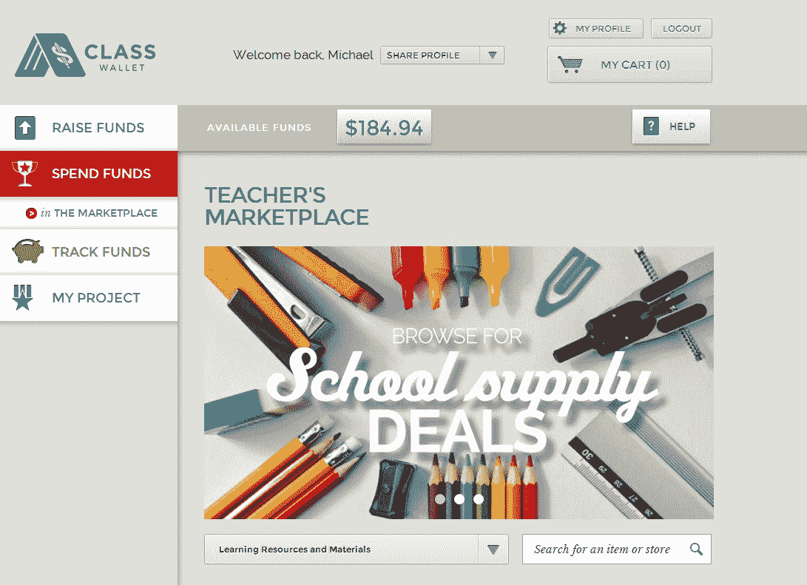
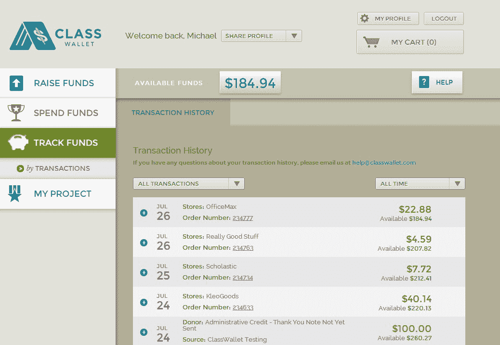

# ClassWallet 将课堂资金管理带到您附近的学校 

> 原文：<https://web.archive.org/web/https://techcrunch.com/2014/07/28/classwallet-is-bringing-classroom-money-management-to-a-school-near-you/>

说到记录课堂开支的资金，收集实地考察的现金只是冰山一角。当涉及到教室里的钱或缺钱时，每个老师都会面临几个共同的问题。大部分源于如何管理它。

今天， [ClassWallet](https://web.archive.org/web/20230131005836/https://www.classwallet.com/) 推出了私人测试版，为教师提供了一种更好的方式来收集、管理、跟踪甚至花费课堂上的自由支配资金。

T2 钱包由杰米·罗森伯格创建，他是一名律师，后来成为了一名科技企业家。此前，他创办了著名的[领养教室](https://web.archive.org/web/20230131005836/http://www.adoptaclassroom.org/)，在过去的 13 年里，该组织已经筹集并向 15 万个教室发放了超过 2500 万美元。

根据 Rosenberg 的经验，无论教师是在为供应品筹集资金，为实地考察筹集资金，还是从补助金或学区本身获得资金，将资金放入适当的帐户，使其可以访问，并对其进行跟踪都成为主要的棘手问题。

例如，去年，杰克逊维尔的年度教师从当地教育基金获得了 500 美元的资助。为了分配资金，基金会给老师开了一张支票。为了给她的教室使用资金，这位老师必须将支票提交给她的学校，学校再将支票提交给学区，学区将钱存入银行。

现在老师有两个选择:要么花自己的钱，并提交报销，这遵循同样的老师到学校到区和回来的过程；或者她可以请求她想要购买的供应品的采购订单。

更重要的是，根据罗森博格的说法，教育立法一直在遵循“思想领袖推动决策更贴近儿童的运动。”

虽然这可能意味着学生可以获得更符合他们需求的用品和工具，但对于教师来说，文书工作可能会变得更糟糕。按照现在的情况，这个过程可能需要两个月的时间才能完成，而且花费的不仅仅是几块橡皮。

ClassWallet 就是为了简化这个工作流而构建的，并且内置了许多有用的功能。在同样的赠款方案中，基金会将支票直接交给学区，学区将钱存入教师的班级钱包。瞧，钱到手了。

从那里，教师可以在应用程序中直接从供应商处购买。ClassWallet 与 Best Buy、Office Depot、Scholastic、School Specialty、Carson Delosa 和其他公司合作，让教师可以轻松获得他们可能需要的任何和所有供应品。

ClassWallet 还认识到，并非所有的购买都是在线进行的。对于线下购买，通过与[万事达卡](https://web.archive.org/web/20230131005836/http://www.crunchbase.com/organization/mastercard)和 [Verifone](https://web.archive.org/web/20230131005836/http://www.crunchbase.com/organization/verifone) 的合作，ClassWallet 使教师能够将钱从他们的 ClassWallet 账户转移到预付费万事达卡，可以用于实地考察等活动。

所有交易都被跟踪，并且可以很容易地导出为 PDF 格式，与学校或学区管理部门共享。教师们可以在这个平台上发起筹款活动，向支持者发送信息和致谢。

在过去的几个月里，ClassWallet 已经邀请了 500 名教师参与测试，他们的收获很明显。每个老师都有同样的问题，不管是在哪个地区，哪个州，哪个年级，或者有多少年的教学经验。

edtech 面临的主要挑战之一是向教育系统销售产品，众所周知，教育系统资金短缺。有很多教师喜欢的应用程序和工具，但学区不能或不愿意为其编列预算。

ClassWallet 希望通过提供一种节省大量时间和金钱的服务来避免这种命运，就像 Clever 所做的那样，为教育系统创造一种“需要有产品”的需求。创始团队的经验和来自领养课堂的网络也应该发挥作用。

ClassWallet 最近加入了[tech stars](https://web.archive.org/web/20230131005836/http://www.crunchbase.com/organization/techstars)–[Kaplan](https://web.archive.org/web/20230131005836/http://www.crunchbase.com/organization/kaplan-edtech-accelerator)加速器，准备为即将到来的返校季服务。

