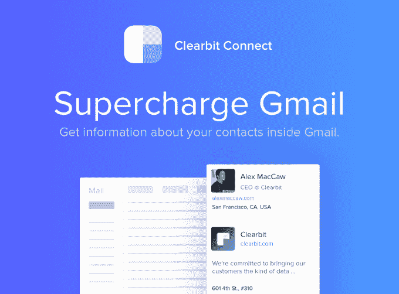
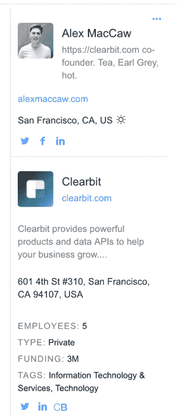
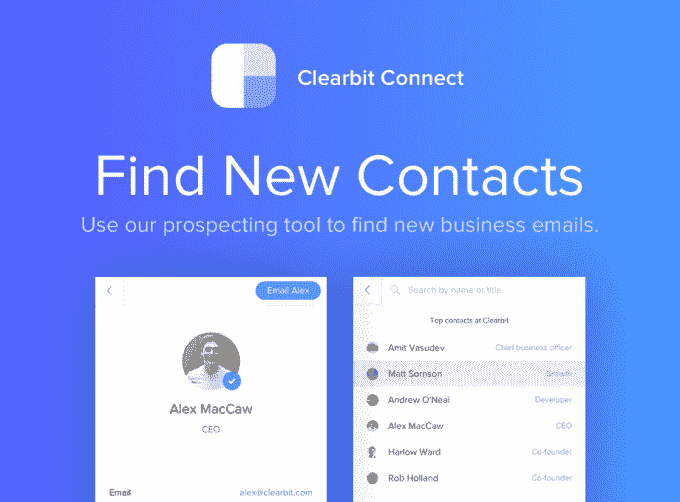

# Clearbit Connect 的新 Gmail 小工具可以帮助您找到任何人的电子邮件地址 

> 原文：<https://web.archive.org/web/https://techcrunch.com/2016/04/07/clearbit-connects-new-gmail-widget-can-help-you-find-anyones-email-address/>

LinkedIn 的[收购了广受欢迎的电子邮件插件 Rapportive 的](https://web.archive.org/web/20221210013258/https://beta.techcrunch.com/2012/02/22/rapportive-linkedin-acquisition/)，随后随着其新主人[剥夺了](https://web.archive.org/web/20221210013258/https://beta.techcrunch.com/2014/06/17/linkedin-owned-email-widget-rapportive-is-about-to-get-less-useful/)一些最好的功能，LinkedIn 也遭到了破坏，这让许多用户感到愤怒，并争相寻找替代方案。这些中的一个[号](https://web.archive.org/web/20221210013258/https://beta.techcrunch.com/2014/12/16/fullcontact-for-gmail-is-the-latest-email-plugin-to-take-on-linkedins-rapportive/)已经从[推出了](https://web.archive.org/web/20221210013258/https://beta.techcrunch.com/2016/04/06/senders-wants-you-to-know-everything-about-your-email-recipients/)，但是今天从 Clearbit 到达的一个名为[Connect](https://web.archive.org/web/20221210013258/https://connect.clearbit.com/)的新来者可能是迄今为止最好的上市产品之一。

[Clearbit](https://web.archive.org/web/20221210013258/https://clearbit.com/) 可能不是一个家喻户晓的名字，但该公司今天是许多技术业务的数据骨干，包括 Asana、Braintree、Slack、Stripe、Zendesk、Zen Payroll、AdRoll、Intercom、Bugsnag、reference、Segment 和数百家其他公司。

它提供了一套[大约半打 API](https://web.archive.org/web/20221210013258/https://clearbit.com/)专注于在网络和其他数据源中搜索公开的个人和企业信息。客户可以将这些信息用于各种目的，比如像 Asana 那样生成新销售线索的数据。或者它可以用于风险和合规目的，就像 Braintree 在承保新商户时所做的那样。

直到今天，该公司还没有提供面向消费者的产品。然而，在 Rapportive 关闭后，他们意识到市场上还有一个空间——特别是自从[他们已经拥有了使电子邮件查找成为可能的工具。](https://web.archive.org/web/20221210013258/https://beta.techcrunch.com/2015/04/07/who-who-who-who/)

Clearbit 联合创始人兼首席执行官亚历克斯·麦克考(Alex MacCaw)解释说:“当年我们是 Rapportive 的忠实粉丝，当所有功能都被删除时，我们感到非常失望。”

这家位于旧金山的八人小团队决定自己解决这个问题。

通过新推出的 Gmail 插件 [Connect](https://web.archive.org/web/20221210013258/https://connect.clearbit.com/) ，你可以像以前使用 Rapportive 一样获得一个侧边栏小工具。这个小部件不仅提供了与你发邮件的人的详细信息，还提供了他们公司的信息。

这些信息包括此人的姓名、照片、头衔、位置、URL 和社交账户，以及公司的名称、地址和其他详细信息，如员工数量、类型(公共或私人)、资金、标签和社交账户等。

如果这就是 Connect 所做的，那它已经比 Rapportive 好了，Rapportive 更关注你联系的人，而不是他们公司的细节。

然而，Connect 更进一步。它实际上可以为你提供某人的电子邮件地址，而你的地址簿中却没有这些信息。

Rapportive 用户可能已经知道这种技巧的一种变体:你键入电子邮件格式的不同组合(如 john.smith@company.com、jsmith@company.com 或 johnsmith@company.com)，然后看看哪一种会触发侧边栏中的 Rapportive 小部件向你显示该人的个人资料。当它出现时，你就知道你猜对了邮件。

连接变得简单多了。

在 Gmail 的“撰写”屏幕上，点击连接按钮，一个新窗口出现。在这里，你输入公司域名——当你输入时，它会自动提示匹配的公司。然后你输入一个人的名字或头衔。在出现的匹配列表中，你点击你想发送电子邮件的人的名字，然后–*嘭！*–这是他们的电子邮件地址。

[gallery ids="1304094，1304095"]

这当然是一把双刃剑。虽然对于希望发送电子邮件的最终用户来说非常方便，但这也意味着那些喜欢保持电子邮件地址隐私的人在未来会遇到一些麻烦。

和 Clearbit 的 API 一样，这个系统通过搜索网络来获取公共数据。对于公司来说，这意味着抓取网站、SSL 证书、Schedule D 文件、政府记录、社交网络等等。但对人们来说，它不仅依赖于网上公开的信息和 Clearbit 购买的一些公共数据集，还依赖于 Connect 的用户群。

这个小部件有一个按钮(在右上角)，让用户标记和修复坏数据。现在，Connect 退出了由 7000 名测试人员组成的私人测试版，它利用人群来修正其人员和电子邮件数据库的能力将大大提高。

对于注重隐私的人，您应该知道，像 Rapportive 一样，Connect 需要对您的电子邮件具有“读取”权限，这样它就可以解析邮件头中的元数据。

“当人们安装它时，我们非常清楚..“我们试图让人们自己做出明智的决定，”麦克考说。“我们从不存储任何电子邮件，我们只是查看元数据……这本质上是一种付出换来的模式，”他补充道。

Connect 目前是免费的，计划推出一个高级层，为付费用户提供每月更多的电子邮件查询。针对其他平台的计划也在进行中，包括收件箱、Outlook 和苹果邮件。