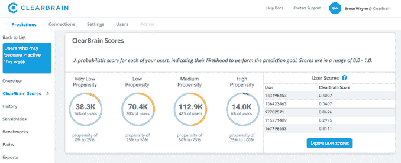

# ClearBrain 使用人工智能帮助广告商瞄准正确的用户

> 原文：<https://web.archive.org/web/https://techcrunch.com/2018/02/07/clearbrain-launch/>

# ClearBrain 使用人工智能来帮助广告商锁定正确的用户

ClearBrain 的团队有一个大目标:“我们的使命是为营销人员民主化人工智能。”

这是首席执行官比拉尔·马哈茂德(Bilal Mahmood)的说法，尽管马哈茂德(Optimizely 的前产品经理)和他的联合创始人埃里克·波尔曼(Google 广告团队的前工程师)并没有试图一次性实现民主化。相反，他们正在应对一个更具体的挑战——帮助公司将广告瞄准最有可能(比如说)注册订阅、购买产品或注销账户的用户。

Mahmood 说，这种定位已经被大公司采用，但对其他人来说太贵了，不管他们是想购买还是内部制造。另一方面，ClearBrain 的定价从每月 499 美元开始，它利用了 Mahmood 所描述的“不同 API 数据层的增长趋势”——即 Segment、Optimizely 和 Heap 等工具的兴起。

“有机会成为数据层之上的智能层，”马哈茂德说。

因此，ClearBrain 从企业已经在使用的工具中提取数据，然后部署人工智能来分析用户，并根据他们执行特定操作的可能性对用户进行分组。然后，客户可以利用这些数据定向投放他们的脸书广告、电子邮件或其他信息。

【T2

“我们有点像人工智能的瑞士，”马哈茂德说，因为 ClearBrain 是企业可能使用的“数据层和行动层”之间的中立协调者。随着该公司向该平台添加更多功能，他希望它能成为“每个营销团队的中枢神经系统”

这家初创公司已经在与 InVision 和 theSkimm 等公司合作。设计软件制造商和以时事通讯为主的媒体公司[之间似乎没有太多联系，但马哈茂德说，该产品对拥有订阅产品的企业特别有用，因为他们有容易跟踪的客户渠道。](https://web.archive.org/web/20230328184046/https://techcrunch.com/2016/09/26/nyt-backs-theskimm/)

ClearBrain 是 Y Combinator 当前创业公司类别的一部分，它还从 YC、Pear VC、Industry Ventures 和 Dan Hua Capital 以及 Optimizely 创始人丹·西洛克(Dan Siroker)和皮特·库门(Pete Koomen)那里筹集了 120 万美元的资金。