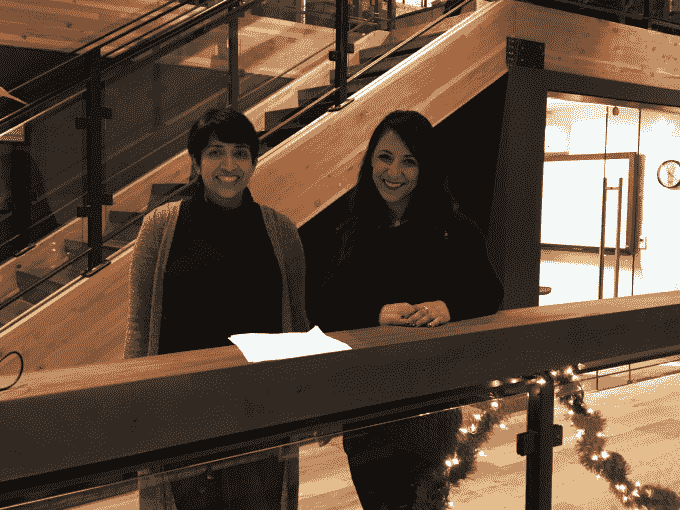

# 聪明的 CEO Tyler Bosmeny 在 2016 年谈论新员工和 ed tech 

> 原文：<https://web.archive.org/web/https://techcrunch.com/2015/12/23/clever-ceo-tyler-bosmeny-talks-new-hires-and-edtech-in-2016/>

Clever 首席执行官 Tyler Bosmeny 表示，现在有超过 50，000 所学校正在使用这项服务，今年和明年将是教育技术最终实现跨越的一年。

该公司创建了一个第三方开发平台，围绕教师和学生的应用程序。2012 年 8 月，仅在 1，000 所学校部署了 smart。该公司去年 12 月筹集了 3000 万美元，Clever 总共筹集了 4430 万美元。

“对我们来说，我敢肯定你总是听到这一点，但教育真的很难获得牵引力，也很难传播好的想法，”Bosmeny 说。“到目前为止,“聪明”还不是这样。在美国，超过三分之一的学校使用我们的技术。在大城市地区，几乎全是公立学校。”

为了帮助 Clever 继续发展，该公司雇佣了几名新员工:前 CrowdFlower 公司的雷尼特·优素福(Renette Youssef)和最近加入 LinkedIn 的花小蕾·萨克塞纳。我们采访了 Bosmeny，了解他对 2015 年和 2016 年的快速更新和想法。

**TC:2015 年教育科技领域有哪些最大的惊喜？**

**TB:** 我认为目前最大的问题是对学生数据隐私的关注。一年前，我们当中没有多少人谈论这个问题，而现在，它已经成为试图适应这个新世界的学校的一个中心问题。此外，大量应用程序涌入课堂。我们与一些地区交谈，他们在两三年前使用两三个软件，现在他们正试图使用 30 个。这是公立学校，无处不在，技术终于在教育中发生，这很令人兴奋，但也有新的挑战。

你能谈谈一些新员工吗？

我们从来没有在 Clever 做过任何营销。这完全是通过有机增长，口口相传，以及应用程序本身倡导学校使用聪明。我们意识到我们需要在品牌和信息上投资。所以我们想找一个世界级的人在 clever 建立这个功能。因此，我们从 Crowdflower 找到了[Youssef]，有了我们平台上如此庞大的地区和应用基础，我们需要一个领导者来帮助我们发展这些关系。我们真的想在这里找到一个世界级的雇员，我们寻找了一段时间来寻找这个职能的正确领导者。这就是[Saxena]出现的原因。

**TC:你对 2016 年的教育科技有什么预测？**

**TB:** 我不认为学生数据隐私会消失，我认为学校正在使用越来越多的技术，有越来越多的对话来共同解决这个问题。学校使用更多的软件，他们关注从软件中得到的结果。这不是为了软件而软件。因此，他们实际上正在以一种更具战略性的方式来思考这个问题，以此来推动学习成果。我想这是十多年来软件在课堂上的承诺。

**TC:国际化成长怎么样？**

TB:这是我们正在考虑的事情。我们已经有很多国家询问使用 Clever，这不是我们现在正在积极做的事情，但是在美国有合适的团队和合适的牵引力，这在任何国家都是有用的。

2015 年，你有哪些大收获？

**TB:** 对我来说，2015 年是 smart 大踏步前进的一年，在学校方面有很大的增长，在参与和使用方面有大量的增长。我们搬进了位于 Soma 的新总部，从 40 人发展到 90 人，我们有这些出色的外部副总裁加入团队，这就是我对 Clever 2015 年的回顾。

> “如果我们在 10 年后回顾 2015 年和 2016 年，软件真正开始改变教育，我不会感到惊讶。”泰勒·博斯曼尼

至于另一部分，教育技术，我认为在 2014 年和 2015 年，我们看到很多学校在尝试技术。然后你看看他们取得的成果，想想西海岸的顶尖公立学校，你看看他们能够取得的非凡成果，将软件与常规教学相结合，我认为 2015 年是人们觉得他们可以使用更多软件的一年。我们看到许多地区通常在采用真正拥抱软件方面进展缓慢。如果我们在 10 年后回顾 2015 年和 2016 年，软件真正开始改变教育，我不会感到惊讶。

**TC:** **现在教育科技领域面临的最大挑战是什么？**

**TB:** 关于教育的最大迷因，我回想起那些试图说服我们不要开始聪明的人，最常见的重复是不可能在教育中获得牵引力。我认为，Clever 确实推动了这一趋势，我们的商业模式和其他模式都允许这一点，但我仍然认为，对于第一次进入教育领域的公司来说，这是一个很大的问题。这是人们问我的问题。

第二，围绕数据的这些问题。现在这么多的注意力和谈话都集中在数据上，每个在教育领域工作的人都试图保持领先。在 Clever，我们的目标是为学生数据和隐私树立一个新的行业标杆。

另一件重要的事情是，每个学区都是如此，他们有使用大量软件的善意教师，但这有点像狂野西部——他们使用各种软件，学校和学区对正在发生的事情一无所知。因此，这就产生了数据发生了什么变化的问题。这是学区目前最大的担忧之一，一方面，他们接受了所有这些软件，但另一方面，它也带来了有关数据隐私的问题，特别是当它是由个别教师完成时。我认为这是一个问题，如果你和任何一个地区管理人员交谈，这是他们最关心的问题之一。

**TC:Clever 的下一步是什么？**

**TB:** 对我们来说，我们关注的是无处不在。我们的目标是能够帮助美国每一所想用 Clever 的学校都能用上 Clever，直到任何应用都不用再担心数据集成的问题。那是我们的北极星，那是我们关注的焦点。