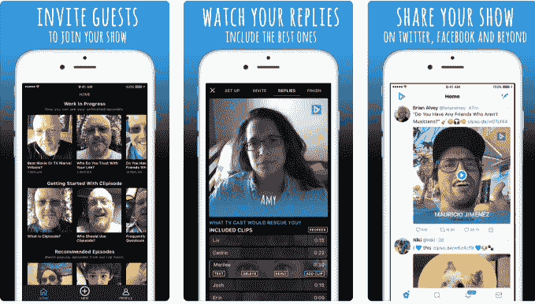
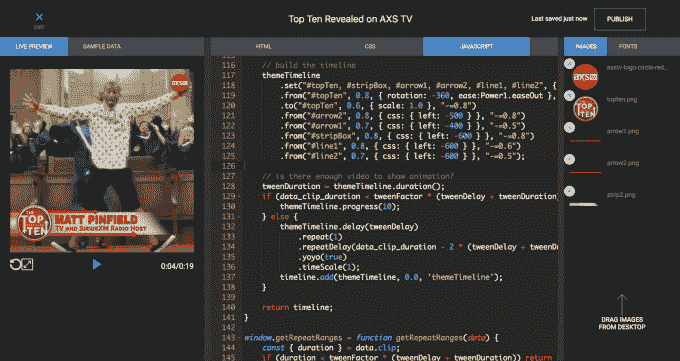

# Clipisode 推出“盒子里的脱口秀”

> 原文：<https://web.archive.org/web/https://techcrunch.com/2018/03/30/clipisode-launches-a-talk-show-in-a-box/>

一家名为 [Clipisode](https://web.archive.org/web/20221025230459/https://clipisode.co/) 的公司今天在[推出](https://web.archive.org/web/20221025230459/https://www.producthunt.com/posts/clipisode)一项新服务，正如创始人 Brian Alvey 所描述的，这实质上是一场“盒子里的脱口秀”。类似于[主播现在允许任何人使用简单的移动和网络工具建立一个专业播客](https://web.archive.org/web/20221025230459/https://techcrunch.com/2018/02/22/anchors-new-app-offers-everything-you-need-to-podcast-including-free-hosting/)，Clipisode 也为视频内容这样做。使用 Clipisode，您可以录制一个可以在任何平台(社交媒体、网络、短信)上共享的视频，并收集视频回复，然后将其集成到“节目”中，并覆盖上专业图形。

视频响应功能更类似于基于视频语音邮件的呼入功能。

它是这样工作的。内容创建者将首先使用 Clipisode 来记录他们的视频，并接收链接以通过社交媒体、网络或通过电子邮件、短信等私下分享视频。当观众或嘉宾点击链接时，他们可以回答节目“主持人”提出的问题。

例如，记者可以询问观众对某个问题的看法，或者创作者可以询问他们的粉丝接下来想看什么。

视频制作者如何使用这一功能实际上取决于他们，具体取决于他们制作的视频节目的类型。

为了给你一个概念，在预发布期间，该应用已经由 [AXS TV](https://web.archive.org/web/20221025230459/http://www.axs.tv/) 进行了测试，以通过询问音乐行业专家[谁是你一直最喜欢的吉他手来宣传他们即将推出的*十佳揭晓*系列？](https://web.archive.org/web/20221025230459/https://twitter.com/AXSTV/status/962125941081194496)”

BBC 苏格兰[询问他们的推特粉丝](https://web.archive.org/web/20221025230459/https://twitter.com/BBCjsutherland/status/961711071890477056)他们希望谁被聘为苏格兰国家足球队的新经理。

Chris Melberger 是一名全职的 Twitch 游戏玩家，他问他的用户[他们在什么设备上看 Twitch](https://web.archive.org/web/20221025230459/https://clipisode.co/watch/f781fd)。

然后，内容创建者可以私下接收对这些问题的所有视频响应，选择他们希望在完成的节目中包括哪些视频，并按照他们想要的顺序拖动这些响应。创作者也可以对剪辑作出回应，或者只是在视频的结尾添加另一个剪辑。也支持从 Dropbox 等服务甚至手机上传预先录制的片段。

此外，内容创作者可以使用 Clipisode 在最终视频上覆盖专业的动画和图形，并附上回应和回复。这使得它看起来更像是在视频编辑团队的帮助下制作的东西，而不是你手机上的应用程序。

因为 Clipisode 邀请是网络链接，所以不需要收件人下载应用程序。

“人们不想下载一个一次性视频回复的应用程序，”阿尔维解释道。“但是有了这个，人家就可以回复了。”他补充说，从技术角度来看，Clipisode 之所以有趣，是因为用户点击回复的网络链接可以在任何应用程序中以一种终端用户感觉无缝的方式工作。

“这是我们最大的技巧——让这在其他人的应用程序中也能工作，这样就没有新的社交网络可以加入，也没有什么可以下载的，”他说。

该应用目前是免费的，但计划是通过以后出售创作套件的订阅权限来产生收入，用户可以创建动画覆盖和品牌组件，为视频提供专业的外观和感觉。

在一个在线 CMS 中，创作者可以创作、测试和部署在他们的视频上运行的动画主题。

最终的视频产品可以分享回社交媒体，或作为视频文件下载，发布在视频分享网站、社交媒体或视频播客上。

阿尔维说，Clipisode 已经开发了一段时间。在转向 Clipisode 之前，该公司最初从包括迈克·琼斯和马克·库班在内的投资者那里筹集了不到 100 万美元，用于一种创始人称之为竞争对手的不同产品。投资者为新产品投资不到 50 万美元。

这个应用程序本身花了几年时间才完成，阿尔维说这与它包含的动画工作室和小团队有关。(只有他和技术联合创始人[马克斯·施梅林](https://web.archive.org/web/20221025230459/https://www.linkedin.com/in/maxschmeling/)。)

Clipisode 可以在 [iOS](https://web.archive.org/web/20221025230459/https://itunes.apple.com/us/app/clipisode-make-video-shows-with-friends-and-fans/id1090165144?mt=8) 和 [Android](https://web.archive.org/web/20221025230459/https://play.google.com/store/apps/details?id=com.clipisode) 上免费下载。