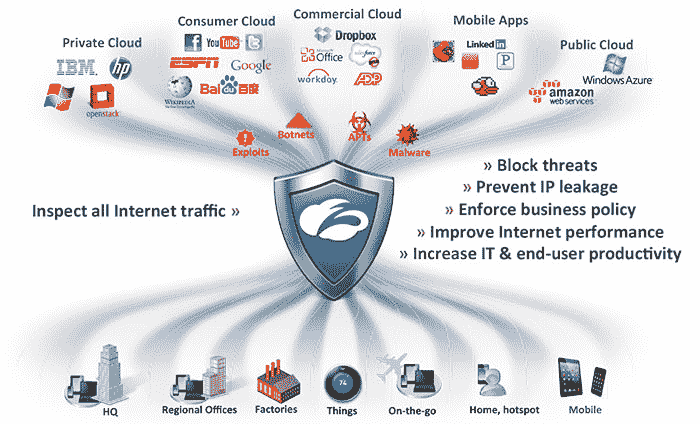

# 云安全平台 Zscaler 获得由 TPG 牵头的 1 亿美元 B 轮融资，目前估值超过 1B 

> 原文：<https://web.archive.org/web/https://techcrunch.com/2015/08/03/cloud-security-platform-zscaler-raises-a-100m-series-b-round-led-by-tpg-now-valued-at-over-1b/>

# 云安全平台 Zscaler 筹集了由 TPG 牵头的 1 亿美元 B 轮融资，目前估值超过 1B

安全平台 [Zscaler](https://web.archive.org/web/20230130021121/https://www.zscaler.com/) 今日[宣布](https://web.archive.org/web/20230130021121/https://www.zscaler.com/20150803-zscaler-announces-100-million-dollars-investment-round-led-by-tpg.php)已获得由后期投资者 TPG 领投的 1 亿美元 B 轮融资。该公司为企业提供广泛的网络、移动和云安全服务，现已筹集了 1.38 亿美元，并表示其在最后一轮的估值超过 10 亿美元。其他投资者包括 EMC 和[之前的投资者](https://web.archive.org/web/20230130021121/https://techcrunch.com/2012/08/29/zscaler-cloud-security/)光速创投合伙人。

Zscaler 首席执行官 Jay Chaudhry 在今天的公告中表示:“我们的使命是通过提供一个令人惊叹的安全平台来保护我们的客户，并实现云计算、移动设备和物联网的战略采用，从而使互联网对企业安全。

“来自 TPG 的投资和合作伙伴关系以及他们提供的全球关系和经验将使我们能够加快技术投资，扩大我们的客户群，并积极扩展我们的业务以满足不断增长的需求。我们很高兴加入这个价值超过 10 亿美元的安全公司精英集团。”

该公司表示，它现在有超过 5000 名客户，是一年前的两倍。其客户包括 Humana、NBC、埃克森美孚和英国国民健康服务等。该公司表示，它现在保护着超过 1300 万名员工。

Zscaler 的技术位于企业网络(和用户的移动设备)和云之间——无论是 AWS、Azure 或私人托管的 OpenStack 云等云计算服务，还是 Dropbox 和 Office 365 等基于云的应用程序。因为它检查从公司拥有的设备和网络到这些服务的所有流量，所以它可以提供安全性和合规性解决方案。

“我们在快速增长的网络安全行业中看到了巨大的机会，在该领域花了大量时间后，我们发现 Zscaler 是面向世界上最大、最苛刻的客户的领先的基于云的安全解决方案——一个像 Salesforce 或 Workday 那样的真正的 SaaS 平台，”TPG 合伙人、现为 Zscaler 董事会成员的 Nehal Raj 在今天的发布会上说。“我们期待着与杰伊及其团队合作，加速增长，最直接的方式是将 Zscaler 介绍给我们全球网络中的潜在客户和渠道合作伙伴。”

Zscaler 成立于 2008 年，这使得它成为这个市场上最古老的参与者之一。它的一些竞争对手包括[火眼](https://web.archive.org/web/20230130021121/https://www.fireeye.com/)、 [Qualys](https://web.archive.org/web/20230130021121/https://www.qualys.com/) 和 [Bit9](https://web.archive.org/web/20230130021121/https://www.bit9.com/) ，以及像思科和赛门铁克这样历史悠久的在位者。