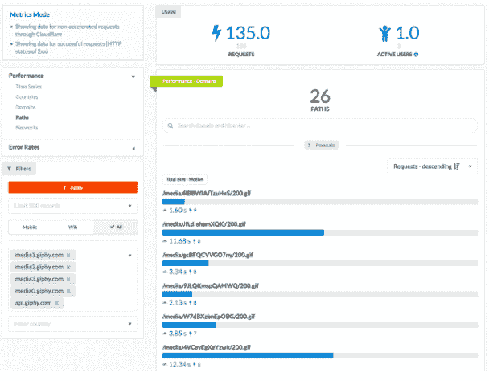

# Cloudflare 为移动应用程序开发人员推出免费网络监控工具

> 原文：<https://web.archive.org/web/https://techcrunch.com/2018/03/22/cloudflare-introduces-free-network-monitoring-tool-for-mobile-app-developers/>

# Cloudflare 为移动应用程序开发人员推出免费网络监控工具

去年秋天，当 Cloudflare 收购移动性能初创公司 Neumob 时，这表明该公司希望超越 web 性能，帮助移动应用程序开发人员了解网络层面正在发生的事情。今天，该公司推出了 [Cloudflare Mobile SDK](https://web.archive.org/web/20230225041818/https://developers.cloudflare.com/mobile-sdk/overview/) ，这是一款免费工具，可以帮助开发人员了解网络级性能问题。

Cloudflare 的联合创始人兼首席执行官马修·普林斯(Matthew Prince)表示，开发人员已经掌握了一些工具来了解为什么应用程序会在设备上崩溃，但他们缺乏对网络的可见性，这可能是应用程序不稳定的主要原因。

开发人员通过向他们的 iOS 或 Android 应用程序添加几行代码来访问监控功能。之后，他们可以登录 web 控制台查看网络性能指标。该工具旨在发现一些问题，如因信号差而丢失数据包或从 WiFi 移动到移动网络，这些问题都可能导致应用程序挂起或出现其他不当行为。

截图:Cloudflare

该工具使您能够了解网络在世界各地的运行情况，以及您在哪里发现了问题，当它收集和显示信息时，它应该有助于将性能问题与不稳定的网络以及可能对应用性能产生的影响联系起来。

他说，随着时间的推移，他们将与其他监控工具合作，为开发人员提供一个检查其性能问题的单一场所。“我们的目标是如何让网络更好地运行，并让应用程序开发人员更好地了解网络行为。”王子说。

Prince 说，首先，他们提供了一些关于如何提高性能的基本建议，但在未来，他们计划将网络监控工具与 Cloudflare 工具包的其余部分更深入地集成，以便更容易调整性能问题。

Cloudflare 还认为这是一种更好地了解网络总体表现的方式，随着他们将这些数据汇集在一起，他们计划发布一份移动网络可靠性报告。他解释说:“我们预计，随着这一点被嵌入到(更多的应用程序)中，并让我们了解移动网络提供商，我们将能够看到谁在提供最高水平的服务，谁的数据服务质量不佳。”