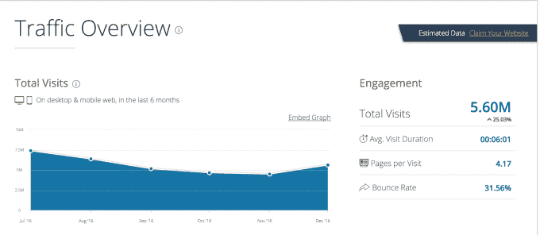

# 企鹅俱乐部即将关闭

> 原文：<https://web.archive.org/web/https://techcrunch.com/2017/01/31/club-penguin-is-shutting-down/>

迪士尼旗下的儿童社交网络企鹅俱乐部今天早上宣布关闭。取而代之的是，该公司将推出一款面向移动设备的新产品——企鹅俱乐部岛(Club Penguin Island ),这款产品已经开发了数年。[企鹅俱乐部岛](https://web.archive.org/web/20230326045125/https://www.clubpenguinisland.com/pre-registration/)将于 3 月推出，而桌面和移动设备上的企鹅俱乐部游戏将于 2017 年 3 月 29 日关闭。

对于某些一代人来说，这次关闭是一个苦乐参半的里程碑——这些人伴随着电脑和互联网长大，并通过企鹅俱乐部的虚拟世界学会了在线社交。

该网站始于 2005 年，以生活在网络世界中的动画企鹅(因此得名)为特色。用户可以玩游戏，聊天，用虚拟配件建造他们的家。该公司于 2007 年在[出售给迪士尼，当时该交易对该业务的估值为 7 亿美元。](https://web.archive.org/web/20230326045125/http://venturebeat.com/2007/08/01/disney-buys-club-penguin-in-700-million-deal/)当时，它拥有超过 1200 万用户。到 2013 年，这个数字已经增长到 2 亿，尽管有迹象表明游客数量在下降。

根据一个流量测量来源 SimilarWeb 的数据，截至 2016 年 12 月，该网站的访问量为 560 万——这一数字比 2016 年 7 月的 740 万有所下降。然而，美国仍然是流量的主要来源，占网站总访问量的四分之一以上。

与此同时，在移动领域，iOS 应用在游戏类别中的排名已经跌至第 595 位，并且在过去几年中一直排名在 400 或 500 位左右，偶尔会反弹到 300 位左右。

企鹅俱乐部的主要目标是更小的儿童和青少年，它的问题是现在有太多的应用程序争夺儿童的注意力。即使他们没有为了加入脸书、Instagram 和 Snapchat 等网站而谎报年龄,也有其他地方可供孩子们上网，包括 YouTube、Nickelodeon 的 properties、PBS Kids 等。此外，还有充斥着游戏的应用商店来转移孩子们的注意力。

新网站企鹅岛俱乐部(Club Penguin Island)将重新唤起孩子们的兴趣，以现代的方式再现原始的虚拟世界，但重点是移动领域。尽管有关联，企鹅岛俱乐部是它自己的独立应用程序——玩家不能将旧网站的物品或硬币带到新网站。他们的企鹅俱乐部会员资格也不会转移到新酒店。

企鹅俱乐部是一个重要的在线资产，这导致了多年来粉丝网站、维基和其他玩家在线社区的发展。然而，最近的新闻报道称，它是小学生反川普网上抗议活动的大本营，这明显提醒人们，今天的政治动荡甚至连美国最年轻的人都感受到了 T2

企鹅岛俱乐部目前正在提供[预注册](https://web.archive.org/web/20230326045125/https://www.clubpenguinisland.com/pre-registration/)，所以孩子们可以在新企鹅三月份发布之前保留他们的名字。