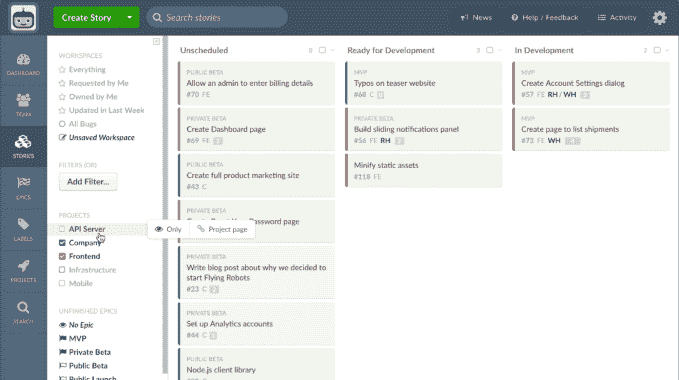

# Clubhouse 从 Battery Ventures 获得 1000 万美元 A 轮投资，让软件开发再次充满乐趣 

> 原文：<https://web.archive.org/web/https://techcrunch.com/2017/12/12/clubhouse-nets-10m-series-a-from-battery-ventures-to-make-software-development-fun-again/>

人们经常把工作描述成一场激烈的竞争，但对许多工程师来说，这并不太离谱。从队列中取出一张吉拉票，修复错误或添加功能，将该票标记为完成，并尽快移动到下一张票。对许多组织来说，工程设计——也许与管理层的意图无关——最终更像一个熟食柜台或[一个*我爱露西*短剧](https://web.archive.org/web/20221206000358/https://www.youtube.com/watch?v=8NPzLBSBzPI)而不是一个为最终用户考虑的任务优先级。

[会所](https://web.archive.org/web/20221206000358/https://clubhouse.io/)希望改变这一切。该产品于 2016 年初推出，旨在消除开发人员在使用软件项目管理软件时感觉到的单调乏味，同时增加每个工程师对其公司顶层目标和开发里程碑的了解。

该公司刚刚获得了 Battery Ventures 投资者 Neeraj agr awal 1000 万美元的 A 轮投资，他也将加入该公司的董事会。

Clubhouse 旨在为软件开发人员提供效率。该软件绑定到 Github，将提交记录与票据匹配，这样开发人员就不必将他们的更改细节输入到多个数据库中。该产品还提供了一个 API，可以很容易地将其他工具连接到开发工作流中。

虽然这些功能摆脱了作为开发人员的一些苦差事，但 Clubhouse 的高级视图使其在该领域脱颖而出。该产品内置了“里程碑”和“史诗”，因此工程组织中的每个人都可以看到关键特性和版本的当前状态。状态页面允许开发人员了解他们的团队成员正在做什么，以及什么可能会阻碍他们。

Clubhouse 允许开发人员组织他们的日子，并专注于工作流，而不是门票

该公司的创始人兼首席执行官库尔特·施拉德说，设计从第一天起就是一个关键因素。施拉德向我解释道:“我们非常固执地希望拥有最好、最快、最容易使用的用户界面/UX，同时还能给[…]人们一个他们喜欢使用的工具，让他们更开心。”。“我们的观点是，基于工作流的结构比无止境的票证堆更好。”

施拉德在纽约一家名为 Intent Media 的公司担任首席技术官时，开始意识到软件项目管理领域的问题，Intent Media 是一家旅游网站数据科学公司。在那里，在竞争异常激烈的广告技术领域，他看到工程师们在狂热的发布时间表中很快就忘记了他们产品的目标。

毕业于 RISD 的设计师 Andrew Childs 在 Intent Media 担任前端工程主管。两人一起工作，到了开公司的时候，他们联手成立了 Clubhouse。

对施拉德来说，产品设计是他们在发布前早期工作的一个关键方面。“我认为我们从一开始就试图做的一件大事是设计产品，以便组织的每个层面都能看到正在发生的事情。你可以从“作为开发人员，我需要做些什么？”“我们本季度要做的 4-5 件事是什么，我们做得怎么样？”我们希望每个人都能做好自己的工作。"

可能最令人难以置信的是——也是 Battery 对投资如此感兴趣的原因——该公司现在有 700 家公司在使用 Clubhouse，但这家初创公司没有雇佣一名销售人员。他们看到的一个模式是，开发商通常会离开一家曾经是 Clubhouse 的公司，然后说服他们的新雇主也开始使用它。施拉德表示，A 轮融资的部分资金将用于建立一个更加融合的销售团队。

该领域的竞争无疑是一个持续的威胁。除了 Atlassian 备受推崇的吉拉产品，还有 Pivotal Tracker、Fogbugz 等软件包，甚至还有 GitHub 自己的问题跟踪系统。施拉德承认存在竞争，但认为开发设计最好的工具会不断吸引开发者。“我认为我们实际上比吉拉收费高，所以这不是价格问题，”他说。“当我们考虑降低工程经理的门槛时，我们如何让系统自动更新自己，以便您可以继续自己的一天，只捕捉现实，而不会有太多的开销。我们只是花了很多心思让我们的客户满意。”

该公司此前已经从 Resolute Ventures、Lerer Hippeau Ventures、RRE、BoxGroup 等公司的两轮种子投资中筹集了 400 万美元。现有的种子投资者也加入了 Battery。