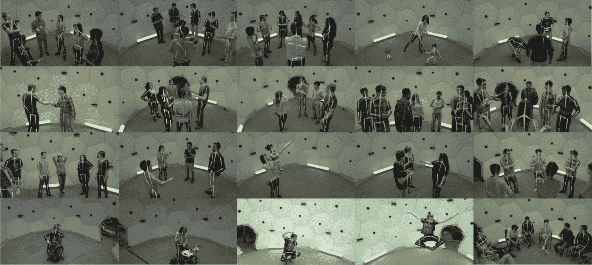

# CMU 研究人员创造了一个可以阅读肢体语言的巨大圆顶

> 原文：<https://web.archive.org/web/https://techcrunch.com/2017/07/07/cmu-researchers-create-a-huge-dome-that-can-read-body-language/>

# CMU 研究人员创造了一个可以阅读肢体语言的巨大圆顶

全景工作室是由卡内基梅隆大学的研究人员创造的一种新的身体扫描仪，将用于理解真实情况下的身体语言。这台扫描仪看起来像是布朗博士为了防止马蒂自相残杀而将他塞进去的东西，它创建了数百个参与者在巨大的穹顶内互动、交谈和争论的视频。该团队甚至发布了[代码，帮助程序员实时理解身体姿势](https://web.archive.org/web/20230315095316/https://github.com/CMU-Perceptual-Computing-Lab/openpose)。

该半球包含 480 个 VGA 摄像机和 31 个高清摄像机以及 10 个 Kinect 传感器。它可以创建圆顶内参与者的线框模型。为什么？向电脑展示我们在想什么。

副教授亚塞尔·谢赫说:“我们用肢体语言交流的次数几乎和用声音交流的次数一样多。”。"但是计算机或多或少对此视而不见."

在下面的视频中，研究人员扫描了一群为一件物品讨价还价的人。计算机可以观察各种手和头的位置，以及潜在的语言交流，并开始理解两个人何时生气、高兴或争论。它还将让计算机识别姿势，包括指向，这意味着你可以指向一个对象，系统将知道你在说什么。

有趣的是，该系统还可以通过实时解码自闭症和阅读障碍患者的行为来帮助他们。最后，像这样的系统可以在体育运动中使用，通过扫描比赛场上的多名参与者，查看每个球员在任何时间的位置。

从发布:

实时跟踪多个人，尤其是在他们可能相互联系的社交场合，提出了许多挑战。当应用于群体中的每个个体时，特别是当群体变大时，简单地使用跟踪个体姿态的程序并不能很好地工作。Sheikh 和他的同事采用了自下而上的方法，首先定位场景中的所有身体部位——手臂、腿、脸等。然后将这些部分与特定的个人联系起来。

全景监狱并不完全适合在超级碗或当地的丹尼餐厅使用，但它看起来是一个足够可靠的解决方案，可以根据一些人的肢体和动作的各种点云来判断他们在做什么。他们甚至能够判断出你什么时候可能会拒绝某人。

研究人员 Hanbyul Joo 说:“一张照片可以让你看到一个人的手的 500 张照片，而且它会自动标注手的位置。”“然而，手太小了，我们的大多数相机都无法进行注释，所以在这项研究中，我们只使用了 31 台高清相机，但仍然能够建立一个庞大的数据集。”

【YouTube = https://www . YouTube . com/watch？v=H0icc3Pg_Ig]