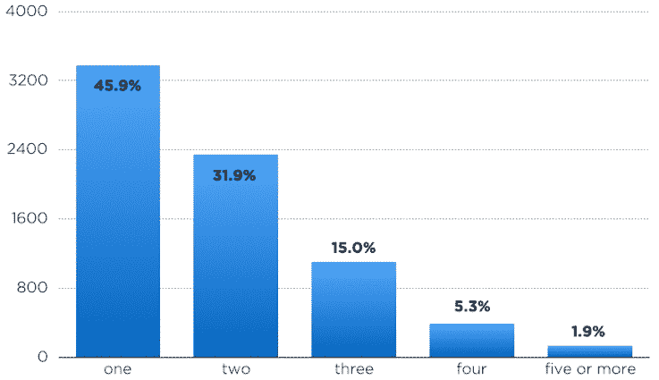

# 打破神话:数据表明，您实际上不需要联合创始人

> 原文：<https://web.archive.org/web/https://techcrunch.com/2016/08/26/co-founders-optional/>

你好吗，乔恩？很好，乔恩。很好，乔恩。让我们开始这个聚会吧。当然，乔恩。

我们经常被告知，自己创业是疯狂的。有成千上万的文章告诉你，还有[为什么](https://web.archive.org/web/20230331020228/https://www.google.com/search?q=why%20do%20you%20need%20a%20co-founder?)你需要一个联合创始人。可能是可靠的建议，但是来自 T4 数以千计的初创公司的数据显示了事情的另一面。超过半数退出的初创公司都只有一个创始人。平均有 1.72 名创始人。

为了确保我拥有最有用和报道最充分的数据，我将我的研究局限于“成功的”初创公司。很难确定是什么让一家公司有资格获得这个标签。有一些例子表明，大公司还没有赚到一分钱，而其他公司虽然赚了很多钱，但仍然不能被认为是成功的。因此，我决定看看两种不同的——诚然有些武断——衡量成功的方法。第一类是筹集了 1000 多万美元资金的公司。另一类是通过 IPO 或收购成功退出业务的公司。

这两个案例中的数字略有不同，但有一些很强的相似性，在这两个案例中[重新确认了大约 10 年前的数据](https://web.archive.org/web/20230331020228/https://blogs.msdn.microsoft.com/testing123/2007/02/23/if-you-are-going-to-launch-a-startup-how-many-friends-would-you-need/)，其中一个小得多的数据集得出结论，成功的公司平均有 2.09 名创始人。

## 筹资超过 1000 万美元的初创公司

我对 [CrunchBase API](https://web.archive.org/web/20230331020228/http://data.crunchbase.com/) 的深入研究给了我总共 7348 家公司，每家都筹集了超过 1000 万美元。当然，其中一些公司随后会失败，但我认为这是一个有助于减少我的数据集中的公司数量的好数字。这些发现令人着迷。

这张图显示了从投资者那里筹集到超过 1000 万美元的初创公司的数量，并按与该公司相关的创始人人数进行了细分。n=7，348

事实证明，几乎有一半成功筹集到资金的公司都是由创始人一人完成的。不到三分之一的公司有两名创始人，只有 22%的公司有三名或三名以上的创始人。每家初创公司的创始人平均人数为 1.85 人。

## 已成功退出的初创公司

当我开始查看另一组数据——那些以某种方式安全退出的公司——这些数字变得更加明显。我应该指出的是，在这组数据中，我*包括了融资少于 1000 万美元的*公司。这组数据包括了 6191 家公司，但单干创始人的明显优势在这一组中甚至更强。

成功退出的创业公司数量，按公司创始人数量分类。n = 6,191

在这种情况下，超过一半的公司是由一个单独的创始人创立的。同样，不到三分之一的人有两个联合创始人，大约 18%的人有三个或更多的创始人。在这一类别中，每个创业公司的平均创始人人数为 1.72 人。

## Sooooo…可以一个人开公司了。你应该吗？

虽然来自 CrunchBase 的上述数据表明，*有可能*以个人创始人的身份筹集资金并确保退出，但这并不意味着这是一个绝妙的主意。在我看来，建立一个有 2-3 个联合创始人的公司可能是一条可行之路。然而，数据表明，如果你未能组建一个联合创始人团队，并不一定意味着所有希望都破灭了。

坦率地说:不可否认，创办和运营一家初创公司是一项压力极大的工作。有一个团队一起工作，并在这个过程中互相挑战，这意味着创业不仅仅是各个部分的总和。还有大量的轶事证据表明，许多投资者会因为没有更大的创始团队而拒绝单独创始人，或者在没有强大团队的情况下更不太可能投资。

如果世界上的加速器可以借鉴的话，你不应该独自建立一家公司。戴夫·麦克卢尔[认为](https://web.archive.org/web/20230331020228/https://www.quora.com/Is-it-possible-to-apply-to-500-startups-being-a-single-founder)加入 500 家创业公司加速器是可能的，但并不常见，而 Y Combinator 的保罗·格拉厄姆甚至认为[独自创办的创业公司是扼杀创业公司的头号错误](https://web.archive.org/web/20230331020228/http://www.paulgraham.com/startupmistakes.html)。顺便提一下，这并没有阻止 Y Combinator [和其他顶级加速器](https://web.archive.org/web/20230331020228/http://blogs.wsj.com/venturecapital/2013/03/12/how-solo-founders-beat-the-odds-and-get-into-top-accelerators/)从[开始在这些年里接受许多一个创始人的初创公司](https://web.archive.org/web/20230331020228/https://www.quora.com/Have-any-solo-founders-been-selected-for-Y-Combinator)，包括一些大的成功故事，如 Pebble 的 [Eric Migicovsky](https://web.archive.org/web/20230331020228/https://www.crunchbase.com/person/eric-migicovsky#/entity) 和 Dropbox 的 [Drew Houston](https://web.archive.org/web/20230331020228/https://www.crunchbase.com/person/drew-houston) (尽管 YC 的保罗·格拉厄姆最终让休斯顿找到了一个联合创始人)。

但是，嘿，如果你真的决定把立体声调到 11，[播放你的主题曲](https://web.archive.org/web/20230331020228/https://www.youtube.com/watch?v=UEaKX9YYHiQ)独自开始你的下一次冒险，至少你可以这样做，因为你知道你不是第一个走这条路的人。