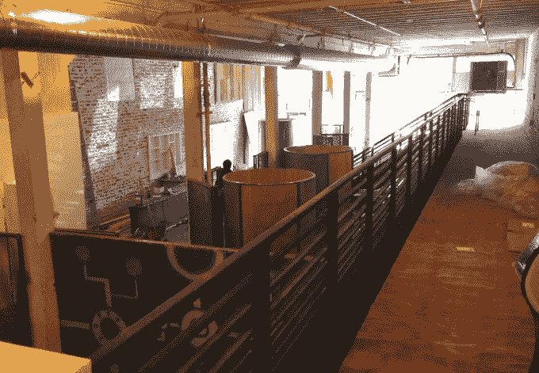
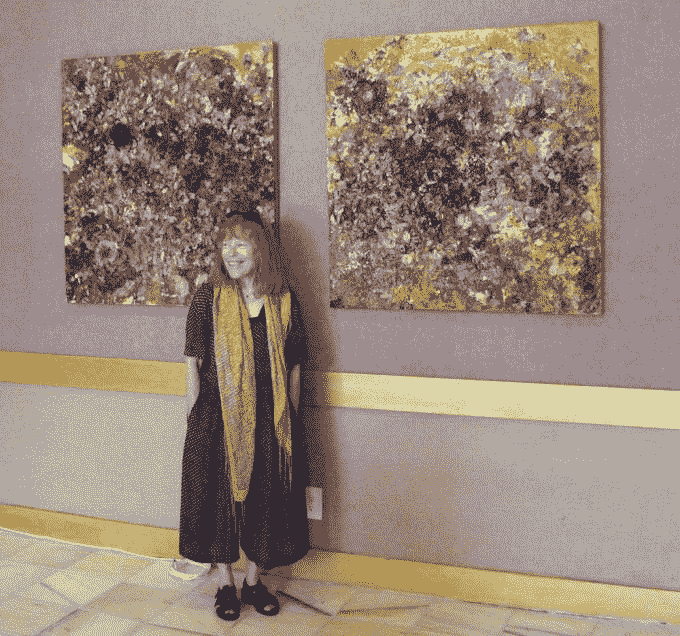

# “代码和画布”将 SF 初创公司和艺术家团结在一个奇怪的屋檐下技术危机

> 原文：<https://web.archive.org/web/https://techcrunch.com/2014/04/10/code-and-canvas/>

快速上涨的租金将迫使 12 位艺术家离开他们在旧金山的工作室。但事实证明，最近备受憎恨的科技资金实际上能起到一些作用。四位企业家租下了整个仓库，让艺术家们留下来，并翻修了这个地方。现在有足够的空间让至少五家初创公司进入创始人所说的“代码和画布”时代。

这个合作和创造性的仓库可以为海湾地区的技术工人如何将租金危机掌握在自己手中创造一个模式。

限制性的分区法律和根深蒂固的业主已经扼杀了旧金山的住房和工作空间的供应。随着科技行业的繁荣，成千上万的工程师、设计师、营销人员和经理涌入这座城市，加剧了这个问题。其结果是迅速上涨的租金迫使长期居民离开，以及对技术专家的普遍恶意，最终导致公司班车在[的抗议](https://web.archive.org/web/20221007221859/https://beta.techcrunch.com/2014/01/24/it-doesnt-have-to-be-this-way/)。

但是，虽然肯定有一些技术工人乐于以新邻居为代价来获得丰厚的薪水，但其他人希望社区保留其艺术家、家庭和遗产。这些人包括[代码和画布创始人](https://web.archive.org/web/20221007221859/http://www.codeandcanvas.org/founding-team/)、脸书和生态系统风险投资公司的 Nik Ajagu、Free:Formers 和 Techlightenment 的 Gi Fernando、Punchfork 和 Pinterest 的 Jeff Miller、Pinterest 的 John Yi、和美国陆军特种作战部队。

易告诉我一个故事，一个家庭如何拥有代码和画布仓库 30 年，并慷慨地让在那里工作的艺术家负担得起。最终，这个家庭需要让租金更接近市场价格，尽管这样会把艺术家们挤出去。幸运的是，一个朋友问易是否想租一张桌子，因为他同时也是一个有抱负的小说家。不过，这还不足以支付整个空间的费用，所以易把其他创始人召集在一起创建代码和画布。

与其他可能取代当地文化的科技合作场所不同，Code And Canvas 试图将其带入内部。“这绝对是工业，但这是它的魅力之一，”易告诉我。易说，这个空间的设计是为了让艺术家和企业家能够近距离接触，并在众所周知的饮水机旁交流。此外，“我们设计了整个空间，所以所有的墙壁都折叠起来，将主要区域作为一个巨大的连续空间，供艺术家、建筑师和平面设计师策划活动。”

占据代码和画布的艺术家包括出生于瓦哈卡的画家卡利克斯托·罗伯斯(他的作品出现在本文的顶部)和诗人兼雕塑家玛琳·阿隆(见下文)，她从事特定场所的装置艺术。

易建联表示，愤怒指向了科技行业，而对他来说，科技行业那些特别麻木不仁的成员的故事似乎“有点言过其实……有点轶事”。但他敏感地意识到，科技繁荣正在给海湾地区的其他人带来真正的困难。“如果因为(房地产)暴利，哪怕只有 1、2 或 10 个人被搬走，那也太糟糕了。”

这座城市当然不需要那些自认为是本地艺术家救星的科技工作者，但这并不是易的初衷。他似乎有理由担心，他的行业可能会痴迷于“短期季度收入”，而不是同情心。这就是为什么《代码和画布》的原则围绕工艺、掌握、交叉授粉和努力改善生活。这不仅仅是技术和工人和平共处，而是积极地相互激励。