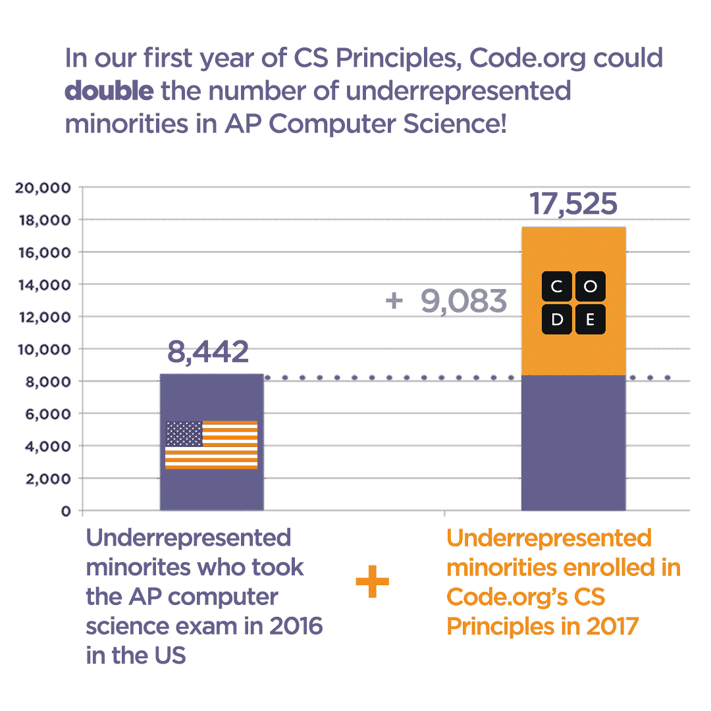

# Code.org 正在大幅增加参加 AP 计算机科学 TechCrunch 的人数不足的少数民族

> 原文：<https://web.archive.org/web/https://techcrunch.com/2017/02/09/code-org-is-drastically-increasing-the-number-of-underrepresented-minorities-taking-ap-computer-science/>

# Code.org 正在大幅增加参加 AP 计算机科学的人数不足的少数民族

Code.org 与大学委员会合作，于本学年开始提供计算机科学原理进阶先修课程，这将使全国 AP 计算机科学课程中人数不足的少数民族人数增加一倍以上。

根据大学委员会的消息，在上一个学年，8442 名代表性不足的少数族裔(黑人、拉丁裔、美洲印第安人/阿拉斯加土著、夏威夷土著/其他太平洋岛民)在美国[参加了 AP 计算机科学考试](https://web.archive.org/web/20221226081405/https://research.collegeboard.org/programs/ap/data/participation/ap-2016)。为了便于比较，上个学年有 15，913 名亚裔学生和 26，698 名白人学生参加了 AP CS 考试，而只有 2，027 名黑人学生和 6，256 名拉丁裔学生参加了考试。

今年，随着新 CS 班的增加，将有 9，083 名代表名额不足的少数族裔参加 AP CS 班。这意味着本学年参加 AP CS 考试的有色人种学生人数(17525 人)可能是去年的两倍多。

这都要归功于 Code.org 的加入和大学委员会新开设的名为“计算机科学原理”的进阶先修课程。这两个组织[于 2015 年 5 月](https://web.archive.org/web/20221226081405/https://code.org/college-board)首次宣布合作，正在帮助美国 35 个最大的学区——尤其是在城市地区——实施新的 CS 课程。

计算机科学有两种类型的 AP 课程，AP 计算机科学 A 和 AP 计算机科学原理。AP 计算机科学 A 以解决问题为导向，特别关注 Java，而 CS 原则则围绕基础采取更广泛的方法，由教师决定他们想使用哪种编程语言。

