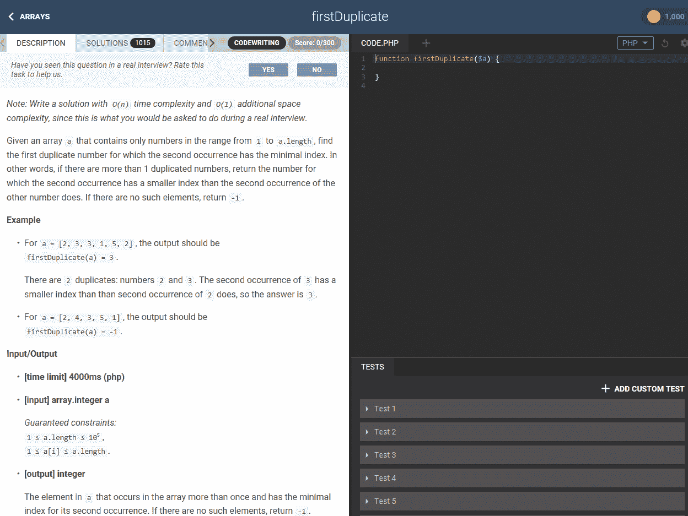

# CodeFights 推出新的实践模式，帮助开发人员准备工作面试 

> 原文：<https://web.archive.org/web/https://techcrunch.com/2017/06/22/codefights-new-practice-mode-helps-developers-prepare-for-job-interviews/>

# CodeFights 推出了一种新的实践模式，帮助开发人员准备工作面试

大多数面向开发人员的技术性工作面试在某种程度上是可预测的，因为他们可能会涉及某种编码——通常是在白板上。这并不真正代表开发人员通常的工作方式(hello， [StackOverflow](https://web.archive.org/web/20221207011030/https://stackoverflow.com/) )，但是传统要求这是编码面试的方式。因为它们与大多数开发人员的真实体验如此不同，所以即使是最好的程序员也需要为这些“考试”而练习 [CodeFights](https://web.archive.org/web/20221207011030/https://codefights.com/) ，这是一个以竞争性编码和技能为基础的招聘平台，希望帮助开发人员为这些面试练习。

今年早些时候，它推出了一个有点有限的测试版的“[面试练习模式](https://web.archive.org/web/20221207011030/https://codefights.com/interview-practice)，用于培训面试技巧。本周，这种模式即将退出测试，团队也增加了相当多的新功能。

CodeFights 的首席执行官兼创始人 Tigran Sloyan 说:“新的面试实践背后的关键思想是创造一种体验，这种体验类似于为面试准备过程配备一名私人教练。“我们帮助用户了解整体情况，包括他们需要准备哪些主题才能在技术面试中表现出色，并提供他们可以遵循的培训计划，以达到最佳效果。”

在它的第一个版本中，面试练习模式只为开发人员提供了面试问题的例子，然后他们可以使用这些例子为即将到来的面试做准备。现在，这种体验更进一步。像以前一样，所有的问题都是基于真实的面试问题，但开发者现在可以从三个预设的学习计划中选择。其中包括复习标准面试问题的速成课程、专注于代码计算机科学主题的基础课程，以及让用户根据需要混合和匹配主题的自由式路径。然后，该服务会在您完成整个过程时监控您的进度。

新的面试练习模式现在对所有想尝试的开发者都是免费的。

