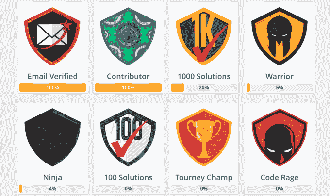
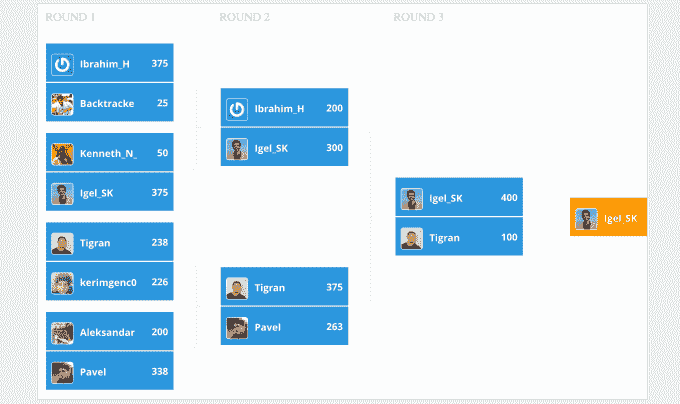

# CodeFights 赢得 240 万美元，将编码实践变成游戏 

> 原文：<https://web.archive.org/web/https://techcrunch.com/2015/04/02/codefights-scores-2-4-million-to-turn-coding-practice-into-a-game/>

一家将练习编程技能变成游戏的初创公司 [CodeFights](https://web.archive.org/web/20221209093941/https://codefights.com/) 刚刚筹集了 240 万美元的种子资金，以进一步开发其实时社交游戏，开发者可以直接参与与定时时钟或其他对手的“代码战”。联合创始人 Tigran Sloyan 表示，虽然该网站仅开通了大约 6 个月，但已经有 7 万名用户出现，并解决了 150 万个挑战。

他还指出，该网站自首次亮相以来，每月增长 30%至 40%。

该轮投资者包括 Felicis Ventures (Aydin Senkut)、Sutter Hill Ventures (Mike Speiser)、Adam D'Angelo(脸书联合创始人/Quora 首席执行官)、Auren Hoffman (LiveRamp 首席执行官)、Tom Fallows(谷歌购物快递创始人/优步)、Raffi Krikorian(Twitter Eng/优步副总裁)等。

来自亚美尼亚的麻省理工毕业生 Sloyan 说，创业的想法是在他和他的联合创始人 Aram Shatakhtsyan 参加国际数学和编码比赛的经历后产生的，例如，包括国际数学奥林匹克和国际信息学奥林匹克。

斯洛扬甚至在麻省理工学院的硕士论文中提出了网站的概念，但他最终在写作之前离开了硅谷，在甲骨文、谷歌和谷歌风投支持的初创公司 [Premise](https://web.archive.org/web/20221209093941/https://www.crunchbase.com/organization/premise) 工作。

但他说，这个想法一直萦绕着他。

CodeFights 的 Sloyan 说:“你实际上是在挑战某人的编程和数学技能，而不是挑战像重新排列糖果或射击小鸟这样的愚蠢技能。”“人们觉得玩这个游戏并不是在浪费时间——他们通过学习新的东西摆脱了这种感觉。”

在推出时，该网站仅提供 JavaScript 挑战，但后来扩展到支持 Java、C++和 Python。今天，程序员们竞相完成调试挑战，成功将会看到他们升级并获得徽章。

第一个挑战很短，只需要几分钟就能解决。但是随着回合的进展，游戏变得更难，玩家有了更多的时间。在该网站上，玩家可以选择与时间赛跑，或者自动匹配系统可以让他们与其他在线并寻求竞争的人面对面。

Sloyan 说，目前，这种匹配系统相当基础，但随着时间的推移，计划是一旦有更多的参与者参与，就开始根据技能水平匹配人员。

该网站目前有超过 1500 个挑战，这位联合创始人说，到目前为止，他已经看到一些程序员达到了 100 级。

有了种子基金，该计划将扩大网站上的内容选择，以吸引其他开发者，并引入不同类型的挑战。Sloyan 说，他还希望看到工程师面临的数据库挑战，或者你在 CSS 代码中寻找错误的地方。

此外，虽然该网站今天的目标是那些更高级的人，但 Sloyan 认为该网站也可以作为初学者的学习工具，提供更简单的游戏，让新程序员练习技能。

这家初创公司也是前谷歌员工费利克斯·德斯罗什(Felix Desroches)的联合创始人，现在正在招聘员工。事实证明，他们已经有了一批有趣的潜在申请者可供选择。“我们期待我们的社区，”Sloyan 指出。“最好雇佣喜欢你产品的人，”他说。

[YouTube https://www.youtube.com/watch?v=YaK8J0cxL8c]