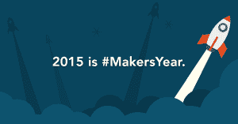

# Codementor 希望在 2015 年与创客年 TechCrunch 一起帮助开发者启动项目

> 原文：<https://web.archive.org/web/https://techcrunch.com/2015/01/02/codementor-makersyear/>

# Codementor 希望在 2015 年创客年帮助开发者启动项目

Codementor 让开发者从经过审查的专家那里获得编码建议，它是为了帮助人们完成项目而创建的。然而，成功推出一个应用程序不仅仅需要编码，所以这家初创公司的创始人创立了[创客年](https://web.archive.org/web/20230129092147/http://makersyear.com/)来帮助更多的项目启动。

这项为期一年的倡议旨在将开发者与设计和营销资源联系起来，并与包括联合导师支持者 [Techstars](https://web.archive.org/web/20230129092147/http://www.techstars.com/) 创始人大卫·科恩在内的人一起组织在线办公时间。

Codementor 的联合创始人表示，他的灵感来自于 Codecademy 的代码年和非营利活动代码年，以及他在 Techstars 和 Y Combinator 的经历(刘是 SocialPicks 的联合创始人)。

“YC 和 Techstars 是很好的加速器，但只能帮助 1%的初创公司，”刘说。“创客年希望帮助其他人，并发起一场运动，帮助今年启动更多项目。漏斗越大，对生态系统越有利。”

报名参加创客年后，参与者将获得 Codementor 的免费试用和折扣，code mentor 目前在其平台上有 2000 名编码专家， [Designlab](https://web.archive.org/web/20230129092147/http://trydesignlab.com/) ， [UXPin](https://web.archive.org/web/20230129092147/https://www.uxpin.com/) ，营销公司 [Moz](https://web.archive.org/web/20230129092147/http://moz.com/) 和 [PressFriendly](https://web.archive.org/web/20230129092147/https://www.pressfriendly.com/) ，DigitalOcean 和 Make School。刘说他选择这些公司是因为 Codementor 以前和他们合作过。

创客年度会员也将收到电子邮件邀请，与科恩和其他专家一起办公。在 Google Hangouts 上，这些会议仅限于 10 到 20 名参与者，但其他人可以现场观看，并通过短信提问。它们也将被记录下来并发布在制造商年度网站上。

刘说，该网站还将为创客年的参与者提供一个社区，开发者可以在那里发布他们的项目以获得反馈。被其他成员投票最多的项目将获得各种优惠和奖励。

要了解更多信息，请访问[制造商年度网站](https://web.archive.org/web/20230129092147/http://makersyear.com/)。