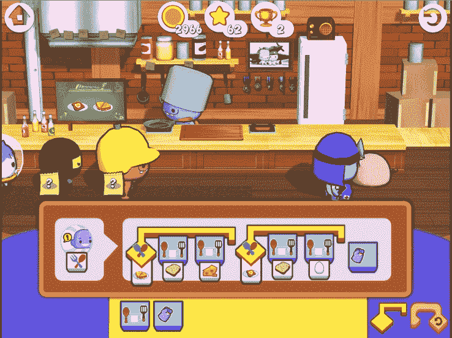
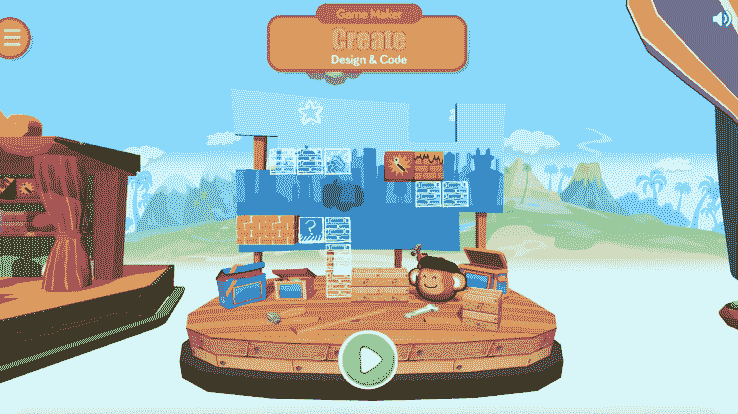

# CodeSpark 为教孩子如何编写代码的游戏筹集了 410 万美元

> 原文：<https://web.archive.org/web/https://techcrunch.com/2016/09/29/codespark-raises-4-1-million-for-games-that-teach-kids-how-to-code/>

一家名为 [codeSpark](https://web.archive.org/web/20230328104207/http://codespark.org/) 的洛杉矶初创公司已经筹集了 410 万美元的种子资金，用于网络和移动游戏，这些游戏甚至在孩子知道如何有效读写之前就教会了他们如何编码。

CodeSpark 的游戏是为 4 到 9 岁的孩子开发的，目的不仅仅是教他们 STEM 概念，还要让男孩和女孩同样参与进来。例如，游戏以女孩为主角，故事情节不涉及女孩的营救。

联合创始人兼首席执行官格兰特·霍斯福德说，edtech 初创公司的第一款游戏[Foos code](https://web.archive.org/web/20230328104207/http://thefoos.com/)到目前为止已经被 201 个国家的 400 万名儿童玩了。该游戏受欢迎的部分原因在于，霍斯福德和联合创始人兼首席产品官乔·肖切特将它的内容设计成视觉的，而不是语言的或数字的。

霍斯福德说:“从可及性和本地化的角度来看，无词方法对我们很重要。这不仅可以在中国或美国进行，无需翻译，而且如果您是一个患有多动症、诵读困难或其他学习障碍的孩子，您可以和您的同学一起玩 Foos。”

*来自 codeSpark.org 的 Foos 编码游戏。*

[Kapor Capital](https://web.archive.org/web/20230328104207/http://www.kaporcapital.com/) 引领了 codeSpark 的种子回合，加入的有 [Idealab](https://web.archive.org/web/20230328104207/http://www.idealab.com/) 、 [PGA Venture Partners](https://web.archive.org/web/20230328104207/http://lunpartners.com/business/) 、Felton Group、 [NewGen Capital](https://web.archive.org/web/20230328104207/http://www.newgencap.com/about) ，以及包括乌蒙古普塔(Umang Gupta)在内的天使投资者。

CodeSpark 让它的游戏免费提供给公立学校、图书馆和非营利组织。个人用户，通常是希望孩子在家玩游戏的父母，可以购买和下载手机和平板电脑的 codeSpark 游戏。

如今，该公司与 Foos 一起推出了一项名为 codeSpark Academy 的优质订阅服务，将为付费用户提供不断更新的游戏和内容。这项优质服务适用于 iOS 和安卓设备。

CodeSpark Academy 基本上是 Foos code 的扩展版本，其中包括让孩子们设计、编程和分享他们自己的游戏的拼图和练习，或者其他孩子使用该平台创建的游戏的“混搭”。

霍斯福德说，孩子们已经用“Foos Studio”创建了 700 万个游戏。

*福氏工作室*

Idealab 创始人比尔·格罗斯说他支持 codeSpark 是因为它独特的方法，在孩子们发展高度的数学或阅读技能之前教他们编程基础。

“如果代码还没有被嵌入到我们生活中的每一件事情中，那么它将会被嵌入到我们生活中的每一件事情中。我们需要美国和世界上更多的人理解这一原则。它能理解诸如循环、变量和序列之类的东西。即使编码不是你的职业，这也很重要，”格罗斯说。

虽然今天的格罗斯以世界上第一个创业孵化器 [Idealab](https://web.archive.org/web/20230328104207/http://idealab.com/) 的创始人而闻名，但他早些时候创办了一家名为知识冒险的教育软件公司，该公司于 1996 年被 Cendant 以 9500 万美元收购。所以他对教育技术市场并不陌生。

“当时，我想开发一款软件，帮助孩子们爱上学习，而不仅仅是进行这些技能和训练练习。从那时起，我就梦想着利用互联网、平板电脑和个性化、适应性学习的所有功能来实现这个梦想，”格罗斯说。

霍斯福德表示，codeSpark 将利用其种子资金开发新课程，继续在国际上建立用户群，并通过与顶级学术研究人员进行第三方研究来测试其游戏的功效。

他认为 codeSpark 有潜力提供不仅仅是编码基础的课程。他说，创业是一个令人感兴趣的领域。