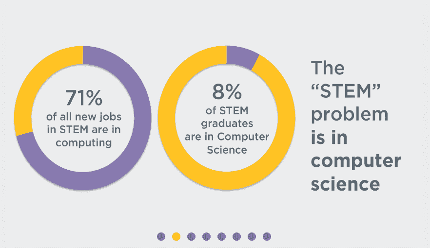

# 编码需要一场新的青年运动

> 原文：<https://web.archive.org/web/https://techcrunch.com/2016/08/22/coding-needs-a-new-youth-movement/>

[Josh Seides](https://web.archive.org/web/20230326052240/http://joshseides.com/)

是哈佛大学的新生，Technocademy 的非盈利创始人，Entepreneur、Yahoo 和 Fast Company 的撰稿人。

More posts by this contributor

让我们面对现实吧——不管你是不是程序员，你总会想到处理网页设计。或者手机 app 开发。或者数据库查询。或者是其他一些正在进化的聪明的现代语言。(对，有[百和百](https://web.archive.org/web/20230326052240/https://en.wikipedia.org/wiki/List_of_programming_languages)。)对于非编码人员来说，缺乏控制和对开发人员的依赖增加了压力，让他们不得不至少掌握*某种*形式的编程——不管复杂不复杂。

## 编码在商业中的价值

毫无疑问，编程已经成为任何创始人不可或缺的一部分。无论你是否会成为你的企业的首席技术官，务实的心态和由此产生的剩余收益都是不容置疑的:

*   **了解你的产品。**“为你的产品与承包商合作会带来麻烦、资金和时间。能够自己对网站或移动应用进行调整，不仅有助于节省宝贵的资源，还能让你更好地了解自己的产品。”( [AJ Agrawal，企业家](https://web.archive.org/web/20230326052240/https://www.entrepreneur.com/article/230241))。
*   **问题解决。“程序员也有这种不受限制的视角(就像企业家一样)。他们很少问为什么；他们总是问为什么不……每天的顿悟、肾上腺素的爆发，以及从零开始创造东西的炼金术，是这份工作最大的乐趣之一。”([霍华德·塔尔曼公司](https://web.archive.org/web/20230326052240/http://www.inc.com/howard-tullman/the-real-benefits-of-coding.html))。**
*   **吸引人才。**“找到一个技术联合创始人很难，风险投资可能不太可能资助缺乏技术联合创始人的初创公司……当你面试开发人员职位的候选人时，获得的知识也会派上用场。”([丹·皮克特，商业集体](https://web.archive.org/web/20230326052240/https://businesscollective.com/why-all-entrepreneurs-can-benefit-from-learning-code/))。

实用主义与创造力、逻辑与艺术之间的完美平衡，与创业所需的活力不相上下。

## 我的(青少年)旅程

毫无疑问，这是一个艰难的挑战，但对于青少年学习黑客来说，挫折会成倍增加。在许多方面，年轻人的编码在通常被认为是其强项的领域被打破了。为什么只有 8%的 STEM 毕业生主修计算机科学，而[71%的 STEM 新工作](https://web.archive.org/web/20230326052240/http://www.bls.gov/emp/tables.htm)都在同一领域？

对于现代的、有技术意识的企业家来说，有如此广泛的好处，任何对计算机科学扩散的威胁都应该被视为对未来创业公司自身健康的威胁。

> 为什么在一个充满技术工作的世界里，许多学生回避编程？

相信我。几个月前，我也有同样的困惑。几年前，18 岁的时候，我参加了[的 AP 计算机科学](https://web.archive.org/web/20230326052240/https://apstudent.collegeboard.org/apcourse/ap-computer-science-a)，但是我的编程经验——更重要的是我的时间——几乎减少到零。当我想到我的创业伙伴们已经编程多年的事实时，我知道有些事情必须改变。

在代码学校进行了六个月卓有成效的实验，有了一堆令人望而生畏的教程书籍和一张现已加载的 Dunkin' Donuts 奖励卡，我终于可以放心地称自己为黑客了。

然而，在一个 500 多名学生的班级里(其中许多人和我上了同一门 AP 计算机科学课)，我一只手就能数出所有那些偶尔编写代码的人。为什么，在一个充满技术工作的世界里(准确地说是 525，293 个空缺职位)，许多学生回避编程？坦率地说，为什么青少年黑客行为处于危险之中？

来源:[Code.org](https://web.archive.org/web/20230326052240/https://code.org/promote)

## 警告标志

**教育陷阱**

我从哪里开始？我就读于一所竞争激烈的公立高中——考试成绩名列全国前 1 %,并且获得了足够的资助，可以向所有学生提供 Surface Pros。然而，计算机科学课程目录中的亮点是 AP 计算机科学。句号。

正如我在 TechCrunch 之前的一篇文章中指出的那样，只有 5%的美国高中提供计算机科学 AP 课程，只有 31 个州允许计算机科学计入高中毕业。公共教育系统将计算机科学视为二流选修课，只是为了欺骗性地吹嘘“将 STEM 课程注入”他们的课程。

更有问题的是，*提供给*的几个编程类仍然是*可怕的*构造的。以 AP 计算机科学(大学委员会设计)为例。为什么 2015 年 AP 考试中只有 1.09%的人考计算机科学？

本课程专门关注 Java——一种后端、强类型、面向对象的语言。虽然我绝不贬低 Java 的实用性(为自己辩护，它展示了许多核心编程概念)，但对于一个非技术专业的学生来说，*Java 入门很无聊*。

> 只制作纯文本让今天的青少年感到厌烦，并过早地让许多人远离这个领域。

Java 完全是后端；在我的 AP 课程结束时，我们已经学会了如何创建一个摄氏到华氏的转换器，设置一个石头/布/剪刀游戏(很遗憾，全部都是纯文本的)和创建一个小费计算器。没有图形设计。没有用户界面。没有 CSS 样式。课程描述一直到[在讨论中包括“g(h(x))”](https://web.archive.org/web/20230326052240/http://media.collegeboard.com/digitalServices/pdf/ap/ap-computer-science-a-course-description.pdf)。

到了年底，我的大多数同行都放弃了编程，转而使用冗余的逻辑线路，最多只能完成基本的数据操作。更糟糕的是，考试要求所有代码都是*手写的*。

网页设计在哪里？前端框架？初学者——尤其是现代年轻人——渴望从他们的工作中得到一些有形的、视觉的东西。的确，[65%的人类是视觉学习者](https://web.archive.org/web/20230326052240/http://visualteachingalliance.com/)。只制作纯文本让今天的青少年感到厌烦，并过早地让许多人远离这个领域。相反，课程应该专注于前端的网页设计——HTML、CSS、JavaScript——向青少年展示代码的实际力量，以及它如何能够导致生产就绪的应用程序。

**不足的堡垒**

你不顾一切，逃避枯燥、麻木的高中计算机科学课程，计划自学。等等！还有一个问题。从字面上来看，每个人都比你写得更好。

当然，[日益增长的黑客马拉松](https://web.archive.org/web/20230326052240/https://mlh.io/)促进了“绝对初学者”的加入，但是说实话——你真的想加入一个由 5 年或 10 年开发人员组成的团队，他们可以在 30 分钟内完成你花了 24 小时完成的黑客马拉松吗？毫不奇怪，[大多数(77%)黑客马拉松参与者](https://web.archive.org/web/20230326052240/http://venturebeat.com/2012/03/15/the-rise-of-the-hack/)认为自己是“开发者”

如果到了中学还不开代码编辑器，那就已经落后了。在谷歌的一项员工调查中，98%的计算机科学专业学生称他们在上大学之前接触过这个领域。在高中，我在教程视频、密集的书籍和编码博客中挣扎，不断担心:*我会在编程方面“足够好”吗*？

从心理学上来说，学习者会怀疑早期学到的基础知识如何能够转化为行业标准的网站。(你真的能看到从[这个站点](https://web.archive.org/web/20230326052240/https://www.codecademy.com/en/courses/make-a-website/lessons/site-structure/exercises/html-css?action=lesson_resume)到[这个站点](https://web.archive.org/web/20230326052240/https://mlh.io/)的平稳过渡吗？)更危险的是，一个想法总是挥之不去:*追赶的游戏什么时候才会停止*？

黑客马拉松、在线论坛(也就是堆栈溢出)和免费教程网站都无法消除这种恐惧。相反，他们引入了外来的(看似不可能的)概念，开发人员似乎比你有更多的经验，并且越来越犹豫是否要问一个超级基本的问题，这个问题可能会惹恼你的同事。

在年轻人发现自己所处的高风险、竞争激烈的环境中(49%的高中生报告日常压力很大)，我们习惯于只关注那些我们会取得巨大成功的活动。这滋生了高度的焦虑，并带走了编码所基于的协作精神。

**网络上的混乱**

当今黑客氛围的一个主要组成部分是自学——在网上搜索语言文档、博客和视频。正如企业家一样，“编程世界总是在不断发展，为了保持相关性和进步，初学者的心态真的很重要，”米歇尔·孙(Michelle Sun)指出。

对于不知道从哪里开始的真正的初学者来说，说起来容易做起来难。尤其是在独立学习时，没有一个可靠的地方可以深入研究 web 开发。当然， [Codecademy](https://web.archive.org/web/20230326052240/https://www.codecademy.com/) 、Code School 和无数其他网站提供了对<标签>的作用以及与 CSS 相关的类和 id 之间的区别的很好的表层理解，但是这些仅仅是起步。

因为这些资源是为完全的初学者准备的，所以它们不容易过渡到更复杂的编程问题。事实上，*齐膝深的漂泊者*——那些了解核心基础知识但仅此而已的人——陷入了僵局。从 A(基础)到 C(专业发展)需要在 B 停下来——然而在线资源似乎完全忽略了这一点。

特别是对于年轻人来说，对知识的无尽渴望与不知道下一步该做什么的挫折感相匹配，可能会导致他们探索其他更直接的领域，而不是放弃计算机科学。

## 最后的想法

编码并没有在年轻人中消亡。事实上，[54%的学生“非常”喜欢计算机科学](https://web.archive.org/web/20230326052240/http://changetheequation.org/students-stem-methodology)(大约比艺术以外的任何学科都多 15%)。但它肯定处于危险之中。有无数的文章讨论计算机科学如何需要在学校中有更大的存在，黑客马拉松称赞他们“欢迎所有技能水平”的哲学，甚至还有白宫提出的让更多学生接触代码的倡议[。](https://web.archive.org/web/20230326052240/https://www.whitehouse.gov/the-press-office/2016/01/30/fact-sheet-president-obama-announces-computer-science-all-initiative-0)

然而，这总是假设有机会上编程课的学生会爱上编程课，并最终找到一份舒适的 STEM 工作。这种观点错误地认为*曝光*先于*接近*。

一个实用实践(前端)学校课程的新环境，一个对新来者更欢迎的态度，以及超越浅薄基础的更清晰的学习方向，将在这场由青年主导的数字革命中发挥重要作用。