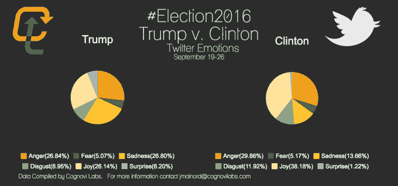
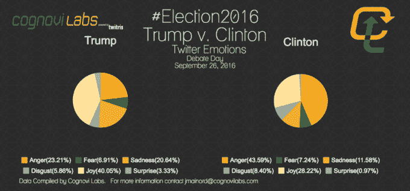
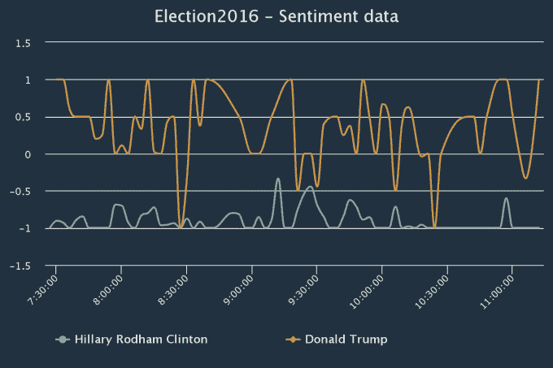
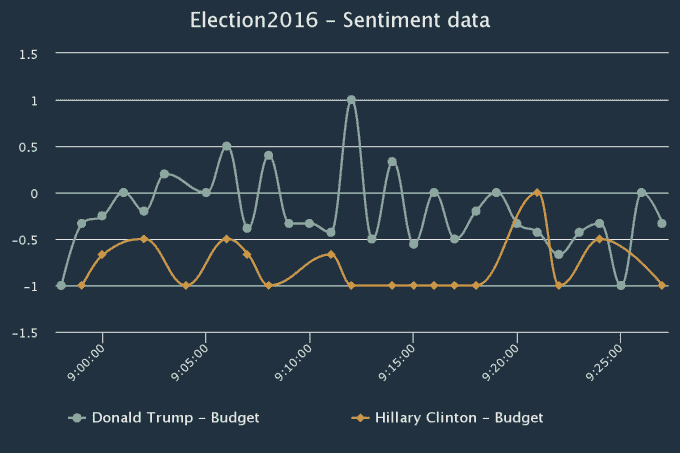
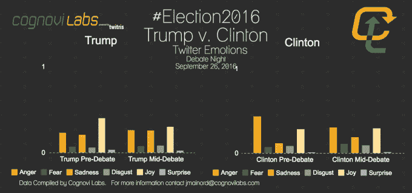
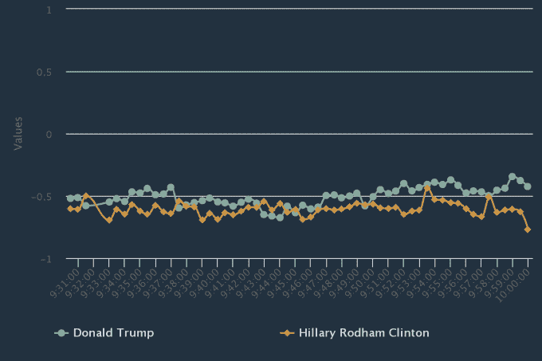
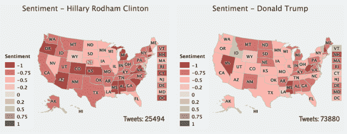
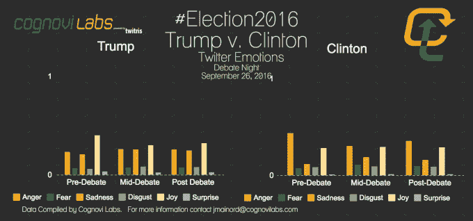

# Cognovi 实验室将用他们的情感工具 TechCrunch 研究今晚的总统辩论

> 原文：<https://web.archive.org/web/https://techcrunch.com/2016/09/26/cognovi-labs-will-study-the-presidential-debates-tonight-with-their-emotional-sentiment-tool/>

[TechCrunch 首次报道 Cognovi Labs 是在 6 月](https://web.archive.org/web/20221209033450/https://beta.techcrunch.com/2016/06/29/the-twitris-sentiment-analysis-tool-by-cognovi-labs-predicted-the-brexit-hours-earlier-than-polls/)，当时[位于俄亥俄州代顿的分析初创公司](https://web.archive.org/web/20221209033450/http://cognovilabs.com/)在最终投票前几个小时正确预测了[英国退出欧盟](https://web.archive.org/web/20221209033450/http://www.bbc.com/news/uk-politics-32810887)的结果——这与传统的投票结果相反。

今晚，该公司与应用政策研究所和莱特州立大学 Kno.e.sis 中心合作，建立了一个由 30 多名政治和技术专家组成的作战室，以实时研究总统辩论，跟踪 Twitter 聊天如何表达国家的情绪。

我发现这很有趣，所以**我问他们我是否可以获得他们的结果，并在他们发布结果时更新这个故事**。他们同意了，所以如果你也感兴趣，就把这个故事加入书签，边看边刷新，我们看看会发生什么。

该公司用来确定情感细分的工具叫做 Twitris。它是由赖特州立大学开发的，能够获取大量 Twitter 数据，不仅可以推断情绪(积极、消极、中立)，还可以在情绪上增加一层情绪反应。许多公司已经在做情绪分析，但 Cognovi Labs 的情绪分析是他们自称的新颖技术。

例如，这家初创公司可以吸收所有 Twitter 数据，这些数据被表达为对某个事件的反应，比如总统辩论，然后确定有多少人对此感到积极、消极或中立。然后，在这些情绪分类中，他们可以确定每个分类中的情绪反应。

这是他们收集的一个数据样本，关于人们在过去 8 天里如何表达对每位总统候选人的情感:

Cognovi 实验室也能够根据位置进行细分，因此他们可以在地图上看到这些特定情绪被感受到的位置。

所以，当你今晚收听的时候，请加载这个页面，我会用随着这场辩论的发生而产生的情感数据来更新它。

**最新数据**

* * *

晚上 8 点 05 分

在辩论之前，推特上对候选人表达的情绪汇总在上面列出。对于特朗普，表达最多的情绪是喜悦(40.05%)。克林顿最常表达的情绪是愤怒(43.59%)。我当然有这样的问题，*对一个候选人表达喜悦的人和对另一个候选人表达鄙视的人是同一批人吗？还是这些独特的用户？*

我从科格诺维实验室得到了消息。记录的信息是基于单一的情绪。例如，可能是同一个用户发布了一条推特，上面写着“希拉里统治，特朗普烂透了”。然而，这将被视为希拉里的喜悦和特朗普的愤怒……两种不同的情绪将被记录下来。

* * *

晚上 9 点 06 分

我们开始吧。辩论已经开始。

* * *

晚上 9 点 26 分

最新更新。根据 Cognovi Labs 的数据，谈到贸易——就总体情绪而言——积极、消极或中立——唐纳德·特朗普在讨论后在推特上获得了更高的积极情绪。

* * *

晚上 9 点 43 分

最新更新。以下是 Cognovi Labs 追踪的 Twitter 总体情绪，基于围绕就业、贸易、预算(繁荣)的前 20 分钟辩论。

* * *

晚上 9 点 58 分

最新更新。目前为止辩论的情绪数据。与顶部图表中辩论前的情绪相比，一些变化是显而易见的。

* * *

晚上 10 点 06 分

这是一个情绪更新，显示了对希拉里·克林顿的情绪下降，这与她的评论“我已经为辩论做好了准备，你知道我也为成为总统做好了准备”相一致。

* * *

晚上 10 点 13 分

大多数都是对两位候选人的负面推文。Cognovi 实验室指出，特朗普的支持者在 Twitter 上更加活跃。

* * *

晚上 10 点 58 分

* * *

晚上 11 点

* * *

晚上 11 点 07 分

这是辩论后的情绪分析。

* * *

晚上 11 点 23 分

**总体结果**

虽然 Cognovi Labs 早在下午 6 点就在分析 Twitter 数据，但你可以在上面的推文中看到，他们将这场辩论称为克林顿的胜利(在数量标准化后)。从晚上 9 点开始，数据显示她的情绪稳步上升，这源于 Twitter 流量。就总结他们的情绪分析如何达到高潮而言，该团队提供了以下总结:

> “情绪成分告诉我们的是，辩论是从希拉里处于负面地位开始的。愤怒占据了几乎一半关于她的推文。这一因素在整个辩论过程中逐渐减少，而对她的喜悦则略有增加。另一方面，特朗普一开始把*喜悦*作为一个高因素，最终他稳定在一个*喜悦* / *愤怒* / *悲伤*平均分配的位置。这向我们表明，尽管他的粉丝基础很强大，但仍有相当一部分人反对特朗普。此外，似乎对某个特定候选人的热情不如对候选人的情绪那样强烈。