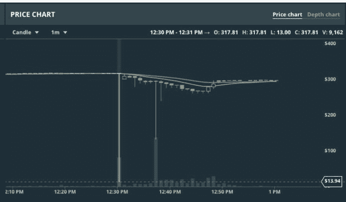

# 比特币基地正在赔偿以太坊闪电崩盘造成的损失 

> 原文：<https://web.archive.org/web/https://techcrunch.com/2017/06/24/coinbase-is-reimbursing-losses-caused-by-the-ethereum-flash-crash/>

本周早些时候，比特币基地运营的数字货币交易所 GDAX 的美元以太坊市场遭遇了闪电崩盘。

几秒钟之内，ETH 的价格从 320 美元暴跌至 0.10 美元。虽然价格迅速回升，但快速的价格波动导致许多交易者遭遇保证金追缴或止损单，导致潜在的严重损失。

虽然许多人最初认为闪电崩盘是邪恶工作的结果，但 GDAX 最终证实，没有任何不当行为或账户被接管的迹象。

相反，闪电崩盘是有人以市场价下数百万美元卖单的结果，这意味着无论出价者目前提供什么价格，ETH 都会转手，直到整个订单被完成——无论价格比 ETH 的当前价格低多少。

完成这一订单导致 ETH 价格立即下跌 30%至 224 美元，这又导致 800 个止损订单和保证金清算，这进一步推动价格下跌，低至 0.10 美元。

通常情况下，下大单的人会在一段时间内平仓，以尽量减少价格下跌的影响。此外，GDAX 提醒即将发起大额卖单的用户，这将导致市场滑点，这意味着这个交易者很可能不在乎(或不理解)他的交易会推动市场。

对于任何不熟悉交易和交易所的人来说，止损单是当价格下降到一定水平时卖出股票(或加密货币)的订单。这基本上是用来减少你的损失的。

此外，保证金融资平仓是指你借入资金做多，并押注某项资产的价格会上涨，如果价格反而下跌，你的头寸可能会自动平仓，以偿还借钱给你做多的一方。这两种类型的交易都需要出售资产，这进一步压低了价格。

最初 GDAX 表示，他们将尊重所有这些订单，因为交易是合法的，符合他们的交易规则。

然而，昨天他们[宣布，交易所将使用公司资金来补偿因执行追加保证金通知或止损指令而遭受损失的客户](https://web.archive.org/web/20221205192433/https://blog.gdax.com/eth-usd-trading-update-2-216a3b946ef6)。

> “由于 2017 年 6 月 21 日太平洋时间下午 12:30 价格快速波动的直接结果，我们将建立一个流程，向经历了 GDAX ETH-USD 订单簿上执行的保证金追缴或止损订单的客户账户贷记。这一过程将允许受影响的客户将其 ETH-USD 账户的价值恢复到价格快速波动前的同等价值。”–GDAX

值得注意的是，不会撤销任何交易，这意味着如果你足够幸运，在闪电暴跌期间以低价买入 ETH，该交易将被兑现。

这与其说是承认任何错误，不如说是善意的表示。GDAX 交易所的表现正如其预期的那样——就像纽约证券交易所这样的市场在接到相应规模的市场卖单时的运作方式一样。

如果有什么不同的话，这应该是对交易员的一个提醒，即保证金交易的风险有多大，加密货币市场可能和其他股票市场一样无情(有时甚至更无情)。