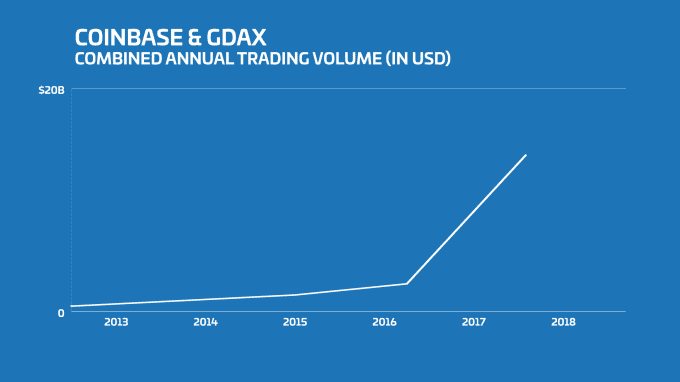

# 比特币基地以 16 亿美元的估值融资 1 亿美元

> 原文：<https://web.archive.org/web/https://techcrunch.com/2017/08/10/coinbase-raises-100m-at-a-1-6b-valuation-amid-explosive-growth/>

# 比特币基地以 16 亿美元的估值融资 1 亿美元

比特币基地度过了相当疯狂的六个月。

这可能很难记住，但在 2017 年初，加密货币世界是一个不同的地方。比特币每枚不到 1000 美元，所有加密货币的[总市值比现在少 7 倍左右](https://web.archive.org/web/20230403082534/https://coinmarketcap.com/)。自那以后，市场大幅上涨。作为当今可以说是最成熟的钱包和兑换服务，比特币基地在正确的时间出现在了正确的地方，利用了这个行业的兴奋。

因此，为了支持这种增长，比特币基地已经筹集了 1 亿美元的 D 轮融资，由 IVP 牵头，参与方包括 Spark Capital、Greylock Partners、Battery Ventures、Section 32 和 Draper Associates。这笔资金使这家数字货币初创公司的融资后估值达到 16 亿美元。

虽然比特币基地之前总共融资[1.06 亿美元，](https://web.archive.org/web/20230403082534/https://www.crunchbase.com/organization/coinbase)但距离他们上一次融资已经过去两年半了——那是他们在 2015 年初[7500 万美元的 C 轮融资](https://web.archive.org/web/20230403082534/https://techcrunch.com/2015/01/20/coinbase-confirms-75m-raise-from-dfj-nyse-strategic-banking-partners/)。但等待似乎得到了回报，因为最近的增长让这家初创公司的估值从 2015 年传言的 5 亿美元增加了近两倍，达到 16 亿美元。

那么，这种增长究竟有多迅猛呢？

仅在 2017 年上半年，比特币基地就促成了近 150 亿美元的数字货币交易，是 2016 年全年的 5 倍多。按照这个速度，从 2016 年全年到 2017 年全年，该初创公司的交易量可能会增长 10 倍。下图有助于正确看待这一增长。

同样在这六个月期间，这家初创公司的新客户注册平台的数量也增加了[4 倍。](https://web.archive.org/web/20230403082534/https://blog.coinbase.com/improving-customer-support-139d99e72876)

当然，伴随疯狂增长而来的是成长的烦恼。

过去几个月，该交易所[经历了一些停机时间](https://web.archive.org/web/20230403082534/https://techcrunch.com/2017/05/25/coinbase-outage-unprecedented-bitcoin-interest/)，他们将其归因于与“前所未有的交易量”相关的性能下降。客户服务响应时间也是一个大问题，但[公司已经认识到这一点](https://web.archive.org/web/20230403082534/https://blog.coinbase.com/improving-customer-support-139d99e72876)，并正在努力在 2017 年第三季度之前将响应时间降至 6 小时以下，并在第四季度之前为至少一定比例的客户群提供电话支持。他们还表示，部分新资金将用于支持扩大客户支持和工程团队。

当然也有很多好处。交易所[在 2016 年增加了对以太坊](https://web.archive.org/web/20230403082534/https://techcrunch.com/2016/07/21/coinbase-is-adding-support-for-ethereum/)的支持，在 2017 年增加了对[莱特币的支持，并公开表示他们希望在未来增加更多的加密货币。在产品方面，](https://web.archive.org/web/20230403082534/https://techcrunch.com/2017/05/03/coinbase-adds-support-for-litecoin/) [GDAX 最近增加了保证金交易](https://web.archive.org/web/20230403082534/https://techcrunch.com/2017/03/21/coinbase-has-added-margin-trading-to-its-bitcoin-exchange/)来吸引专业交易员，比特币基地正计划在纽约市开设一个 GDAX 办事处，继续与机构和专业交易员建立关系。

那么，比特币基地的下一步是什么？除了预期目标——如改善客户支持，并在市场支持时添加新的加密货币，比特币基地的联合创始人兼首席执行官 Brian Armstrong 暗示，他认为该公司[开始过渡到其“总体计划”](https://web.archive.org/web/20230403082534/https://blog.coinbase.com/the-coinbase-secret-master-plan-f4d644443301)的第三阶段——该计划被描述为为数字货币应用程序建立一个消费者界面，可能覆盖 1 亿人。

他是对的——未来一年左右将决定加密货币是否会在帮助普通消费者获得加密货币的技术的帮助下成为主流，或者仍然是技术和金融社区中的一个相对利基。