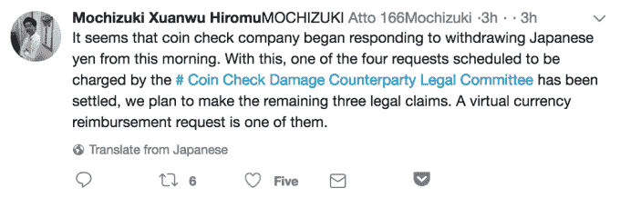

# Coincheck 用户提起诉讼，要求从遭到黑客攻击的加密货币交易所 TechCrunch 取回他们的钱

> 原文：<https://web.archive.org/web/https://techcrunch.com/2018/02/12/coincheck-hack-lawsuit-nem-cryptocurrency/>

# Coincheck 用户正在起诉，要求从被黑的加密货币交易所取回他们的钱

今年迄今为止最大的加密货币黑客攻击的余波仍在继续。周一，[路透社](https://web.archive.org/web/20221130220839/https://www.reuters.com/article/us-japan-cryptocurrency-regulation/coincheck-heist-sheds-light-on-japans-rush-to-create-cryptocurrency-rules-idUSKBN1FW04F)报道称，使用东京交易所 Coincheck 的 10 名交易员准备在周四向东京地方法院提起诉讼。原告将由 Hiromu Mochizuki 代表，他一直在[推特](https://web.archive.org/web/20221130220839/https://twitter.com/166mochizuki?lang=en)上发布一些案件的最新消息。

在最近价值 5.3 亿美元的 NEM 代币被黑事件发生后，Coincheck 冻结了其平台上的交易，并在此过程中扣押了大量虚拟财富。目前的诉讼要求 Coincheck 让原告撤回他们的虚拟货币，以便将它们从平台上移除，并将硬币转移到外部钱包。路透社报道称，该组织可能会在 2 月晚些时候就与黑客攻击相关的损失提起后续诉讼。

日元支票提款在 1 月 27 日被冻结。上周，Coincheck [表示](https://web.archive.org/web/20221130220839/http://corporate.coincheck.com/2018/01/31/36.html)将在“[完成]外部专家合作下的技术安全确认”后，恢复撤回日元。

在 1 月下旬宣布损失 5 亿 NEM 代币后，Coincheck 概述了其对受影响客户的“[赔款](https://web.archive.org/web/20221130220839/http://corporate.coincheck.com/2018/01/31/36.html)”计划。

在这些计划中，Coincheck 发誓要“找到漏洞的根本原因，保护我们的客户，并采取更有效的系统风险管理措施，防止未来发生类似事件。”