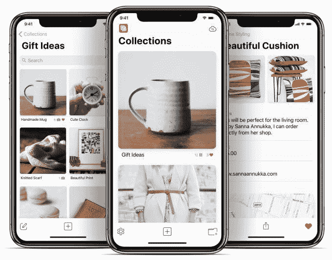
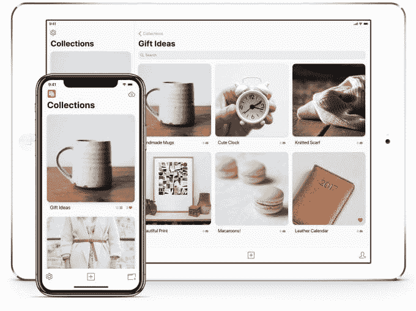

# 收藏是一种更好的方式，可以将您拍摄的照片整理成记忆笔记 

> 原文：<https://web.archive.org/web/https://techcrunch.com/2018/05/25/collections-is-a-better-way-to-organize-those-photos-you-snap-as-mental-notes/>

你路由器上的 Wi-Fi 密码贴纸？*打响*。商店橱窗里的可爱毛衣？*恶声恶气。*聚会邀请？*恶声恶气。*送给妈妈的酷礼物？*猛咬。*如果这些听起来对你来说很熟悉，那么你可能还会用你的 iPhone 相机来拍摄你想记住的东西——甚至可能比你用笔记来记东西更频繁。如果你的大脑笔记本质上更加视觉化，那么你可能想要尝试一下新的应用程序[集合](https://web.archive.org/web/20221209141045/https://www.collectionsapp.co.uk/)，而不是仅仅依赖于你的相机胶卷。

我知道，我知道……可视化书签不是已经被 Pinterest 处理了吗？

好吧，好吧，当然。你可以走那条路。

但是用 Pinterest 感觉很沉重。有大量的图片可供探索和搜索。一个新东西的家庭饲料看。(为什么 Pinterest 要给我看蜘蛛纹身？为什么？).跟随的人。要检查的通知源。(在那里我可以给人们回信，比如，“嗨，你发错信息了，莎拉·佩雷斯。我不认识你。”唉，太频繁了。愚蠢的普通名字。)

[收藏](https://web.archive.org/web/20221209141045/https://www.collectionsapp.co.uk/)只是一个供你使用的小 app。

不是过度紧张。它简单的界面只是帮助你更好地组织那些你拍摄的照片，以获得灵感、想法、心理笔记或任何其他你可能需要参考的东西——比如你喜欢的衣服、你路过并想稍后尝试的餐馆、艺术或设计想法、你的狗的最佳照片、你想去的活动、截图、礼物想法、旅行灵感或你能想到的任何其他东西。

但与将这些东西保存到相机胶卷中不同，在那里它们会很快消失在照片中，收藏让你写下小细节——比如供应商或价格，或者你的笔记。例如，*“送给妈妈的伟大礼物。店主说它还有蓝色的。两周内有一次夏季大甩卖。”*

虽然你的收藏主要是为你自己准备的，但如果你想分享它们，你可以使用 iCloud 来做到这一点——朋友和家人不必注册新的服务来查看你的分享，只需下载应用程序。如果您愿意，您还可以将它们分享到社交媒体、iMessage、电子邮件、信息应用程序和其他地方。

如果您更喜欢保留您的精选，您可以在设置过程中关闭 iCloud 同步，以便仅将它们存储到本地储存。

在 iPad 上，该应用程序甚至更好，因为它支持拖放——这意味着你可以将其他应用程序中的图像拖到你的收藏中。

这款应用是由两位独立开发者 Emile Bennett 和 Dave Roberts 团队设计的，他们分别位于法国的夏蒙尼和英国的利物浦。班尼特此前推出了一款名为[便士](https://web.archive.org/web/20221209141045/https://www.getpennies.com/)的预算应用，但他建立了收藏库，因为这是他自己想要的东西。

“我经常发现自己在服装店只是‘浏览橱窗’。我会找一件衬衫，或者一双鞋，或者另一件价格过高的 GoreTex 户外夹克——我有点喜欢它们……我有太多了！–我想“是的，我喜欢这个，但我现在不打算买，我会改天再买，”他告诉 TechCrunch。

“所以我会拍一些照片，比如物品、标签，可能是我穿着它，也可能是店面，这样我就能记得它在哪里。我总是想‘它在我的照片流里，我以后会记得的。’但是，当然，这不会发生，因为照片只是在你的信息流中消失了，即使我找到并记住了这些照片，它们周围也没有上下文，”他说。

他尝试用 Evernote 和 Notes 来跟踪这些东西，但发现 Evernote 太臃肿，Notes 太以文本为中心。他还觉得 Pinterest 太专注于发现和公共分享，而不是用来收集你自己的私人灵感。

在我看来，收藏最大的好处之一就是*无需注册。*激进的想法，对吗？班尼特也厌倦了。

“我真的热衷于不强迫人们注册我的应用程序——我希望你的数据是你的，我不希望你为了使用这个应用程序而不得不注册一个新的服务，”他说。“我想这些天我们都有点‘注册疲劳’了。大多数应用这样做是因为这是他们赚钱的方式——他们免费给你应用，让你注册使用它，收集你的数据，然后用这些数据赚钱。贝内特说:“这真的违背了我的精神。

相反，收藏是 2.99 美元的下载。

嘿，人们，这是我们应该鼓励的那种应用程序开发。

Bennett 给了我一些促销代码，让我和朋友们一起试用这个应用程序，但我忘记了这一点，并购买了它。

所以给你，先到先得:

M77J6T7WLHWJ

N3X9APPT9THE

KNJMTXMY6FFJ

TRT4E77MTR4H

*促销代码只是免费下载。这不是一个赚钱的计划，愤世嫉俗者。这里没人能拿到钱。我只是喜欢这个应用程序，并认为我应该分享。周末愉快。*