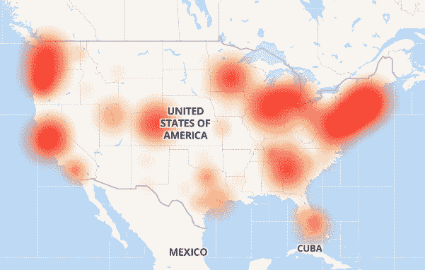
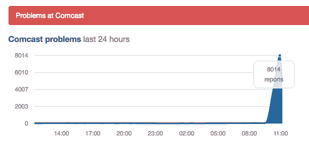

# 康卡斯特(Comcast)的 Xfinity 互联网服务(和其他服务)今天早上似乎在全国范围内有点崩溃

> 原文：<https://web.archive.org/web/https://techcrunch.com/2017/11/06/comcast-xfinity-slow-outage/>

# 康卡斯特(Comcast)的 Xfinity 互联网服务(以及其他服务)今天早上似乎在全国范围内有点中断

今早和康卡斯特有矛盾吗？你并不孤单。

就在太平洋时间上午 10 点左右，我们开始看到来自东西海岸的报道，说互联网突然变慢并停止了。某些网站加载正常，但绝大多数(从 Reddit 到脸书到 TechCrunch)只是超时了。更深入的研究表明，许多报告问题的人都使用了康卡斯特的 Xfinity 服务。

[Down Detector](https://web.archive.org/web/20230307142248/http://downdetector.com/status/comcast-xfinity/map/) 的用户生成的断电地图显示了全国各地亮起的报告

同一网站显示，太平洋时间上午 10 点过后，报告数量激增。

Down Detector 在第 3 级(一级或“回程”提供商之一)的[报告中也显示了类似的峰值。如果他们有问题，这将波及到许多其他互联网服务提供商，包括康卡斯特。](https://web.archive.org/web/20230307142248/http://downdetector.com/status/level3)

康卡斯特在其客户服务账户上承认了这一问题，称“一些”客户遇到了问题，但没有给出任何关于发生了什么或何时修复的任何信息。

换句话说:现在还不要麻烦重置你的路由器。似乎不是那些问题中的一个。

**更新:**

康卡斯特表示，这是一个“外部网络”的问题，他们仍在调查。

**更新#2:**

截至太平洋时间下午 12:40，康卡斯特表示，这些问题现在应该得到解决。

Level3 还发给我以下声明，将中断归咎于“配置错误”:

> 11 月 6 日星期一，我们的网络经历了一次服务中断，影响了一些使用 IP 服务的客户。中断是由配置错误引起的。我们知道这些服务对我们的客户有多重要。我们的技术人员能够在大约 90 分钟内恢复服务。