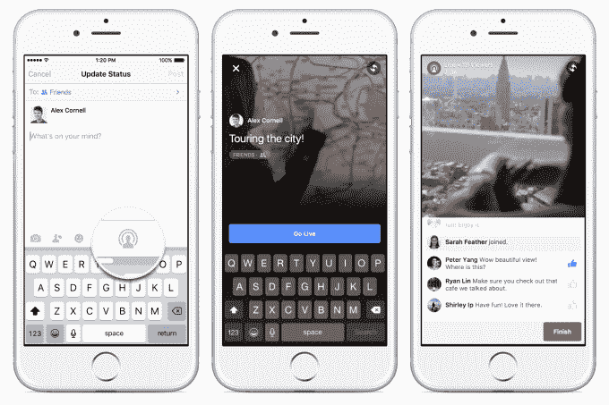

# 脸书挑战 Periscope，向所有美国 iPhoners 用户提供直播

> 原文：<https://web.archive.org/web/https://techcrunch.com/2016/01/28/comfortable-ephemerality-vs-reach/>

准备好迎接直播大对决吧。最后，我们将看到谁的方法获胜:Twitter 和 Periscope 有一个单独的应用程序和只能观看 24 小时的重播，或者脸书直播将其功能集成到流行的社交网络中，并允许重播永久直播。

经过 5 个月的调整和缓慢推出，今天[脸书向美国所有 iPhone 用户开放其 Live 功能](https://web.archive.org/web/20230404061405/http://newsroom.fb.com/news/2016/01/expanding-live-video/)。当他们分享状态更新时，他们会在照片、贴纸和位置按钮旁边看到 Live 按钮。Android 还在路上。

脸书从名人开始，然后通过其提及应用程序向记者和公众人物开放直播，然后引入验证页面，现在终于装备了所有美国 iPhone 用户。

你会注意到我们不再谈论猫鼬了。没有一个主要的支持平台，Meerkat 被排除在主流之外。

问题是，潜望镜的被迫短暂性是否会让人们更舒服，更不自觉地广播，更迫切地被迫观看溪流。另一方面，脸书更大的观众群和永久重播可能会说服大名人在那里做他们的流媒体，因为他们可能会立即和随着时间的推移获得更多的浏览量。

从右起:脸书现场，潜望镜，和猫鼬

通知是另一个很大的区别。Periscope 将它们发送给所有 Periscope 联系人，这通常意味着您导入的 Twitter 关注图。脸书更保守一点，只给你的密友或最近与某个名人或页面有过互动的人发送通知。

最后，还有如何找到溪流。Twitter 的实时反馈显示潜望镜现在在线播放，这意味着在它们启动时很容易找到它们。但如果一个视频流拖得太久，它的 URL 可能会被推下 feed，并需要观众重新分享才能被发现。

对于实时突发新闻流来说，脸书的过滤订阅可能更糟糕，而重新分享在那里并不是一件大事。但是如果一个视频流有很多观众和反馈，脸书可以自动把它放在更高的位置，这样它就更容易被看到。基本上，Twitter 依赖于观众的明确放大，而脸书的算法选择谁看到什么流。

但最终，移动直播的战争将不再是直接的竞争，而是谁能说服从未尝试过的庞大主流人群跳到镜头前。