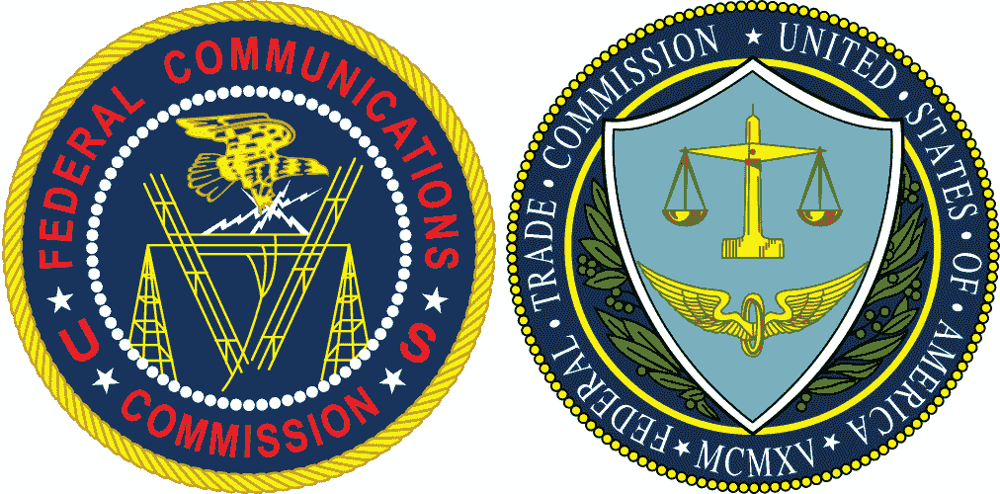
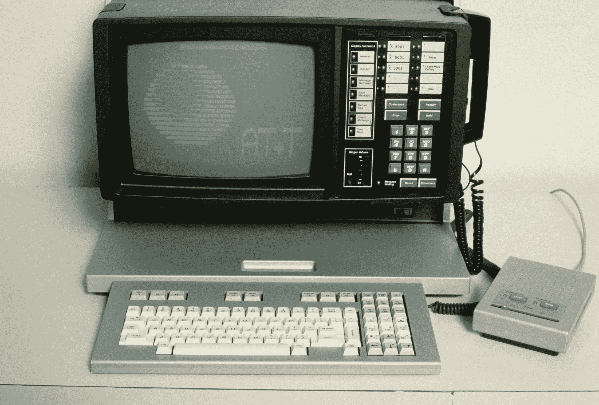
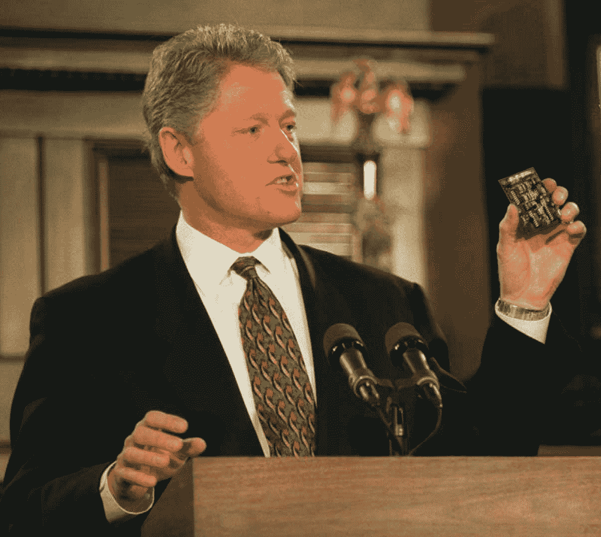
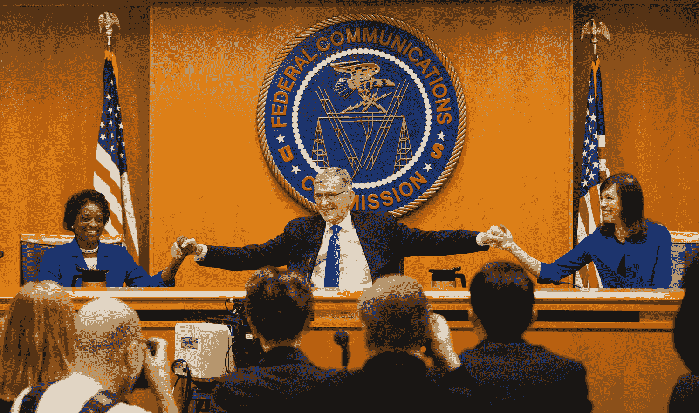

# 不可能的委员会:联邦通信委员会如何和为什么创造网络中立

> 原文：<https://web.archive.org/web/https://techcrunch.com/2017/05/30/commission-impossible-how-and-why-the-fcc-created-net-neutrality/>

网络中立被许多人视为美国科技政策中的一个亮点，而它的敌人受到了最严厉的蔑视。许多人会问，除了出于无知、贪婪或两者兼而有之，怎么会有人反对这样一个简单、常识性的措施？

事实上，我们今天看到的演习是一场复杂的争端之舞的一部分，这场争端已经持续了相当长的时间——比你想象的要长。尽管如此，对于整个互联网来说，我们已经到达了一个临界点，而占据力量平衡支点的是两个机构:联邦通信委员会和美国联邦贸易委员会。这些组织在幕后辛勤工作了几十年后，变得如此有效和平庸，突然成为一场冲突的前沿，这场冲突可能会改变数字时代首要工具的性质。

为了理解今天的互联网发生了什么，以及我们如何在未来保持它的自由和开放，我们必须参考它的过去。

然而，很难在一个单一的叙述线索中，用最少的法律和技术术语找到过去。这就是我试图用这个系列创造的东西，*不可能的任务*。你坐得舒服吗？那我们开始吧。

## 第一部分:两个委员会的故事

作为一个简短的介绍，让我们把这两个机构放在一起，观察它们不同但互补的使命。

 **正如你可能猜到的，FCC** 与通信有关。它成立于 1934 年，旨在确保消费者能够公平合理地使用从电报到(显然是后来的)高速互联网的一切东西。它的管辖范围是传输中的信息，有权决定无线电台或 Wi-Fi 路由器应该使用什么频率，或者传输数字电视信号的标准。(它作为媒体审查者的角色是一个时代错误，谢天谢地，与我们的目的无关。)

另一方面，美国联邦贸易委员会(FTC)则完全致力于这项贸易。它的使命是让雄心勃勃和肆无忌惮的公司保持一致，在高层次上完成反垄断和合并调查，在低层次上完成欺诈性广告或身份盗窃，或在 Instagram 上不当披露[赞助的个案。正是这个机构阻止强大的公司把消费者当作猎物。(它的有效性可能是一个见仁见智的问题，但请相信:我们有了联邦贸易委员会总比没有好。)](https://web.archive.org/web/20221226082731/https://techcrunch.com/2017/04/20/ftc-tells-influencers-to-quit-trying-to-hide-the-fact-that-theyre-shilling-for-brands/)

在这一点上，另一个值得注意的区别是，联邦通信委员会制定了指导方针，主动地塑造它所监管的行业的行为。另一方面，联邦贸易委员会是一个反应性的机构:不良行为会引起它的注意，它会追踪并惩罚肇事者。

他们都有自己的位置；想象一下在路上画车道和开超速罚单的区别。

有了这些预备知识，让我们开始吧。很久以前，在一个遥远的监管环境中…

## 电脑查询

我们从一个重要的案例开始。联邦通信委员会正在调查一种情况，即一家运营商向客户提供通信服务，但同时利用这一机会限制客户使用其家庭连接可以做的事情，并推进其自身的数据服务，这些服务本质上超出了基本服务。熟悉的情况。

联邦通信委员会得出的结论是，基本上有两种服务可供选择。一、**将数据从客户选择的一个地方移动到另一个地方**，二、**为该数据提供处理或存储服务**。联邦通信委员会宣称，前者是一种*电信服务*，而后者是一种*信息服务*(你会经常看到这些术语)。这些东西受到不同的监管，因此提供两者的公司必须保持“最大限度的分离”以避免冲突。

听起来像是几年前的康卡斯特，对吗？事实上，这是在 1966 年——标志着联邦通信委员会早期试图解析当时混乱和快速发展的行业的几个“计算机调查”中的第一个。该公司是美国电话电报公司，其公认的垄断当时受到联邦贸易委员会的监督。

一种美国电话电报公司计算机电话系统，类似于那些与计算机查询有关的系统。

这个案子可能已经很久了，但是调查中的问题在今天仍然适用:

> 公共运输公司提供的服务以及它们的收费和做法是否跟上了数字技术的快速发展？计算机行业的需求和要求与通信技术和费率及惯例之间是否存在差距？
> 
> ……有可能以与提供通信和数据处理服务相关的费用混合的形式出现滥用，这可能会引起上文讨论的交叉补贴问题以及受管制和不受管制服务定价中的其他不公平竞争做法。

这是将持续几十年的管辖权谈判的开始——直到今天仍在如火如荼地进行。

电信业的规模和复杂性确保了这两个机构经常接触，正是为了解决 1966 年计算机调查中提出的问题。美国电话电报公司的商业策略是否侵犯了其电信服务的公平性，因而(或许)值得 FCC 的审查？或者反过来说，它在电信市场的主导地位仅仅是一个发动这些不公平策略的平台，从而成为联邦贸易委员会的目标？

> 信息服务和电信服务之间的这种曾经模糊的区别，以及由此产生的职责分工，是今天冲突的核心。

当时(经过一段时间的谈判)，答案是两者都有一点。当它作为电信服务提供商(一种“公共运营商”，我们稍后会谈到这个术语)时，人们希望美国电话电报公司遵守 FCC 的规则，而当它作为信息服务提供商时，它必须符合 FTC 的标准。一条试探性的、有点模糊的线，但仍然是一条线；毕竟，如果两者都不符合，它就逃脱了任何一个监管机构的监管。如果两者兼而有之，那当然意味着更多的文书工作，但消费者更安全。

*信息*服务和*电信*服务之间的这种曾经模糊的区别，以及由此产生的职责分工，是今天冲突的核心——尽管，正如我们将看到的，这种冲突已经发展到足以成为更广泛的党派政治战争中的一场代理战。

现在让我们跳到更近的过去:就在世纪之交之前。互联网和网络正处于一个过渡时期——至少比平常要多。

## 大危机

90 年代见证了美国在线、CompuServe 和 Prodigy 等公司的诞生。这些公司体现了早期的互联网:聊天室、电子邮件和新闻由一家私人公司管理和运营。

> 随着千禧年的临近，那堵墙上的裂缝开始蔓延。

你拨通了一条电话线(一旦妈妈、爸爸或姐姐挂断电话)，在一阵震耳欲聋的噪音之后，你进入了我们现在称之为有围墙的内容花园，或许还有一点真正的网络。在很大程度上，电信服务和信息服务之间有一道厚厚的墙:你从一家公司获得电话线，从另一家公司获得数据。

但是随着千禧年的临近，那堵墙的裂缝开始蔓延。有线电视变得越来越普遍，有线电视提供商发现了一些奇妙的东西——你可以通过这些电缆发送*数据*！所以他们决定进入互联网连接业务。从墙的另一边感觉到这种融合的电信公司，也想提供宽带和内容服务。

为了刺激创新和促进竞争，1996 年通过了电信法案，目的是让几乎任何公司都可以进入通信业务的任何方面。

克林顿总统在讨论 1996 年电信法案时手持的 V-Chip 自动内容监视器应该能告诉你当时的情况有多么不同。

你可以想象，这个行业的故事从此只会变得更加复杂。它还介绍了一些你可能见过的重要术语:标题 I、标题 II 和公共承运人。我故意避免使用这些，因为对于我已经说过的事情来说，它们是一种多余的法律术语。现在，你可以认为信息服务属于第一类，电信服务属于第二类，即所谓的公共运营商。

不过，不要太担心这个:不管我们怎么称呼它，移动数据和提供或修改数据仍然是关键的区别。一旦你确定了这一点，正确的机构只是做好自己的工作，执行适当的规则。

不幸的是，1996 年预想的竞争加剧并没有真正发生。相反(虽然不一定是因为该法案)，我们看到连通性和媒体公司相互吞噬，形成了像美国在线时代华纳和康卡斯特 NBC 环球这样的大型企业集团。

宽带服务也变得越来越普遍，类似于 1966 年解决的冲突突然出现。举例来说，如果康卡斯特为你提供宽带等连接服务、电子邮件等信息服务以及电视服务，情况会怎样？较小的互联网服务提供商认为，如果电缆是电信基础设施(他们认为是，有线电视公司发誓不是)，他们应该有权使用其中的某些物理部分，就像法律要求其他电信杆和设施一样。

如果该公司开始掷骰子，联邦贸易委员会是否会介入纠正康卡斯特的商业行为，或者联邦通信委员会是否会处理其传输行为？

> 如果康卡斯特为你提供连接服务，如宽带，信息服务，如电子邮件，但也有电视服务？

联邦通信委员会在 2002 年提出了这个问题，并做出决定，根据 1934 年和 1996 年法案的措辞，有线互联网仍然是一种信息服务，因此不在其管辖范围内——不像 DSL，它仍然被归类为电信。

有些人对此不以为然，于是他们提起了诉讼。一家法院驳回了联邦通信委员会的决定，认为有线互联网显然既是电信服务又是信息服务。

但是这个案子到了最高法院，最高法院在 2005 年推翻了那个判决，发现联邦通信委员会的分类是对法律的合理解释——如果不是唯一的解释的话。困惑了吗？这是历史上重要的一点，所以让我们再深入一点。

最高法院的裁决被称为“X 品牌”(把这个名字想象成一个公司的“无名氏”)，它巩固了宽带作为信息服务的地位——但有两个主要的警告。

首先，法院没有决定任何法律*是这样定义*宽带的，而是法律*授权*FCC 来定义它。因此，法院遵从机构及其选择。

其次，不提及斯卡利亚大法官的异议是不可能进行下去的。他认为，在联邦通信委员会的决定明显错误的情况下，顺从它是荒谬的；对任何不是不诚实的律师的人来说，有线网络显然是一种电信服务。他用比萨饼店的比喻来说明这一点。

> 在翻译了所有的监管术语，驱散了机构专业知识的烟雾之后，仍然十分清楚的是，销售电缆调制解调器服务的人是在“提供”电信服务。斯卡利亚大法官

你打电话给一家比萨饼店，问他们是否送货上门。他们说“不，但是我们确实把比萨饼送到你家。”你说，好吧，所以你

*do*

交付。但比萨店的说法——以及联邦通信委员会的说法，据斯卡利亚称——相当于“不，即使我们把比萨送到你家，我们实际上并没有‘提供’送货上门服务，因为我们为最终用户提供的送货服务是我们比萨店比萨上门服务的‘重要组成部分’,也是‘它的其他功能的组成部分’”"

不是很有说服力，对吧？斯卡利亚同意你的观点。

“任何一个理性的顾客都会在那个时候断定，他的对话者要么是疯了，要么是听从了一些过于聪明的法律建议，”他写道。“在翻译了所有的监管术语，驱散了机构专业知识的烟雾之后，仍然非常清楚的是，销售电缆调制解调器服务的人是在‘提供’电信服务。”

斯卡利亚说得很有道理，尽管他是少数意见，但这是将宽带互联网归类为电信服务的有力论据——我们将再次看到这一点。

## 尊重我的附属权力

很复杂，对吧？有一天这个行业想要这个，而另一个行业想要那个，然后他们交换位置。一天一个法官这么说，另一天另一个法官这么说，然后第二年就反过来了。

我包括了所有这些东西，所以你可以看到有多少来回，但不要太陷入细节。当你缩小一点时，它实际上只是在争论当一些可疑的事情发生时，联邦通信委员会或联邦贸易委员会是否必须介入。经验法则是这样的:行业总是游说那些给他们带来最少麻烦的选择。

> 经验法则是，行业总是游说给他们带来最少麻烦的监管者。

无论如何，联邦通信委员会对宽带作为一种信息服务还是满意的，因为它觉得《通信法》的第一章给了它一个

*little*

如果“鼓励宽带部署，保护和促进公共互联网的开放性和互联性”，信息服务的权力因此，即使一家公司通常不属于联邦通信委员会的业务范围，他们也可以行使这种“辅助权力”(与法律中明确规定的“法定权力”相对)来接触它——据推测。

不是过了几年，这种力量才真正得到考验。联邦通信委员会在 2007 年告诉康卡斯特停止限制 BitTorrent 流量，康卡斯特将他们告上法庭，说嘿，你不监管我们。信不信由你，这个案子花了*三年*才解决。2010 年，法院基本上告诉联邦通信委员会[其所谓的附属权力是扯淡](https://web.archive.org/web/20221226082731/https://techcrunch.com/2010/04/06/federal-court-tells-fcc-it-does-not-have-authority-to-enforce-net-neutrality/)。

法院说，如果你没有一部适当的法律规定你可以监管信息服务，你就不能仅仅适用一部你认为足够接近的法律。这基本上免除了宽带公司的监管，联邦通信委员会为了省事而选择不考虑电信公司。联邦通信委员会玩了自己。

现在，你可能还记得 2007 年到 2010 年间发生了很多事情。移动和有线宽带继续爆炸式增长，智能手机正在改变消费者格局，新总统上任，带来了新的 FCC 专员和一系列新的优先事项。

这些优先事项包括扩大宽带接入和创建某种网络中立框架，这已经讨论了十年，甚至在国会提出，但还没有人坚持。不幸的是，康卡斯特的案子让联邦通信委员会束手束脚，不过还好。

## 良性循环

现在，有一段时间，联邦通信委员会考虑采取 L，退居幕后，只是让联邦贸易委员会做自己的事情。他们与另一个委员会没有过节，只是在一些边缘案件上偶尔发生口角。但是放手有一个大问题。不是说联邦贸易委员会不打算做它的工作，而是它不打算做*需要做的工作*:建立强有力的、*积极主动的*网络中立规则。

> 联邦贸易委员会的工作做得很好，只是这不是需要做的工作。

新任主席朱利叶斯·格纳考斯基有两个选择。一个是将宽带重新归类为电信，但他担心这会扰乱秩序，这是理所当然的。尽管如此，它还是摆在桌面上。

最终，他采取了一种更温和的方法，即电信法案中的第 706 条，该条款呼吁 FCC 采取行动鼓励及时部署宽带。他的论点是，良好商业行为和消费者信任的“良性循环”将推动需求并增加采用，而强大的网络中立规则将促进这一循环。让我们现在就承认这是一个相当大的延伸——这就像说，因为你有责任保持街道清洁，所以你应该成为更好的市长。

很少有人对这个提议感到满意。行业游说者表示，这些规定太过强硬，倡导团体表示它们不够强硬，最终，在 2014 年，法院表示这是没有意义的，因为他们没有权力，因为宽带提供商，根据 FCC 自己的承认，不是电信服务。(不过，它确实支持了有关透明度要求的部分规定；一个微小但意义重大的胜利。)

这是网络中立规则的又一次挫折，因为这是另一个被发现缺乏的法定权威来源。

大约在这个时候，三种影响走到了一起。

首先，联邦通信委员会又有了一位新主席，汤姆·惠勒。惠勒曾是有线和无线行业协会的负责人，他被指控是电信行业的工厂——尽管这些指控最终会非常离谱。

2015 年，联邦通信委员会主席汤姆·惠勒在 Disrupt。

其次，2014 年对民主党来说是糟糕的一年:他们在中期选举中损失惨重，他们需要一场胜利。

第三，奥巴马总统正在努力思考他的遗产——大的东西，而不是所有那些受益于许多人但很少人记得的吃力不讨好的小法律和法令。他有 ACA(尽管它可能很快就会被废除，但它设置了很难降低的门槛)，他有一些好的民权材料，但他真正需要的是对互联网持久的东西。网络中立是显而易见的选择——如果我们诚实的话，他在几年前就承诺要做到这一点，但从来没有时间去做。因此，他的政府着手研究如何完成这项工作，并且做得正确。

在这一点上，你会听到“影子 FCC”开始在行政部门内部形成自己的网络中立规则——这可能至少在一定程度上是正确的:时间紧迫，政府需要提出理由，并将其完全成型。FCC 是一个独立的机构，没有义务接受白宫提出的任何计划——但是如果计划是好的，为什么不合作呢？

毫无疑问，这个计划是好的。非常好。这个行业过去和现在对这一切如此愤怒的部分原因是这个计划有多好。

## 转变是公平竞争

2015 年 2 月，联邦通信委员会发布了开放互联网令，我们现在知道，该令确立了网络中立。批评者称之为史无前例的夺权——他们说对了一半。这是一场夺权，好吧。但史无前例是完全错误的词来形容它。

首先，FCC 指出，与一些行业喜欢宣称的相反，它很久以前就打破了将“电信”分类应用于互联网接入的封印。那要追溯到 1966 年，那起案件及其后续案件中确立的定义仍在发挥作用。事实上，直到 2005 年，DSL 仍然被认为是电信，一些提供商努力保持这种方式！

然后，委员会提出了他们是如何自愿将宽带接入归类为信息服务而不是电信服务的。该命令指出，2005 年，最高法院明确表示，无论如何他们都将遵从联邦通信委员会的分类决定，因为成文法律允许两种解释。所以，联邦通信委员会继续说，最高法院说这取决于我们，这个决定仍然有效。当时我们说这是一项信息服务。时代变了，我们的思想也变了。现在我们说是电信。

不喜欢那个决定？也许你还记得斯卡利亚的异议。他说宽带显然是电信服务中的*，这就是它应该被分类的方式。*

 *这是最精彩的部分。因为最高法院已经遵从了联邦通信委员会的意见，他们的决定自动带有这种权威。因为斯卡利亚，没有人可以争辩这种重新分类违背了决议的精神*或*！

然后，联邦通信委员会说，关于康卡斯特的事情和我们试图创造的良性循环。还记得你说过我们需要一部适当的法律，专门赋予我们对宽带提供商的权力吗？因为他们现在是一家电信服务公司，这将是《通信法案》的第二章，也是我们拥有的最强有力的法律。

 在处处受挫后，FCC 凭借最终的司法支持、坚如磐石的立法基础和广泛的历史先例，一举确立了其对互联网提供商的权威——同时，他们也确立了网络中立的基础。

只有一个小问题:2016 年是选举年。

* * *

*这是关于 FCC 和网络中立性系列文章的第一篇。在这里阅读第二部分。*

*