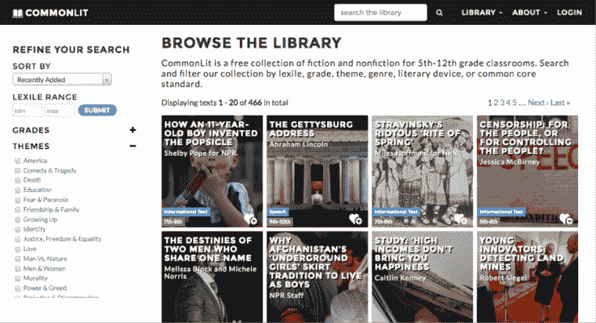

# CommonLit 赢得 390 万美元资助，帮助学生掌握阅读技巧 

> 原文：<https://web.archive.org/web/https://techcrunch.com/2016/10/05/commonlit-scores-a-3-9-million-grant-to-help-students-master-reading-skills-online-for-free/>

一家名为 [CommonLit](https://web.archive.org/web/20221225022341/http://commonlit.org/) 的科技非营利组织获得了教育部 389 万美元的拨款，用于开发软件和内容，帮助学生阅读足够好，以从高中毕业，并在职业生涯或大学中取得成功。

这笔拨款是能源部发起的 2600 万美元倡议的一部分，该倡议旨在支持图书馆和非营利组织采用[创新的扫盲方法](https://web.archive.org/web/20221225022341/http://www2.ed.gov/programs/innovapproaches-literacy/index.html)。

CommonLit 是这样运作的:教育者或家庭可以建立一个账户，给学生一个登录 CommonLit.org 的密码。在那里，学生们得到阅读作业和随堂测验，这些作业和测验随着时间的推移适应他们的阅读水平。

教师可以跟踪班级或个人学习者的进度，给他们的作业评分，并了解他们最大的挑战在哪里。

CommonLit 课程的内容由出版商和作者捐赠，包括小说、非小说和诗歌中的短篇作品或段落。

CommonLit.org 数字图书馆*。*

CommonLit 的撰稿人包括丽塔·达夫、比利·科林斯、谭恩美和加里·索托等个人作者，以及科学与公众学会、NPR 和美国数字公共图书馆等机构。

许多其他教育技术公司为学校和 5 到 12 年级的学生提供工具来发展和测试他们的阅读技能。

承担这一使命的公司包括大型教育出版商，如麦格劳-希尔(McGraw-Hill)，其 Learn Smart 和 Smart Book 计划，Renaissance Learning 的加速阅读器平台，以及风险投资支持的初创公司，如 [Newsela](https://web.archive.org/web/20221225022341/http://newsela.com/) 或 [ActivelyLearn](https://web.archive.org/web/20221225022341/http://www.activelylearn.com/) ，等等。

但 CommonLit 的首席执行官兼创始人米歇尔·布朗(Michelle Brown)表示，common lit 的不同之处在于，它向希望使用它的学校、家庭和学生完全免费提供软件和内容。

CommonLit 允许用户打印材料，这对那些没有足够的电脑或智能手机时间来完成所有在线阅读任务的学生来说至关重要。

据研究美国学校互联网可用性和速度的组织[教育超级高速公路](https://web.archive.org/web/20221225022341/http://educationsuperhighway.com/)称，[美国](https://web.archive.org/web/20221225022341/http://www.educationsuperhighway.org/challenge/)有 2100 万学生无法使用高速互联网。

CommonLit 成立于 2013 年，它还将外联重点放在最需要但财政资源最少的学校，以帮助学生提高阅读能力。显然，像上面列出的那些盈利性公司必须产生利润，所以不能只关注最需要的学校和学生。

当被问及营利性公司是否被视为竞争对手，尤其是那些提供“免费增值”平台的公司——教师或最终用户可以零成本获得一些课程和软件功能——布朗说没有。

她指出，免费增值对许多人来说是一个很好的商业模式，但可能会导致所谓的“数字鸿沟”，低收入学生及其教育发展受到影响，因为他们无法获得从平板电脑和个人电脑到个人应用程序的工具，这些工具相当于富裕学校或社区的同龄人使用的工具。

“我们不想把我们产品中最好的部分放在付费墙后面。我们的目标是开发一种促进高阶读写技能的产品，并使其可以免费使用，以便即使是高需求学校的教师也可以采用它，”布朗说。

布朗报告称，截至 9 月的最后一周，CommonLit 在 12000 多所学校中拥有 22689 名注册的非学生用户，即教师。

布朗说，她打算在未来两年内将拨款用于招聘，将 CommonLit 图书馆的规模扩大近两倍，并为教师开发一年期规划工具，以及一款适用于实行自带设备政策的学校的移动应用程序。

CommonLit 毕业于旧金山的 FFWD.org T4 非营利组织加速器，但总部在华盛顿特区