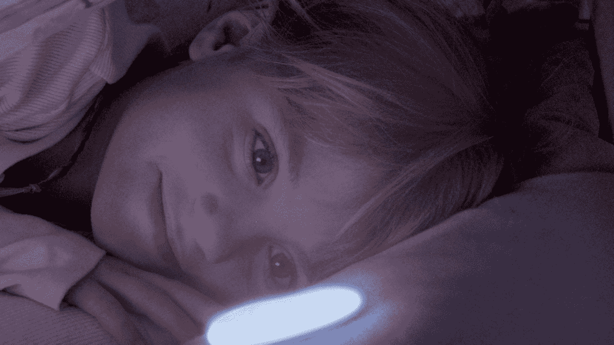

# 通过触摸交流 

> 原文：<https://web.archive.org/web/https://techcrunch.com/2015/03/16/communicating-through-touch/>

More posts by this contributor

**编者按:** *大卫 罗斯是[同上实验室](https://web.archive.org/web/20221006044025/http://ditto.us.com/)的首席执行官，麻省理工学院媒体实验室研究员和被施了魔法的物品[的作者](https://web.archive.org/web/20221006044025/http://www.amazon.com/dp/1476725632/ref=cm_sw_su_dp)。*

三次挤压表示“我爱你”；两次挤压表示“我害怕”这些是我和我 11 岁的女儿分享的特殊语言的例子。我们开发了传递保证、恐惧、惊讶的模式，并“检查那个方向的疯狂装备”拥有一种基于触摸的语言既有用又有趣，再加上它的快速、谨慎和亲密。

触觉学，即触觉的科学，来源于希腊语 haptikos，意思是“能够接触到”基于触摸的界面是我们在麻省理工学院媒体实验室探索的方式之一。

## 麻省理工学院触觉界面原型

在麻省理工学院的有形媒体小组，我们探索人机界面的新材料。一些根据数字输入改变形状和硬度。例如，一群学生刚刚制作了一个汽车门把手的原型，它可以从光滑变成凹凸不平，以避免“撞上”迎面而来的骑自行车的人。

> 采用触摸技术的最大障碍是发明、学习和回忆大量新奇手势的困难。

触觉界面有一些固有的优势:1)它们“读取”非常快；2)它们可以嵌入日常物品和手势中；3)我们的触觉可能是传达人类情感的最佳方式。比如 [LumiTouch](https://web.archive.org/web/20221006044025/http://tangible.media.mit.edu/project/lumitouch/) 看起来就是一个普通的相框，但是当你挤压每一边的时候，它就会向对方的相框发出彩色的光芒。这些颜色可以表示“我在想你”，或者“我生你的气”，或者这对夫妇发明的任何颜色映射。与美国银行合作创造的众所周知的钱包是普通的皮革钱包，当你超出每月预算时，它会变得更难打开。虽然这些例子只是原型，但触觉界面将很快为每个人所用。

## 成双成对的人的亲密装置

我合作过的另一个产品设计师和工程师团队正在创建一个双向触觉界面，它将一些关于触摸界面的想法从实验室带到了人们的生活中。 [Smartstones](https://web.archive.org/web/20221006044025/http://www.smartstones.co/) 外观和手感都像一块光滑的手掌大小的河石。每对石头都允许两个人使用手势、触摸、光和声音建立一个新的、专用的、微妙的交流渠道。

在[魔法物品](https://web.archive.org/web/20221006044025/http://www.enchantedobjects.com/)中，我将未来的物联网世界分为六种超能力，这是我们共享了一千年的驱动力，也是技术试图满足的驱动力。Smartstones 特别试图满足我们心灵感应的愿望——了解另一个人的思想。

交易和佩戴成对的物品是很常见的，比如结婚戒指和友谊手镯。Smartstones 是为相似类型的亲密关系设计的:最好的朋友，父女对，年迈的父母和远程家庭成员和照顾者。

## 触摸最有效地传达情感

我认为采用触摸技术的最大障碍是发明、学习和回忆大量新奇手势的困难。像 Smartstones 这样的公司和 Lumitouch 这样的产品渴望创造一种新的通用非语言，类似于盲人的盲文和聋人的手语。这是一个大胆的野心。我认为，他们最好的策略是交流情感，而不是具体的名词和动词。

在一个经典的感知心理学实验中，几对陌生人被要求单独通过触摸来交流情感。“编码者”被赋予 12 种不同情绪中的一种，然后隔着窗帘触摸“解码者”的前臂。被触摸的人必须选择他们认为编码器传达的是哪种情绪:

“结果表明，参与者能够解码愤怒、恐惧、厌恶、爱、感激和同情，其解码能力高于正常水平。[……]例如，同情与抚摸和轻拍有关，愤怒与击打和挤压有关，厌恶与推搡有关，恐惧与颤抖有关。”

## 魔法物品的未来世界

来自麻省理工学院的产品是从智能手机应用程序向有形、专用、迷人的物体大规模迁移的挑衅性例子。人机界面转变的证据无处不在，从连接 wifi 的恒温器和镜子，到蓝牙网球拍、[珠宝](https://web.archive.org/web/20221006044025/http://www.ringly.com/)、[灯泡](https://web.archive.org/web/20221006044025/http://misfit.com/products/bolt)等等。

去年[谷歌以超过 30 亿美元的价格收购了 Nest](https://web.archive.org/web/20221006044025/https://beta.techcrunch.com/2014/01/13/google-just-bought-connected-device-company-nest-for-3-2b-in-cash/) ，[三星收购了 SmartThings](https://web.archive.org/web/20221006044025/https://beta.techcrunch.com/2014/08/14/smartthings-acquired-by-samsung-for-around-200-million/) ，苹果、微软、英特尔、Fitbit、Withings、Jawbone 和其他几十家公司正在争夺你手腕上的不动产，思科[预测](https://web.archive.org/web/20221006044025/http://share.cisco.com/internet-of-things.html)到 2025 年将会有 500 亿个物联网。

> 我们的触觉是为快速处理信息而独特设计的——通常不需要神经往返大脑。

微芯片成本的下降、无线技术的普及，以及将物品转化为服务所带来的收入不断增加的前景，正促使几乎所有的产品公司考虑云连接产品。如果它们设计得好——尊重我们的注意力，友好合作，尊重我们的隐私——它们会让我们着迷。

触摸让我们无需打字或说话这种昂贵的认知任务就能交流。我们的触觉是为快速处理信息而独特设计的——通常不需要神经往返大脑。我们的皮肤下意识地处理。当我牵着女儿的手时，我会无意识地感觉到她的状态，即使我们没有互相发送挤压图案。Smartstones [有潜力在一段距离内传递这些相同的信息](https://web.archive.org/web/20221006044025/https://www.indiegogo.com/projects/smartstones-communicate-by-touch),减少社交孤立，并且没有发短信的不必要的干扰。

今天的可穿戴设备主要专注于记录和可视化数据，而 Smartstones 正在连接并使人们能够在更本能/原始的层面上进行交流，并开创了一个非语言交流的新领域。想象一下所有使用感官、非语言交流的可能应用，作为接近和上下文信息传递的接口，甚至作为增强增强现实应用的手段。

随着触摸界面变得越来越普遍，它们将重塑我们远距离交流的方式——微妙、富有表现力和速度。