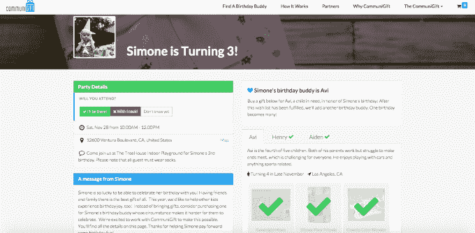

# CommuniGift 推出儿童向慈善机构捐赠的新方式 

> 原文：<https://web.archive.org/web/https://techcrunch.com/2015/12/01/communigift-launches-with-a-new-way-for-kids-to-give-to-charity/>

为了让每个孩子的生日梦想成真，总部位于洛杉矶的 CommuniGift 推出了一项新业务，旨在促进节日期间的慈善捐赠。

该公司由北卡罗来纳大学的四名本科生创立，已经找到了一种将潜在捐赠者与有需要的人联系起来的新方法。

他们的方法？生日聚会。

CommuniGift 与包括美国[男孩女孩俱乐部](https://web.archive.org/web/20221007053521/http://www.bgca.org/)、[救世军](https://web.archive.org/web/20221007053521/http://www.salvationarmyusa.org/)、[美国志愿者](https://web.archive.org/web/20221007053521/http://www.voa.org/)、[baby baby](https://web.archive.org/web/20221007053521/http://baby2baby.org/)和 [Target](https://web.archive.org/web/20221007053521/http://www.target.com/) 在内的国家合作伙伴合作，确定需要援助的家庭，并让他们与孩子生日相同、兴趣相同的捐助者联系。

家庭负担不起生日派对或礼物的孩子可以将他们的愿望清单上传到 Communigift 网站，赞助家庭会在他们发给自己孩子派对客人的邀请中包含该清单的链接。

“孩子们在我们的网站上创建一个邀请，”Communigift 的 21 岁主管托马斯·杜钦解释说。“他们给自己的客人发送电子邮件邀请，然后客人就可以读到他们的‘生日伙伴’了。”

然后，客人可以选择购买“生日伙伴”放在他们愿望清单上的东西，礼物就会送到需要它的孩子手中。

社区礼物邀请

CommuniGift 已与 Target 合作，成为其最初的零售合作伙伴。“产品从塔吉特百货运送到非营利组织，非营利组织为有需要的孩子举办生日派对，”杜钦说。

对于 Doochin 和他的合作伙伴来说，Communigift 的公开推出是两年来思考如何改善在线慈善捐赠的高潮。

该公司最初是一个副业项目，去年在洛杉矶地区的几百个家庭中进行了试运行。当时，杜钦和他的团队认为这是在节日期间联系家人的好方法。

但是，当杜钦和他的合伙人把注意力从假期转移到生日时，这个开始时的小插曲变成了一个真正的公司。

杜钦说，该公司通过其为塔吉特百货公司创造的销售额的一定比例来创收——这项服务是向捐赠者和非营利组织收取的费用。

然而，杜钦说，将贫困家庭与慈善捐助者联系起来的能力本身就是一种回报。

他说，人们会对网站上描述的家庭的叙述做出反应，尤其是孩子，他们会将自己读到的关于他们正在帮助的人的故事联系起来。