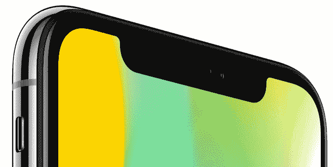

# iPhone 系列变得非常复杂

> 原文：<https://web.archive.org/web/https://techcrunch.com/2017/09/12/compare-iphones/>

史蒂夫·乔布斯说过“简单可能比复杂更难”，所以看起来苹果走的是容易的路线。客户现在必须[在 8 款不同的 iPhone 之间选择](https://web.archive.org/web/20230315095319/https://www.apple.com/iphone/compare/)，现在又增加了 iPhone 8、8 Plus 和 x。这需要比较大量的规格和选项，我们甚至还没有谈论颜色或存储大小。

现在有:

*   廉价小巧的“有趣尺寸”4 英寸 iPhone SE 起价 349 美元
*   “是的，我还需要一个耳机插孔”的 iPhone 6s 和 6s Plus 起价 449 美元
*   “我生活在耳机插孔是异端的未来”iPhone 7 和 7 Plus 从 549 美元起
*   699 美元起的“我想要一个新的但不是巨大的”iPhone 8
*   “我想变焦，但也想节省 200 美元”的 iPhone 8 Plus 从 799 美元
*   999 美元起的“我想感受优越感，用我的脸解锁”iPhone X

这比今天宣布之前的 5 个型号有所增加。另外，现在有 5 种不同的命名方案:SE、_、s、Plus 和 x。

对一些人来说，增加的选择可能很好，这样你就可以专注于你想要的功能。但对其他人来说，这只会激起一种挥之不去的感觉，认为你选错了。

“该死，我知道我需要一个耳机插孔，”“我为什么不多花几百块买一个最好的 iPhone 呢？、“它很漂亮，但我不能用一只手来操作它，”“真希望我现在就有那个变焦镜头。”

这些是人们习惯于用相机、汽车和电视来纠缠的恼人的技术问题。但苹果本应通过提供一些优秀的产品来消除这些问题，让人们有信心购买和拥有它们。相反，对一些人来说，新的阵容将变戏法决策瘫痪和遗憾。如果你的运营商没有提供你想要的手机，你要么不得不经历巨大的转换麻烦，要么接受你的不满。

就我个人而言，我会投票废除 6 号线和 7 号线。这将清理东西，所以只有微小的，现代的两种尺寸或加大码的奢侈品。

伟大的技术消失了，留下的只是体验，如果你头脑中有一个小小的声音怀疑你的决定，那就不可能发生。