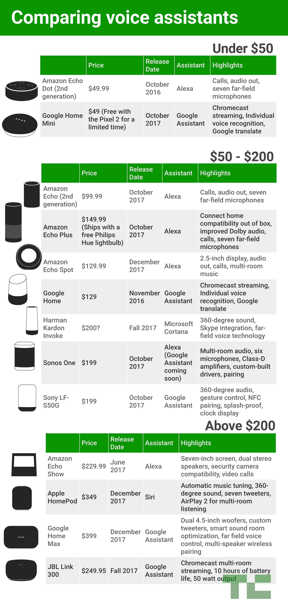

# 比较 Alexa、谷歌助手、Cortana 和 Siri 智能音箱 

> 原文：<https://web.archive.org/web/https://techcrunch.com/2017/10/08/comparing-alexa-google-assistant-cortana-and-siri-smart-speakers/>

# 比较 Alexa、谷歌助手、Cortana 和 Siri 智能音箱

在过去的几年里，智能家居助手竞赛已经发展到了白热化的程度。在过去的两周，事情真的到了紧要关头，当[亚马逊](https://web.archive.org/web/20230206041244/https://techcrunch.com/gallery/heres-everything-amazon-announced-today/)、[谷歌](https://web.archive.org/web/20230206041244/https://techcrunch.com/gallery/heres-everything-google-announced-today/)和 [Sonos](https://web.archive.org/web/20230206041244/https://techcrunch.com/2017/10/04/sonos-announces-the-sonos-one-a-self-contained-alexa-connected-speaker/) 都举办了大型活动，强调他们最新的智能音箱产品，使得本已繁忙的领域更加拥挤。

这个新兴的类别可能很难驾驭。根据自己的需求选择合适的扬声器很大程度上取决于你选择的助手，而这反过来又与功能集和你自己的移动操作系统忠诚度有很大关系。两者各有利弊——亚马逊垄断了市场，苹果在移动领域做得很好，谷歌比任何人都更好地跨越了这两者。还有微软，嗯，至少很多人拥有 Windows 电脑。

从硬件的角度来看，第一方产品和越来越多的第三方(如索尼、Sonos 和 JBL)之间的事情同样复杂。设备的价格区间也很宽，从 50 美元到 300 美元不等。有些专注于高级声音，有些功能屏幕，有些甚至让你在多个助手之间进行选择。

这里有一个快速分解，可以让航行这些水域看起来不那么危险。

[【信息图版】](https://web.archive.org/web/20230206041244/https://infogram.com/comparing-voice-assistants-1gv4m75xk3xyp18)