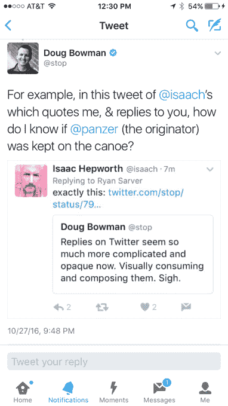

# Twitter 正在测试一个新的、更复杂的回复

> 原文：<https://web.archive.org/web/https://techcrunch.com/2016/10/28/complaining-about-twitter-on-twitter/>

# 我正在测试 Twitter 的新@ reply 设计，它一团糟

**披露**:每个人和他们的母亲都对 Twitter 做错的事情有自己的看法。这个是我的。

Twitter 正在测试@reply 的新设计，旨在通过完全删除推文中的用户名来“清理”对话视图。[我在测试桶](https://web.archive.org/web/20230404014712/https://twitter.com/panzer/status/792047256098607104)(Twitter 的一群用户正在测试这些功能，看看他们的反应如何)这是一个烂摊子。

以下是新回复设置的示例:

这是对很多人的回复，祝你好运。

另一个例子是我放在这篇文章上面的标题图片。我有参与那次谈话吗？没有照片的还有谁？谁知道呢？

这个选择有一堆奇怪的，不健康的东西。这里有几件事:

*   细小、较轻的文字意味着“不要看着我”，所以即使意识到你在对话或回复，也需要额外的注意力和更多的认知负荷。
*   现在，要看到对话中的每个人，需要注意并点击回复中的“其他人”链接，显示一个包含参与者的*附加*弹出窗格。
*   如果你回复多个人，你只会看到最后一个人的名字，这就是人们在他们自己的时间表中看到的回复链。
*   新的配置使得从独木舟上“移除”或“放下”某人变得更加困难(正在进行的对话)。这种礼节性的下降在对话出现分歧或比最初的当事人参与得更多时非常有用。现在是三次点击深度，而不是仅仅从你的推文文本中删除用户名。
*   此外，Twitter 在辱骂性推文和钓鱼方面存在大量问题，它已经决定，在你回复推文之前，让它更难*查看一直在骚扰你的人是否在回复链中是一个好主意。就像在常规对话中一样，你应该能够在你选择与谁交谈之前充分意识到你选择与谁交谈——而不是作为某种悲伤和痛苦的惊喜玩偶盒。*
*   当你收到通知时,“其他人”的信息甚至都不存在，这让你很难看出你是否参与了对话。
*   第三方客户对此处理得很差，使得对话显得更加混乱。

这种混乱的解决方案可能应该从从字符数中删除用户名开始，但保留实际的用户名本身。很大程度上，链接(最终，仍然没有实现，lol)或照片被添加并出现在 tweet 中，但不计入字符数。

反对这一点的论点是‘正常人被‘名字’搞糊涂了’。我不同意。我认为这可能是早期的一个问题，但大量的人已经熟悉了用户名，通过主流媒体、电视和网络上的大量用户，以及像吉米·基梅尔的平均推文片段等流行文化。

人们把用户名理解为名字。从推文中删除个人资料图片或“@name”等图标会删除重要的上下文，并在不必要的地方制造混乱。

我完全理解这只是对 Twitter 可能会做的事情的测试。我只是极力鼓励他们不要这样做。如果他们想让对话更友好，我建议使用嵌套的、类似论坛的回复线程。