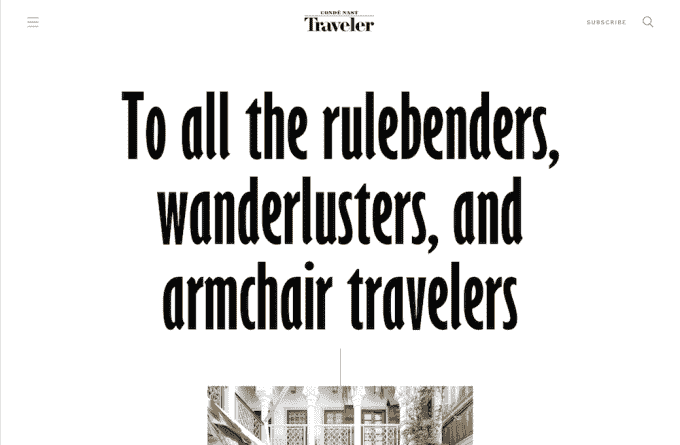

# 《康泰纳仕旅行者》网站改版，推出 20 个新的城市指南

> 原文：<https://web.archive.org/web/https://techcrunch.com/2018/03/06/conde-nast-traveler-revamps-its-website-and-unveils-20-new-city-guides/>

旅游网站一直在重新设计，但你只需要访问主页就能知道《康泰纳仕旅行者》的团队有一些不同的想法。没有一条标准的文章河，也没有一个导航到不同区域和旅行目的地的菜单，只有一个大文本的声明:“给所有规则爱好者、漫游者和 amrchair 旅行者。”

向下滚动一点，你会开始看到一些最值得注意的内容的链接，包括世界上最好的酒店的列表，以及几个不同的城市指南，但它的间隔比普通的首页更豪华，并且有更厚脸皮的标题:“别担心，这是一个网格”([纽约市](https://web.archive.org/web/20230328183314/https://www.cntraveler.com/destinations/new-york-city))，“向右看，不要向左看”([伦敦](https://web.archive.org/web/20230328183314/https://www.cntraveler.com/destinations/london))等等。

当然，很多读者根本不会去访问首页。相反，他们最终会通过搜索、社交媒体或时事通讯访问个人指南和页面。尽管如此，主编皮拉尔·古兹曼说，头版是“我们非常清楚地表明我们是谁的机会。”

在这种情况下，她希望表明《康泰纳仕旅行者》有“一个非常具体的观点”:“这些内容没有任何共性。”

改变的不仅仅是主页。该网站现在分为三大部分:最佳，地方和英特尔。《康泰纳仕旅行者》(以及《建筑文摘》和该公司的食品创新小组)的数字总经理埃里克·吉林(Eric Gillin)说，这三个部分代表了对组织网站上所有内容的最佳方式的“12 个月的研究”。

基本上，目标是根据您的旅行规划阶段，帮助您找到合适的内容。如果你还在试图寻找去哪里的灵感，那么你可以访问[best](https://web.archive.org/web/20230328183314/https://www.cntraveler.com/the-bests)，在那里你会找到关于[最好的海滩](https://web.archive.org/web/20230328183314/https://www.cntraveler.com/galleries/2015-02-24/top-10-most-beautiful-island-beaches-hawaii-australia)和[最浪漫的冒险](https://web.archive.org/web/20230328183314/https://www.cntraveler.com/gallery/the-30-most-romantic-adventures)的文章。

如果你已经把范围缩小到一个目的地，或者几个可能的目的地，你可以查看[地点](https://web.archive.org/web/20230328183314/https://www.cntraveler.com/the-places)——在那里你会找到 20 个新的城市指南。指南被分解成总共近 5000 张“场地卡”，Gillin 说这些卡片是“从零开始”创作的，包括 Q & A 格式的简洁评论。例如，对一家酒店的评论可能会从问房间怎么样开始；Guzmán 说，这些问题只有你真正去过某个地方才能回答。此外，这种形式允许她的团队“打破一些不良的旅游习惯”

最后，还有[英特尔](https://web.archive.org/web/20230328183314/https://www.cntraveler.com/the-intel)，这是最新的部分，有最新的提示和交易。

Guzmán 和 Gillin 表示，随着时间的推移，他们将增加更多个性化和保存信息的功能。

再说一遍，所有这些的主题是抵制创造更多你可以在任何其他旅游网站上找到的普通内容。Guzmán 说，她并不试图提供任何地方的完整指南或权威指南。相反，我们的目标是“这种超特异性和功利主义或灵感的偶然的、特殊的混合。”