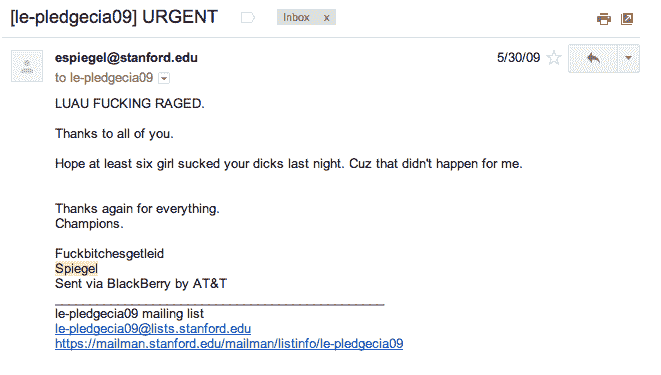

# 证实:Snapchat 的埃文·斯皮格尔是个混蛋 

> 原文：<https://web.archive.org/web/https://techcrunch.com/2014/05/28/confirmed-snapchats-evan-spiegel-is-kind-of-an-ass/>

我认识 Snapchat 首席执行官兼联合创始人埃文·斯皮格尔已经有一段时间了。我们进行了六次以上的面对面交谈，更多的电话交谈，甚至在 Disrupt SF 的舞台上一起呆了 20 分钟。尽管我很努力，我还是很难喜欢他。现在，在阅读了埃文·斯皮格尔在斯坦福大学期间发来的电子邮件后，我清楚地明白了我的直觉告诉我的事情。

那家伙是个混蛋。

你可以在[谷](https://web.archive.org/web/20230130234618/http://valleywag.gawker.com/fuck-bitches-get-leid-the-sleazy-frat-emails-of-snap-1582604137)看到一大堆泄露的电子邮件，但是我可以用上面的段落很容易地为你总结它们。这里有一个典型的例子:

就像扎克伯格的臭名昭著的即时消息泄露一样，斯皮格尔在大学时发送了这些电子邮件，描述了向女性撒尿、吹箫、未成年饮酒、让朋友喝醉酒、向“胖女孩”发射激光。这些邮件在内容、拼写和语法方面都令人不安，并且消磨掉了年轻一代所剩无几的希望。

Spiegel 向 TechCrunch 发布了这份官方声明以回应此次泄密事件:

> 我在兄弟会期间的白痴邮件被公之于众，这显然让我感到羞愧和尴尬。我没有借口。我很抱歉我当时写了它们，我写了它们是愚蠢的。它们绝不反映我今天是谁，也不反映我对女性的看法。

他感到尴尬是有道理的，这些邮件显示了最糟糕的“兄弟”心态，这种心态继续导致硅谷女性的边缘化。

这些邮件还暗示，斯皮格尔的父亲是一名备受尊敬的律师，他纵容未成年人饮酒。

总而言之，这些邮件对 Snapchat 和 Spiegel 来说是坏消息，但它们丝毫没有让我感到惊讶。正如我很久以前向他承诺的那样，我不会转述我与埃文的私人谈话中的轶事。然而，当你把埃文这个人和联合创始人埃文分开时，你得到的不是一个画了一个鬼并开发了一个应用程序的可爱的孩子。你会看到一个极度缺乏自信、身材瘦长的孩子，他用毫不掩饰的自大掩盖了自己的不安全感。

> 埃文是自己的理想用户。

他很聪明，从来没有在我这个媒体成员面前说过这种种族主义或性别歧视的话，但我们大多数谈话的基调都围绕着他有多聪明，他创建了像 Snapchat 这样酷的东西，其他一切都可能会搞砸。这些电子邮件虽然来自一个更不成熟的男孩之王，但仍然有着相同的语气，搭配着不同的、更恶心的图像。

公平地说，我们都会说一些本该是私人的事情，当 Spiegel 把这些邮件发给他的 Kappa Sig 兄弟时，他可能从未想到它们会被展示给全世界。也就是说，我们不可能在不指出深刻讽刺的情况下评论他们:埃文是他自己的理想用户。

斯皮格尔和鲍比·墨菲，据说在写这些邮件的某个时候非常兴奋，建造了一些东西来防止这种情况。Snapchat 是一个发送自毁消息的应用程序，所以即使你喝得太醉而无法做爱，并最终在一个名叫莉莉的可怜女孩身上撒尿，你关于这些事件的信件也永远不会被公之于众。

Snapchat 自诞生以来就很少出现混乱。除了一次[性短信“恐吓”](https://web.archive.org/web/20230130234618/https://techcrunch.com/2012/12/26/inside-snapchat-the-little-photo-sharing-app-that-launched-a-sexting-scare/)(这实际上给该公司带来了更多的宣传)，Snapchat 道路上唯一真正的障碍是对暴露用户数据的恶意攻击的处理。该公司直到被网络骚扰才道歉。

从公司的角度来看，Snapchat 的另一个障碍是埃文自己。

这位 24 岁的年轻人很聪明。不可否认。与他交谈五分钟，你会发现一个你从未见过的视角，充满了假装的自信。我不是唯一有这种感觉的人。就在昨天，[塞特亚·纳德拉](https://web.archive.org/web/20230130234618/http://www.businessinsider.com/snapchat-post-inspires-microsoft-ceo-2014-5)还在 re/code 的舞台上称赞这位神童。

在接受《福布斯》采访时，斯皮格尔在讲述脸书的马克·扎克伯格提出与他会面并讨论收购事宜的故事时，显然撒了谎。他对这个故事的描述包括扎克热情而略带绝望地邀请他去拜访，以及埃文冷冷地拒绝让扎克去洛杉矶。

当 Spiegel 被叫去的时候，[他展示了真实的电子邮件通信](https://web.archive.org/web/20230130234618/https://twitter.com/evanspiegel/status/420254504991211520)，它读起来更像是一个高中新生试图和足球队的四分卫玩欲擒故纵的游戏。

洛杉矶地区的其他创始人，他们的企业根本不与 Snapchat 竞争，也没有什么好话可说。我的一个朋友，不把斯皮格尔称为朋友，但确实经常和他交流，称他“极度缺乏安全感”和“难以忍受的自大”。

老实说，我*希望*喜欢埃文。我真的尽力了。我认为他的自大是不成熟的，甚至有点活该。毕竟，他确实在 21 岁时建立了一个 20 亿美元的企业。但是最终，你越了解你尊敬的人，你尊敬的那部分就会和那些令人尊敬的成就背后的真实的人分离。对我来说，这些邮件是一个男人和一个男孩之间的最终分界线，前者经营着一家非常有趣的公司，而后者从未学会尊重女性或其他人。

这些电子邮件中的言辞不仅令人厌恶，而且描述了非法活动、吸毒，是令人难以置信的性别歧视，近乎种族歧视。这是一件大事，也是一个重大风险。

我们最近看到创始人的不成熟对其他公司产生了适得其反的影响，最明显的是说唱天才，他刚刚在本周末解雇了一名联合创始人，原因是他在网站上发布了一条不敏感的注释。

斯皮格尔写这些邮件时已经 18 岁了，可能不会受到如此严酷的命运。毕竟，如果同样的规则适用于所有创始人和风险投资人的私人信件和年轻时的轻率行为，他们中的大多数人也会出局。(完全实话实说，SV 充满了怪人和年轻人的轻率。)

然而，Snapchat 正处于关键时刻。痴迷使用这款应用的孩子不会关心 Spiegel 的恶作剧，不管是现在还是以前。他们可能甚至不知道他是谁。

但是，随着 Snapchat [走向货币化](https://web.archive.org/web/20230130234618/https://techcrunch.com/gallery/a-brief-history-of-snapchat/)，这很可能包括与大品牌的合作，首席执行官的学院式游说可能会使这一过程变得更加困难。虽然我认为 Snapchat 的董事会和风投会对此感到震惊，但他们很可能会保持沉默，希望这件事能及时平息，让 Snapchat 不辜负其 20 亿美元的估值。

没有钱，没有问题。