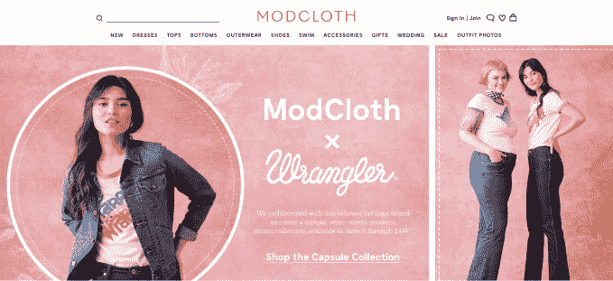
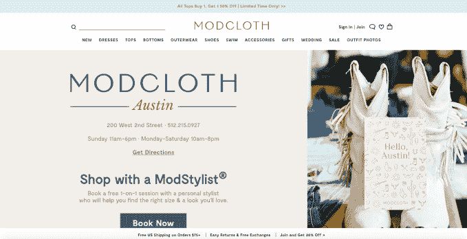

# 证实:沃尔玛已经收购了女装网站 ModCloth 

> 原文：<https://web.archive.org/web/https://techcrunch.com/2017/03/17/confirmed-walmart-jet-modcloth/>

在线时尚和电子商务领域的进一步整合。今天[沃尔玛](https://web.archive.org/web/20230321115709/http://walmart.com/) [宣布](https://web.archive.org/web/20230321115709/http://news.walmart.com/2017/03/17/walmart-announces-the-acquisition-of-modcloth-a-leading-online-womens-fashion-retailer)收购了女装零售商 ModCloth，该公司专注于更年轻、更进步的人群，以及更健康的尺码范围，而不仅仅是人们经常强调的高瘦身材。今天的新闻证实了本周早些时候来自美国和[其他](https://web.archive.org/web/20230321115709/http://jezebel.com/womens-retailer-modcloth-to-be-bought-by-jet-com-which-1793296461) [的关于收购](https://web.archive.org/web/20230321115709/http://www.recode.net/2017/3/15/14937028/walmart-jet-modcloth-acquisition)[的报道。](https://web.archive.org/web/20230321115709/https://techcrunch.com/2017/03/16/walmart-subsidiary-jet-com-to-buy-modcloth-for-less-than-75m/)

早先[报道](https://web.archive.org/web/20230321115709/http://jezebel.com/womens-retailer-modcloth-to-be-bought-by-jet-com-which-1793296461)称沃尔玛子公司 Jet.com 主导了此次收购。沃尔玛的[声明](https://web.archive.org/web/20230321115709/http://news.walmart.com/2017/03/17/walmart-announces-the-acquisition-of-modcloth-a-leading-online-womens-fashion-retailer)没有提到这一事实，但 ModCloth 的联合创始人苏珊·科格在一篇博客文章中提到了 Jet.com:“我很兴奋地宣布，我们将加入 Jet.com 和沃尔玛的大家庭，”她写道。

沃尔玛和科格都指出，ModCloth 团队将继续运营其网站和商店，作为其其他电子商务网站的独立和补充品牌。此外，ModCloth 首席执行官 Matthew Kaness 及其高管团队和 ModCloth 的 300 多名员工将继续驻扎在旧金山、洛杉矶和匹兹堡，并将加入沃尔玛的美国电子商务零售组织。

这笔交易的条款尚未披露，只是沃尔玛告诉我们，这是一笔全现金收购，与之前的两笔 ShoeBuy(7000 万美元)和 moose jaw(5100 万美元)交易“相同”。

正如我们在之前的报道中提到的，不止一个非常接近该交易的消息来源告诉我们，该交易不超过 5000 万至 7500 万美元，沃尔玛的“大概”数字似乎证实了这一点。

对于这家初创公司来说，这不是一个好结果，因为[已经从包括 Norwest Venture Partners、Floodgate、First Round 和 Accel Partners 在内的投资者那里筹集了 7800 万美元。值得注意的是，Norwest 和 Accel 也支持沃尔玛](https://web.archive.org/web/20230321115709/https://www.crunchbase.com/organization/modcloth#/entity)[在 2016 年以 30 亿美元](https://web.archive.org/web/20230321115709/https://techcrunch.com/2016/08/08/confirmed-walmart-buys-jet-com-for-3b-in-cash/)收购的 Jet.com。

与收购 Jet.com 一样，沃尔玛的战略是收购更多在线品牌，这将有助于其拓展新的人口统计数据。在这种情况下，它希望更好地瞄准更年轻、更时尚的客户，这些客户以前可能不会在沃尔玛购物。这也是向服装领域的更深一步迈进。

这方面的其他收购包括 2017 年 2 月以 5100 万美元收购户外零售商 Moosejaw 。

沃尔玛被 ModCloth 吸引有几个原因，它说，包括其强大的社交媒体存在，高度参与的社区以及其品牌建立包容性声誉的方式——从身体积极性到生活方式的包容性，再到尺寸的多样性。

沃尔玛的 Jet.com 最初是亚马逊的全面竞争对手，它也进行了收购，以扩展生活方式和时尚领域:2016 年 3 月，它[收购了](https://web.archive.org/web/20230321115709/http://www.retaildive.com/news/jet-buys-home-furnishings-e-retailer-hayneedle/414797/)家居和生活方式在线商店 Hayneedle，今年早些时候，Zappos 风格的鞋类零售商 ShoeBuy [以 7000 万美元的价格从 IAC 收购了](https://web.archive.org/web/20230321115709/http://news.walmart.com/2017/01/05/jet-announces-the-acquisition-of-shoebuy-a-leading-online-footwear-retailer)。

今天的沃尔玛是世界上最大的零售商，但是纯在线的亚马逊正在迎头赶上，因此这促使沃尔玛更加努力地推进数字化，这既是为了顺应今天的购物习惯，也是为了帮助保护未来的顾客。此外，还有另一家大型实体零售商塔吉特百货(Target)，该公司在服装领域建立了庞大的业务。

其中，时尚和服装已经成为这两个竞争对手的主要战场。亚马逊自己也在时尚领域积极扩张，希望收购一些公司，并有机地构建自己的运营。

一个大问题是，随着 mod cloud 加入一个更大的母公司，mod cloud 现有的年轻客户[是否会继续留在该品牌，mod cloud 的一些年轻女性客户](https://web.archive.org/web/20230321115709/https://twitter.com/flimflamfloozle/status/842740782050238464)[公开拒绝将](https://web.archive.org/web/20230321115709/https://twitter.com/_Republic/status/842727575470428160)作为[消费者](https://web.archive.org/web/20230321115709/https://twitter.com/kristine_ish/status/842734880870072320)，或者他们是否会迁移到其他地方。

正如我们本周早些时候所写的，收购发生在 ModCloth 的艰难时期之后。该公司最初于 2002 年由苏珊和埃里克·科格在一间宿舍里创立，在强调潮人设计和女性时尚的包容性方法的公式中看到了早期的成功。

与此同时，它看到了来自一系列风投的资金，这些风投希望更深入地利用在线商店和智能分析的新浪潮，瞄准并获得新类别消费者的业务。

但是增长——虽然有时是有利可图的——开始放缓，公司经历了多轮裁员(有些报道称这里的、这里的和这里的)；由来自 Urban Outfitters 的校友 Matthew Kaness 取代 Eric Kroger 担任首席执行官，以及其他一些高管变动；从 [Glassdoor](https://web.archive.org/web/20230321115709/https://www.glassdoor.com/) 上的一些帖子来看，还有一些员工士气低落的显著例子。

这种论调我们已经听过很多次了，但是建立一个大的可持续的电子商务业务是很难的。因此，这促使该领域的许多初创公司要么被沃尔玛(Walmart)和亚马逊(Amazon)等更大的公司吞并(亚马逊也收购了大量较小的在线公司)，要么半途而废。

就在昨天，有消息称内衣创业公司和在线零售商 True & co .[被时尚集团 PVH](https://web.archive.org/web/20230321115709/https://techcrunch.com/2017/03/16/bra-startup-trueco-sold-to-calvin-klein-owner-pvh/) 收购，该集团拥有卡尔文·克莱恩、汤米·席尔菲格和许多其他品牌。

除了 ModCloth 的网上店面，该公司一直在尝试一种实体零售模式，在洛杉矶和旧金山有临时商店，在 T4 奥斯丁有永久商店。

这种线下到线上的组成部分可能也引起了沃尔玛的兴趣，因为它收购的 Moosejaw 还包括一家涉足两个世界的零售商。

沃尔玛吹捧这笔交易将如何帮助目前的 ModCloth 设计师通过 Jet.com 和沃尔玛的其他电子商务网站获得更大的客户群。

“ModCloth 的目录提供了数千种服装和配饰选择，包括高度差异化的独家风格和大量尺寸，吸引了广泛的女性群体，”沃尔玛声明说。“目前在线提供的引人注目的风格、品牌和内容，以及深厚的行业关系和专业知识，将帮助我们进一步提升我们的整体客户体验。”

今天开市时，市值 2160 亿美元的沃尔玛在 T2 的交易量略有下降。