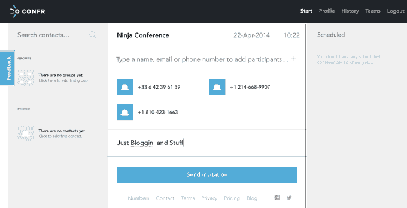

# Confr 帮助您在 Scnds TechCrunch 中创建国际电话会议

> 原文：<https://web.archive.org/web/http://techcrunch.com/2014/04/22/confr-helps-you-create-international-conference-calls-in-scnds/>

# Confr 帮助您在 Scnds 中创建国际电话会议

[Confr](https://web.archive.org/web/20230128100524/https://confr.com/#!/start) 做到了它在电视上所说的:它允许你点击几下鼠标就可以召开电话会议，这是许多[尝试过](https://web.archive.org/web/20230128100524/https://www.uberconference.com/)但很少有人实现的一个技巧。会议有什么不同？嗯，它是由以前的电信公司运营的，有一个国际工程师团队，他们必须使用自己的产品来构建它。主要针对那些不想打国际电话的国际团队，它将一个非常简单的网络界面与老式的 [POTS](https://web.archive.org/web/20230128100524/http://en.wikipedia.org/wiki/Plain_old_telephone_service) 配对。

“我们是一个九人团队，在波兰、挪威和英国的五个不同地点远程工作，”联合创始人卡米尔·罗金斯基说。“我们的创始人之前构建了 Oyatel，这是云 SaaS 中的一种大规模电话技术，被北欧市场上的数千家公司所使用。”

该团队在 2012 年出售了 Oyatel ,并四处寻找潜在的破坏性后续产品。他们决定在 2013 年艰难的云会议市场一试身手。到目前为止，他们做得很扎实，但这是艰难的一年。

“我们还没有令人印象深刻的数字可以展示。尽管现在这种情况随时都有可能改变。几天前，我们与一家付费客户(一家全球咨询公司)签约，拥有 300 名活跃用户，并有机会再增加 3000 名。更多类似的交易即将到来，”罗金斯基说。

系统很简单。您创建一个免费帐户，然后添加多个国家的电话号码。这些客户收到一条短信或电子邮件，要求他们拨打一个本地接入号码——他们支持数百个国家——会议就开始了。目前，该系统不支持电话录音或“语音通知”(当有人说话时弹出的小气泡)，但更多的功能正在路线图上。

你按通话时间付费，新用户有 200 分钟免费时间。您可以升级到年度计划，并允许您添加无限的用户。

当我们尝试时，Romain 惊喜地发现他收到了一个法国接入号码，而我们其他人收到的是美国号码。如果您从最初收到短信的手机上拨打电话，则无需输入 pin 码。

“从我们以前成功创业的经验中，我们了解到分散在不同地点的团队需要一些优秀的工具才能以良好的方式合作，”罗金斯基说。“当每个人都在有良好互联网连接的办公室或家中时，Google Hangouts 和 Skype 是很好的选择。但正如大多数企业所知，在不同的地点，许多参与者都在路上，这些工具并不能真正发挥作用。互联网连接问题、硬件可访问性或每个人都加入通话的麻烦是常见的问题。这促使我们创建 Confr 一种简单、快速且经济高效的方式。”

这家公司仍然很小，但他们愿意尝试一些事情来引起注意。例如，在伦敦的一次电信会议上供应的“挪威棕色奶酪华夫饼”，这一策略帮助他们签下了一个大客户。显然，奶酪华夫饼干的覆盖面比我们美国人想象的要大得多。