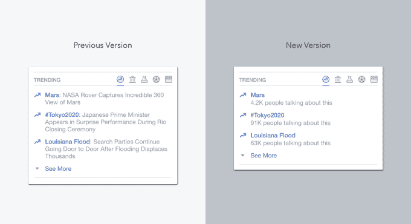
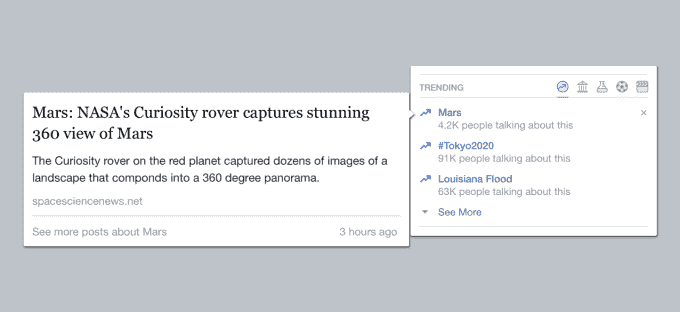

# 脸书放弃全球范围内有用的趋势主题描述 

> 原文：<https://web.archive.org/web/https://techcrunch.com/2016/08/26/confusing-topics/>

Twitter 的“趋势”往往令人困惑。为什么#MPBMS 或#TechMunch 是趋势？你必须点击进去，自己想办法解决。当脸书在 2014 年复制 Twitter 的趋势时，它通过在正下方添加人类书写的描述大大改进了它们，这样你就知道你是否关心了。

今天，脸书正在删除这些描述，并声称这是为了增加产品的可扩展性和个性化。对于不浏览英文版脸书的用户来说，这是一个胜利，他们可能会更快地获得热门话题。但对于那些说英语的用户来说，这是一个损失，他们以前可以更快地浏览趋势的描述，以确定它们是否值得点击。

没有人放慢速度和抬高产品价格，每个人都会看到根据你喜欢的页面、你的位置、你以前互动过的趋势等更适合你兴趣的趋势话题。它还能把流行话题带到更多的语言中。

另一个解释是，脸书正试图将人类与趋势的互动降至最低。今年早些时候，Gizmodo 的匿名消息来源指控[压制保守趋势，尽管调查发现](https://web.archive.org/web/20221205131322/http://gizmodo.com/former-facebook-workers-we-routinely-suppressed-conser-1775461006)[没有证据](https://web.archive.org/web/20221205131322/https://beta.techcrunch.com/2016/05/23/facebook-denies-bias-in-trending-topics-but-vows-changes-anyway/)支持这种说法。【更新:然而，脸书没有[从被质疑的时间段开始的策展选择的完整数据记录](https://web.archive.org/web/20221205131322/https://www.commerce.senate.gov/public/_cache/files/93a14e98-2443-4d27-bf04-1fc59b8cf2b4/22796A1389F52BE16D225F9A03FB53F8.facebook-letter.pdf)。]

在脸书寻求显得公正的选举周期中，这些指控仍然激怒了右翼。人类仍将确保趋势是关于新闻的，而不仅仅是每天的#午餐。

当然，如果你有一些小众兴趣，比如极限运动、极客学术追求或 B 级名人，新的热门话题将能够向你展示更多关于它们的标签。但是你再也不能一眼看出这些神秘的标签是关于什么的了。相反，你需要将鼠标悬停在趋势上才能看到新闻故事、用户帖子或关于趋势的原始来源的摘录。

为什么是的，脸书，我听说过那些名人。但是，如果没有他们成为流行趋势的背景，我不会觉得有必要去关心

这一策略似乎是一种倒退。脸书赚了很多钱——仅上个季度的利润就超过 20 亿美元。资助现有的人类描述作者应该不是什么大问题。为地球上其他一些最流行的语言雇佣抄写员可能也不会倾家荡产。

相反，脸书本可以选择用英语向很多人展示主要趋势主题的描述，当算法建议一个小众趋势或一个针对不支持语言的用户的趋势时，就放弃这些描述。

面对 17.1 亿用户，脸书必须做适合大众的事情。然而，很少看到公司明显降低产品的可用性，这是扩大规模的捷径。