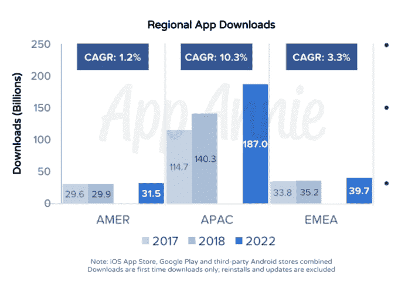
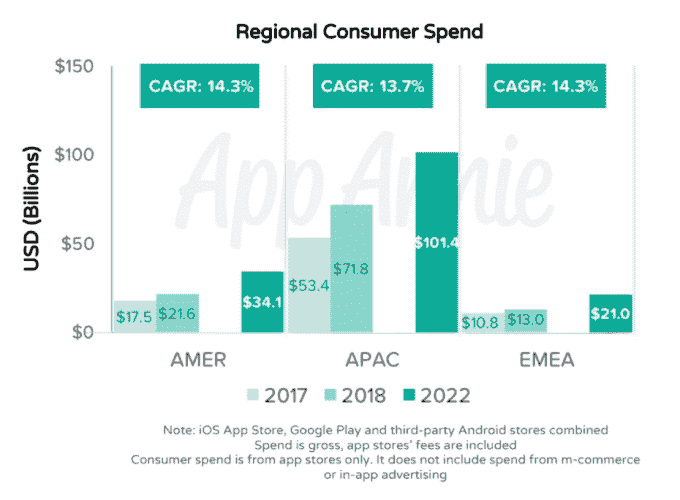

# 消费者在应用上的支出今年将达到 1064 亿美元，到 2022 年将达到 1565 亿美元 

> 原文：<https://web.archive.org/web/https://techcrunch.com/2018/05/02/consumer-spend-on-apps-to-reach-106-4-billion-this-year-156-5-billion-by-2022/>

根据 App Annie 今天早上发布的一份新报告，到今年年底，全球应用商店的消费者支出总额将达到 1064 亿美元，到 2022 年将达到 1565 亿美元。2018 年的数字比该公司去年 12 月估计的 1100 亿美元略有下降。大部分增长仍来自亚太地区，中国轻松保持着全球最大应用市场的地位，占全球支出的 40%。

该报告还发现，每台设备的消费者支出正在上升，将从 2017 年的 20.94 美元增长 23%，到 2022 年达到 25.65 美元。

2022 年，应用下载量将增长 45%，达到 2582 亿次。

到 2022 年，下载增长将来自亚太市场，包括印度、印度尼西亚和越南，以及更具体地说，中国的农村地区。与此同时，美洲的增长将由巴西推动，EMEA 地区的增长将由埃及、乌克兰、波兰和俄国推动。

与此同时，报告预测，美国和日本等更稳定、更成熟的市场的年下载量将在 2022 年稳定下来。然而，下载量仍将很高，美国平均每台设备每年下载 21 个新应用，日本平均每台设备每年下载 15 个。

但应用程序的增加和下载频率的降低将导致出版商花费更多的钱来获得新用户。

到 2022 年，消费者在应用程序上的支出将增长 92%，达到 1565 亿美元。

2022 年消费支出最高的国家将是中国、美国、日本、韩国和德国。中国将遥遥领先，从 2017 年起增长 107%，达到 624 亿美元，而美国从 150 亿美元增长 97%，达到 297 亿美元。

到 2022 年，每台设备的平均支出将增长 23%，达到 25.65 美元。

到 2022 年，日本每台设备的支出将超过 140 美元——接近全球平均水平的 6 倍，是迄今为止全球最高的。

相比之下，到 2022 年，美国每部手机的支出将增加近一倍，达到 60 美元。

当然，游戏仍将是消费者支出的主要来源，但其他应用程序将在 2017 年至 2022 年期间占据一席之地。在此期间，游戏之外的支出将增加 750 亿美元。App Annie 表示，这将得益于约会应用、音乐和视频流媒体应用的订阅收入增长。

报告全文可从 App Annie 的[网站](https://web.archive.org/web/20221025222141/https://www.appannie.com/en/insights/market-data/app-annie-2017-2022-forecast-data-sheet/)获得。