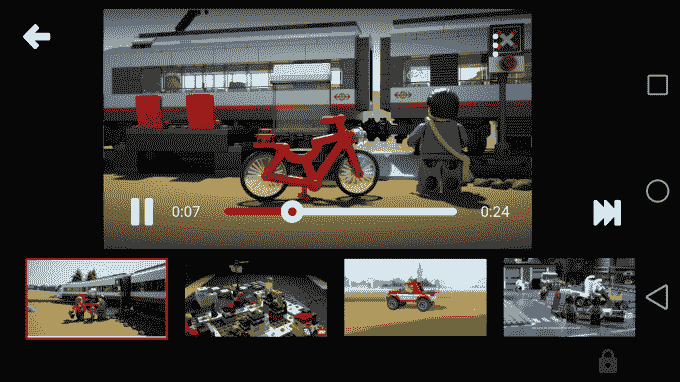
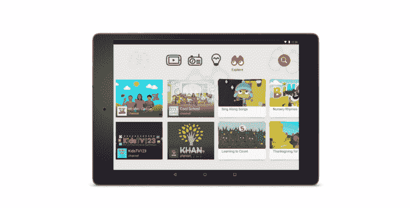
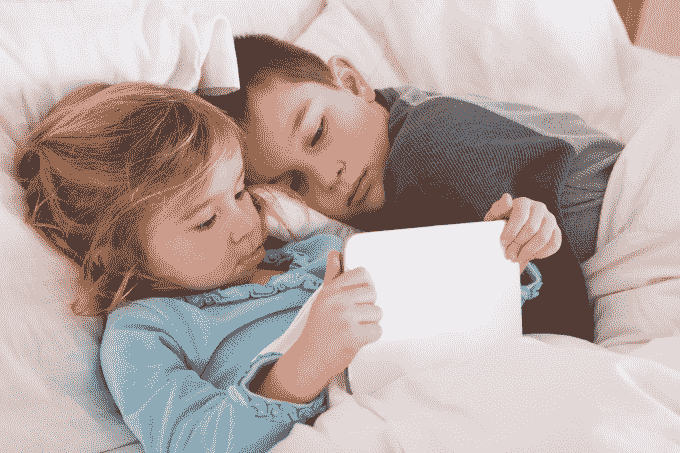

# 消费者监督组织抱怨更新的 YouTube 儿童应用程序仍然让儿童接触欺骗性广告

> 原文：<https://web.archive.org/web/https://techcrunch.com/2015/10/02/consumer-watchdog-groups-complain-updated-youtube-kids-app-still-exposes-children-to-deceptive-ads/>

YouTube 本周宣布了对其儿童友好的 YouTube 儿童移动应用程序的改变，旨在更好地教育父母该应用程序如何工作及其提供的保护，此前消费者监督组织提出了一些投诉，包括向联邦贸易委员会提出的投诉。但是今天，这些团体表示，YouTube 在更新 YouTube Kids 应用程序方面做得还不够，称这些变化是“肤浅的”

特别值得关注的是，这些组织认为应用程序中的广告本质上仍然是“过度和欺骗性的”，不符合儿童电视节目中允许的广告的指导原则。

这些团体提出的问题是一个值得讨论的问题，尤其是当手机和平板电脑成为当今儿童选择的主要屏幕时。今年[的一项移动技术研究](https://web.archive.org/web/20230308071945/http://www.latimes.com/science/sciencenow/la-sci-sn-babies-screen-time-iphone-ipad-20150424-story.html)发现，36%接受调查的美国父母称，他们的孩子在一岁前曾与智能手机或平板电脑互动。另有 36%的孩子在两岁时就开始玩手机游戏。

与此同时，正如消费者采用新创新的转变经常出现的情况一样，法律法规跟不上技术实际应用的现实。

YouTube Kids 之类的网站似乎就是这种情况，它提供了一系列针对学前到小学的“儿童友好型”视频，这些视频被分为“表演”、“音乐”、“学习”和“探索”等主题领域。

对于儿童来说，使用该应用程序浏览视频内容实际上取代了看电视。它甚至以网络系列的形式向他们提供“节目”，以及来自知名儿童娱乐品牌的其他内容，如梦工厂电视、吉姆·汉森电视、鹅妈妈俱乐部、汤姆和朋友的谈话、国家地理儿童、阅读彩虹和坦克引擎托马斯。

然而，尽管 YouTube 在许多方面正在成为“新电视”，但儿童应用程序并不需要满足适用于电视行业的相同法规。像无商业童年运动(CCFC)和数字民主中心(CDD)这样的组织对此提出异议。

代表这两个团体向联邦贸易委员会提交投诉的律师 Angela Campbell 解释道:“谷歌有意让广告商接触使用 YouTube Kids 应用的 5 岁及以下儿童。她告诉我们:“对没有能力区分节目和广告的儿童来说，广告是欺骗性的，对他们来说是不公平的。”。

在广播电视、有线电视或卫星电视上播放的儿童节目中， [FCC 规定](https://web.archive.org/web/20230308071945/https://www.fcc.gov/guides/childrens-educational-television)不允许出现如今在 YouTube 儿童应用中被允许的同类广告。例如，主机销售是不允许的；节目材料必须与商业广告分开；此外，还有关于广告播放频率的时间限制的指导方针。

但是在 YouTube Kids 中，YouTube Kids 的广告政策——禁止食品、饮料和其他产品的广告—[—现在只适用于谷歌出售的付费广告](https://web.archive.org/web/20230308071945/https://techcrunch.com/2015/10/01/youtube-addresses-complaints-about-inappropriate-content-in-updated-youtube-kids-app/)。这些付费广告是带标签的 30 或 60 秒的视频，在孩子选择的视频之前显示。

然而，坎贝尔指出，付费广告“只占 YouTube Kids 上可用内容的一小部分。”

“这意味着 YouTube Kids 上的绝大多数内容不受任何广告限制，”她说。"….正如 CCFC 和 CDD 在提交给联邦贸易委员会的诉状中所显示的那样，YouTube Kids 包括真实的电视广告、公司制作的宣传视频以及主机销售和付费植入式广告的视频。”

例如，如果一个孩子在应用程序上搜索“cookie”，他们可能会在 YouTube Kids 的用户频道上看到 cookie 公司的电视广告。但是因为这个视频是在一个用户频道上，谷歌不会认为这个视频是“付费广告”——所以它不受 YouTube 广告政策的约束。

谷歌通过在 app store 描述中添加新的免责声明，向家长们披露了这一点，这是值得的。

> “YouTube Kids 包含付费广告，以便免费提供应用程序。您的孩子也可能会看到 YouTube 创建者提供的带有商业内容的视频，这些视频不是付费广告。如需了解更多信息，请查看我们的家长指南。”

(这里导游是。)

换句话说，该公司在某种程度上对其政策保持透明，但它表示，为了保持应用程序免费，付费广告是一种必要的邪恶。然而，与节目和其他针对儿童的视频内容明显分开的带标签的付费广告可以让应用程序保持免费。所以免责声明有点不真诚，因为它没有提到创作者自己的广告或付费代言是如何涉及的。

对于监督组织来说，他们的最终目标是迫使谷歌等儿童视频应用制造商遵循适用于电视行业的相同准则。

这不仅是因为随着越来越多的孩子采用移动技术，越来越多的家庭切断了与付费电视提供商的联系，应用程序本身正在成为电视节目的真正替代选择，还因为应用程序内容也可以反映在大屏幕上——实际上*变成了*“电视”

谷歌表示，事实上，YouTube Kids 应用程序的更新版本现在允许用户将内容传输到 Chromecast、Apple TV、游戏机和智能电视。

“关键是，如果 YouTube Kids 是一家广播、有线或卫星提供商，未能将商业内容与节目分开显然违反了 FCC 的规定，”CCFC 的执行董事乔希·戈林(Josh Golin)指出。“我们认为，仅仅因为 YouTube Kids 是一个应用程序，谷歌就不应该遵守规则，这是荒谬的。他说:“YouTube Kids 现在被设计成在电视上播放，这一事实进一步证明了这一点。

至于 FTC 的投诉，调查仍在进行中，还没有给出裁决的时间表。

*更新，10/2/15，下午 2:25 美国东部时间:这篇文章被更新，以澄清应用商店描述参考付费，而不是未标记的广告。*