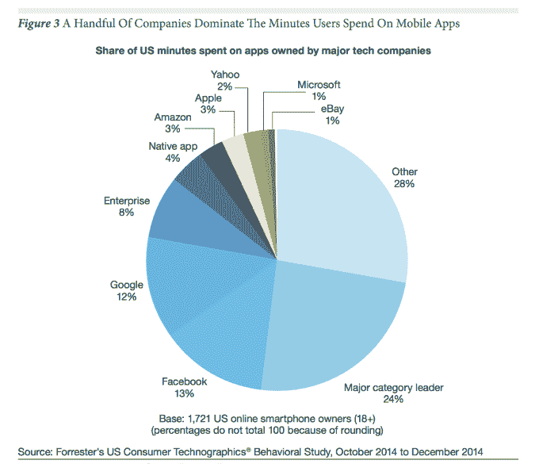
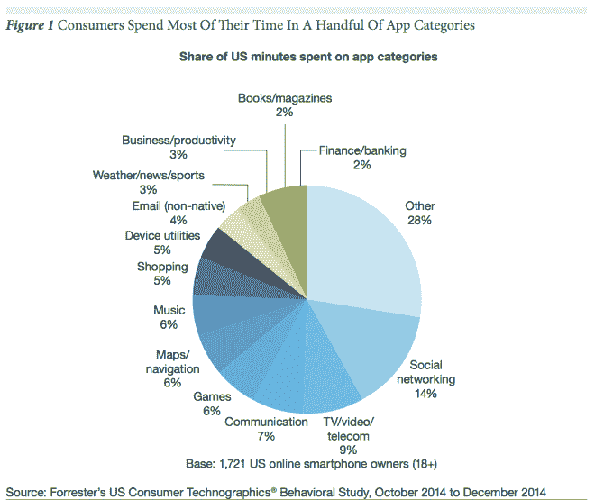

# 消费者花 85%的时间在智能手机的应用程序上，但只有 5 个应用程序被大量使用

> 原文：<https://web.archive.org/web/https://techcrunch.com/2015/06/22/consumers-spend-85-of-time-on-smartphones-in-apps-but-only-5-apps-see-heavy-use/>

今天发布的关于移动行为的新研究指出，应用程序企业在将自己确立为用户智能手机上的必备下载时面临越来越大的挑战。今天的消费者在智能手机上花费超过 85%的时间使用原生应用程序，但他们的大部分时间(84%)只花在他们从 App Store 安装的五个非原生应用程序上。

那五个应用会因人而异。对于一些人来说，他们的前五名可能包括社交媒体或游戏，而其他人可能会在即时消息上花费更多时间。

这一数据进一步支持了尼尔森本月早些时候发布的一项研究，该研究也重申消费者每月使用的应用程序数量似乎确实存在上限。虽然 Forrester Research 的这项新研究调查了消费者将大部分时间花在哪里，但尼尔森的报告指出，用户每月总共只会使用 26 至 27 个应用程序。

关于应用使用的新数据来自 Forrester Research 的一项研究，该研究分析了 2000 名美国智能手机用户，以更好地确定用户如何参与他们手机上的应用。根据调查结果，通信和社交应用程序占了最大的使用量——合计占智能手机总使用时间的 21%。短信和语音通话没有被计算在内，但如果被计算在内的话，它们会被加到总数中。

这一趋势也意味着一小撮公司正在主导应用程序的使用。例如，脸书占美国花在应用程序上的时间的 13%，紧随其后的是谷歌，占 12%。其他知名科技公司也有大量使用，包括亚马逊(3%)、苹果(3%)、雅虎(2%)、微软(1%)和易贝(1%)。)

作为一个类别，社交网络占所有智能手机使用的 14 %,即每天超过 25 分钟。脸书是这方面的领导者，每月有 12.5 亿移动活跃用户。

*【上图注意:被称为“主要类别领导者”的大分组包括不属于该研究评估的 6 家公司的其他领先应用，如 Twitter、Firefox、天气频道等。]*

与此同时，美国用户在 WhatsApp 等即时通讯应用上花费 4.8%的智能手机时间，但在全球范围内，这一数字甚至更高。在世界范围内，像微信、KakaoTalk、Line 和其他应用程序的用户每周花 50 到 200 分钟使用它们。然而，在美国，手机的本地消息应用程序的使用率高于即时通讯应用程序，占智能手机通话时间的 8%。

媒体是另一个受欢迎的应用类别，天气、新闻和体育占总使用时间的 3%。新闻每天领先 11 分 51 秒。移动用户对新闻应用程序的兴趣和大量使用可能是苹果决定通过推出即将推出的“新闻”应用程序来进入这个领域的原因，该应用程序将在 iOS 9 中默认安装。

游戏和音乐占智能手机使用时间的 6%，而流媒体视频占 9%。在这里，YouTube 以 43%的使用率领先，但网飞的平均使用率最高，为 31 分 33 秒。书籍和杂志占智能手机使用时间的 2%，考虑到它们的长格式性质，这实际上是相当高的。其他类别如购物(5%)、地图/导航(6%)、电子邮件(非本地，4%)、生产力(3%)也很受欢迎。

基于这一数据和新报告中的其他发现，Forrester 建议企业只为他们最好、最忠诚或最频繁的客户设计他们的应用程序，因为只有这些人会定期下载、配置和使用应用程序。报告称，例如，大多数零售商表示，他们的移动网络销售额超过了应用程序销售额。与此同时，除了这些较大的玩家，许多客户将使用移动网站，而不是企业的本地应用程序。