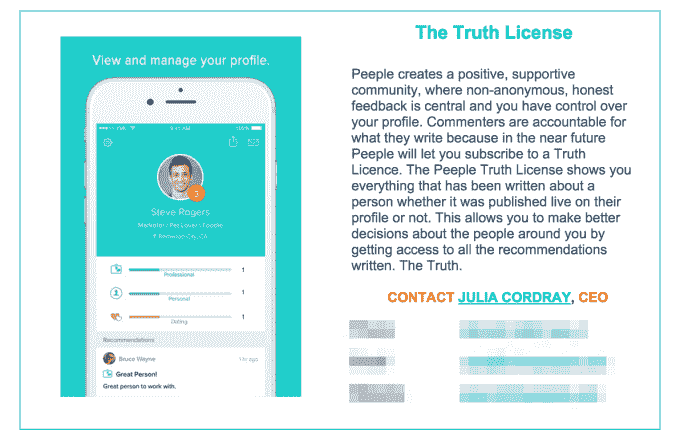
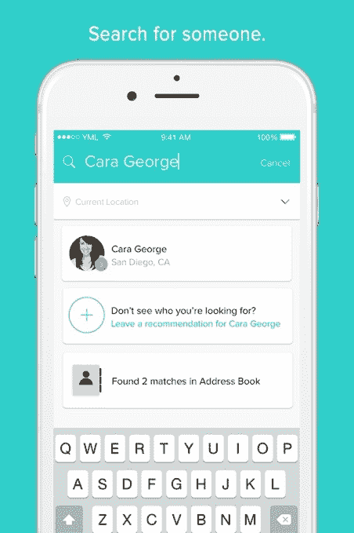

# 有争议的人物评级应用 Peeple 上线，计划从用户的负面评论中获利 

> 原文：<https://web.archive.org/web/https://techcrunch.com/2016/03/08/controversial-people-rating-app-peeple-goes-live-has-a-plan-to-profit-from-users-negative-reviews/>

Peeple ，这个[有争议的](https://web.archive.org/web/20221227100053/https://techcrunch.com/2015/10/05/much-ado-about-peeple/)人物评级应用程序，允许其用户对任何人进行评级和评论，并不是[一个骗局](https://web.archive.org/web/20221227100053/http://www.newsweek.com/was-peeple-just-joke-379706)或[软件](https://web.archive.org/web/20221227100053/http://www.snopes.com/2015/10/01/peeple/)，正如许多人在去年秋天围绕该公司意图的披露遭到媒体强烈反对后所怀疑的那样。《华盛顿邮报》甚至称这款应用“可怕”，因为该应用不打算允许用户选择不接受审查——这一功能仍保留在本周发布的版本中。

随着该应用的首次亮相，该公司正试图展示自己更积极的目标和形象，展示反欺凌的姿态和隐藏不想要的推荐的设置。然而，仍然有一些合理的担忧，即该公司正计划通过出售其平台上隐藏的负面评论来获利。

[如果你第一次没有注意到的话，](https://web.archive.org/web/20221227100053/https://techcrunch.com/2015/10/05/much-ado-about-peeple/)这家位于卡尔加里的初创公司来自 Julia Cordray 和 Nicole McCullough——两人都不是技术型创始人，他们将应用程序的开发外包给了 Y Media Labs。这款应用被描述为“人类的叫声”也就是说，你可以注册留下你认识的任何人的评论——从同事和老板到前任和朋友，甚至是当地的服务专家。

McCullough 的 LinkedIn 个人资料称，她受启发创建了 Peeple，作为审查人员的一种方式，如承包商、保姆或邻居。当然，针对评级专业人士和企业的服务，包括谷歌的商业评论、Yelp、ZocDoc、Angie's List 等已经存在了一段时间。Peeple 的与众不同之处在于，它也想涉足个人空间。

当时还不清楚创始人是否真的天真地意识到这种应用可能引发的问题，或者他们是否聪明地发挥了“所有媒体都是好媒体”的角度，以鼓励对这项服务的病毒式宣传。

但当这款应用在 2015 年末没有像预期的那样推出时，它就被当作蒸汽而被遗忘了。

现在 Peeple 实际上已经上线了。

[gallery ids="1288235，1288234，1288233，1288232，1288231"]

在一份新闻稿中，创始人写道，在该应用受到负面报道后，他们受到了多少骚扰，他们说这是“讽刺性的”，因为投诉涉及对其平台上可能发生的残酷欺凌、威胁和虐待的担忧。

该公司还表示，鉴于这些担忧，它做出了一些改变，包括让用户完全控制他们个人资料上的内容，提供停用他们个人资料的能力等。该公司还指出，“没有人可以将你添加到应用程序中”——这听起来好像在 Peeple 上接受审查是一种选择加入的体验。

然而，这并不完全正确。

Peeple 自己的网站说你仍然可以为任何不在该应用上的人写“推荐”(即评论，但不一定是正面的)，然后选择邀请那个人加入 Peeple。

换句话说，即使你没有参与，有人也可以写你的评论。当然，那篇评论可能不会公开，但它以数字格式存在于公司的服务器上。

如果您选择加入 Peeple，您可以决定在您的个人资料中显示哪些评论。

## 真相许可——一种购买负面评论的方式

Peeple 令人担忧的方面是，它正在考虑以付费订阅的方式提供这些隐藏的负面评论。

Peeple 称，付费用户可以阅读任何关于一个人的文章，不管这个人是否在个人资料上发表了评论。

或者总结一下:Peeple 的计划是通过出售人人的负面评论的访问权来盈利。

联合创始人 Cordray 向 TechCrunch 澄清说，Truth License 实际上并不是实时的，而是该公司正在*考虑将它与其他应用内购买功能一起作为未来的功能，如应用内搜索积分、礼物和个性测试。*

 *话虽如此，但事实上，它已经摆在桌面上，并在该公司的新闻稿中进行了宣传，这应该让用户暂停关注。

## 反欺凌措施也很薄弱

不仅如此，该公司似乎没有一个可靠的计划来通过该服务主动防止网络欺凌。它的条款显然禁止像“亵渎、欺凌、健康证明、残疾证明、机密信息、在你目前没有为其写推荐信的推荐信中提及其他人、辱骂、有辱人格的评论、虐待、贬损性评论、性证明、种族主义、法律证明、仇恨内容、性别歧视”等等。

但是 Peeple 的术语很难读懂，因为它们只链接到应用程序本身，而且有好几页长。[但是这个片段](https://web.archive.org/web/20221227100053/https://techcrunch.com/wp-content/uploads/2016/03/peeple-terms-snippet.png)应该让你知道 Peeple 到底在做什么，注意:

*“内容一旦发布，可能无法删除，”*，*加入后，您在此不可撤销地授予 Peeple 以任何形式、出于任何目的使用您的内容的持续、非独家、免版税的权利。这些权利可由 Peeple 转让、转移和许可。”*

嗯，没有吗？

实际上，Peeple 似乎也不打算主动监管这项服务的用户。当被问及如果有人通过创建虚假的脸书账户(即为了发布负面评论而不与他们直接关联)违反条款，Peeple 会怎么做时，Cordray 回答说，这些虚假账户将被删除。

但是，她补充说，“请记住，我们需要你的帮助，通过报告和阻止用户来打击这种行为。”

让我们记住，要阻止和报告用户，你必须是一个用户——这意味着你已经同意 Peeple 的条款。

简而言之，该计划似乎是被动地处理滥用指控，就像今天 Twitter 这样的大型社交服务机构所做的那样。但是对于一个仅仅为了让用户写推荐信而提供空白页面的服务来说，没有一些基本的自动审核系统来至少阻止脏话和其他关键词，要么是一个明显的疏忽，要么是一个故意的(和冷酷的)决定。

如果是后者，很可能是为了加强该公司标记为待售的私人差评数据库。

我的意思是，这整个事情是如此糟糕，即使应用程序是活的，很难相信我们仍然没有在这里不知何故。

(不幸的是，如果不同意 Peeple 繁重的条款，就不可能测试这款应用，所以我们选择了退出。虽然一个假的脸书账户可以安全地测试这个应用程序，但创建这个账户会违反脸书的条款，我们拒绝这样做。)

一个可能的希望是[苹果公司有一项政策，禁止促进骚扰的应用](https://web.archive.org/web/20221227100053/https://developer.apple.com/app-store/review/guidelines/#personal-attacks)(即其审查指南的第 14.1 节)，因此该公司有可能在某个时候实际上介入，禁止 Peeple 进入其应用商店。

Peeple 暂时在 iOS 应用商店上线。(TechCrunch 选择不提供直接链接。)*