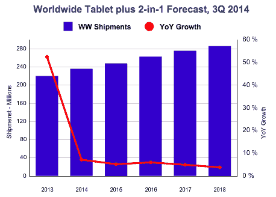

# 冷却平板电脑市场转向低端设备寻求增长 

> 原文：<https://web.archive.org/web/https://techcrunch.com/2014/11/26/cooling-tablet-market-turns-to-low-end-devices-for-growth/>

在科技史上，从来没有这么多人在这么短的时间内买了这么多东西。

在第一代 iPad 发布前的最后几天，有一条令人难忘的推文:科技界的一个人——遗憾的是，我忘记了他们的名字，找不到那条推文了——用不到 140 个字符写道，他们即将开始他们没有 iPad 前的最后一个周末。

这就是分类创建设备的市场兴奋点。随之而来的平板电脑市场的增长是爆炸性的。

但奇怪的事情发生了:平板电脑市场一下子变得成熟起来，随着普通人手持设备的时间比预期的长，消费者对小型触屏平板电脑的兴趣减弱了。

这是我最喜欢的新图表， [via IDC](https://web.archive.org/web/20221007031214/http://www.idc.com/getdoc.jsp?containerId=prUS25267314) ，展示了我见过的增长率最大幅度的下降:

在可预见的未来，平板电脑市场将保持适度增长。IDC 预测的年增长率的复合效应实际上使单位体积的增长在一定程度上保持健康，但随着红线向右逐渐变细，你会注意到蓝色柱之间的增量开始变得非常小。

正如 TechCrunch 最近报道的那样，IDC 预计苹果的 iPad 销量会下降，然后在 2018 年恢复到 24.5%的市场份额。未来几年，Android 的总销量将出现最大的增长，其市场份额将从今年的 67.7%下滑至 2018 年的 64%。

到 2018 年，基于 Windows 系统的平板电脑销量将增加两倍，市场份额将增加一倍以上。

最后一个期望让我大吃一惊。在一个日益成熟的市场中，除了其适中的数字起点之外，是什么推动 Windows 平板电脑如此快速地增长呢？

我想我们开始发现了。今天，关注微软的社区正在热议一批低于 100 美元的基于 Windows 的平板电脑，虽然它们的技术规格有限，*的价格不到 100 美元，运行 Windows。*

不难看出，微软希望这样的事情发生——当[将所有 9 英寸以下设备的 Windows 价格降到零](https://web.archive.org/web/20221007031214/https://beta.techcrunch.com/2014/04/02/microsoft-will-slash-the-price-of-windows-to-zero-for-phones-small-tablets/)时，它使这些设备成为可能。请允许我引用自己的话:

> 微软到底在做什么让 Windows 免费用于小型平板电脑和智能手机？购买市场份额。
> 
> 通过削减智能手机的 Windows 成本，微软正在向原始设备制造商推销其产品，为采用其移动平台提供新的激励。原始设备制造商通常向微软支付每台设备的费用来运送运行谷歌 Android 的设备，现在有了一个不包括软件费用的单独选项。那很有趣。
> 
> 微软如何承担这个决定？值得记住的是，微软贬低的收入来源很少。[这里指的是其平板电脑 OEM 收入] […]
> 
> 因此，微软的举动不会在财务上对其造成损害，而且可以准确地获得它所需要的:市场份额。

因此，微软通过其合作伙伴在市场上推出了极其廉价的设备，而谷歌则推出了广受欢迎的低成本安卓设备。

据 IDC 称，随着微软和谷歌为市场的大部分预期增长展开更加激烈的竞争，苹果的单位销量将会上升。我认为，我们将因此在平板电脑市场的低端看到一场真正的战斗。更简单地说:苹果对高端市场的所有权不会改变，这意味着开放单位出货量即 IDC 的预期可能是更便宜的设备。所以，这就是争吵的地方。

在接下来的 6 个月里，最有趣的是看看低成本的 Windows 平板电脑是否能比预期吸引更多的消费者关注。如果是这样，IDC 的 2018 年数据可能会开始出现偏差。

现在，你有很多便宜的选择。圣诞节应该很简单。