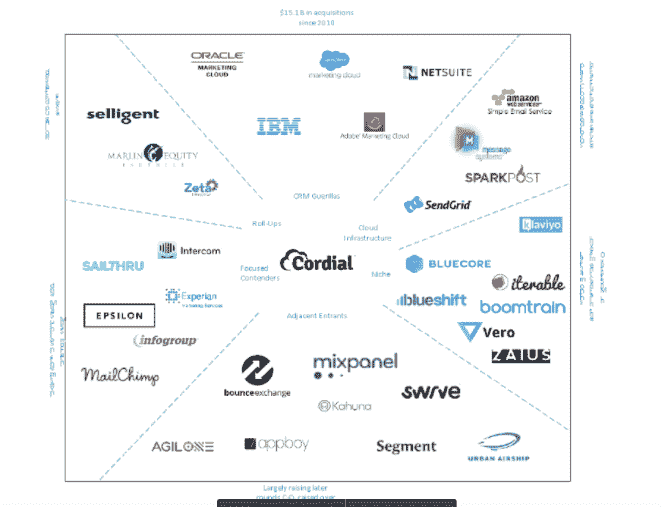

# Cordial 为其定制的自动化电子邮件营销服务 TechCrunch 筹集了 600 万美元

> 原文：<https://web.archive.org/web/https://techcrunch.com/2017/02/27/cordial-raises-6-million-for-its-customized-automated-email-marketing-service/>

# Cordial 为其定制的自动化电子邮件营销服务筹集了 600 万美元

开发一种软件来跟踪应用程序和网站上的用户行为，并为这些用户生成有针对性的营销电子邮件，这为总部位于圣地亚哥的技术公司 [Cordial](https://web.archive.org/web/20221006201213/http://cordial.io/) 赢得了 600 万美元的新资金。

这家总部位于圣地亚哥的公司由一个长期从事电子邮件营销的专业团队创建，并在首轮融资中获得了前期风险投资的支持。该公司也是 [R/GA 的互联商务加速器](https://web.archive.org/web/20221006201213/http://rgacommerce.com/)的毕业生。

Kobie Fuller 是电子邮件营销服务 ExactTarget 的前投资者之一，也是该公司的合伙人，他将在该公司的董事会中占有一个席位。

2013 年，Salesforce.com、甲骨文、Adobe 和 IBM 等公司围绕电子邮件营销进行了一场收购狂潮，仅甲骨文和 Salesforce.com 就在两次收购中花费了 40 亿美元(甲骨文以 15 亿美元收购了 Responsys，Salesforce.com 以 25 亿美元收购了 ExactTarget 许多新进入者正试图以进一步自动化营销信息的服务进入市场。Cordial 希望将自己定位于这些产品的中心。

该公司还将自己标榜为能够理解(读取跟踪)潜在客户在他们使用的所有联网设备(如亚马逊 Echos、谷歌家园和家庭或办公室中所有其他联网设备)上的行为的供应商。

Cordial 由首席执行官杰里米·斯威夫特和首席技术官亚当·吉莱斯皮(他将电子邮件营销商 BlueHornet 出售给了 Digital River)以及首席运营官大卫·贝克(前 Digital Impact/Axciom 副总裁)共同创建，其管理层长期以来一直参与电子邮件营销领域。

“投资 Cordial 对我们来说很容易。Cordial 的核心是最具适应性的信息平台，专为这个不断发展的互联时代而打造。富勒在一份声明中说:“这是由一个先锋团队领导的，他们有着同样的高标准、热情和实现伟大想法的愿望——这是他们首先成为营销人员的原因。”。