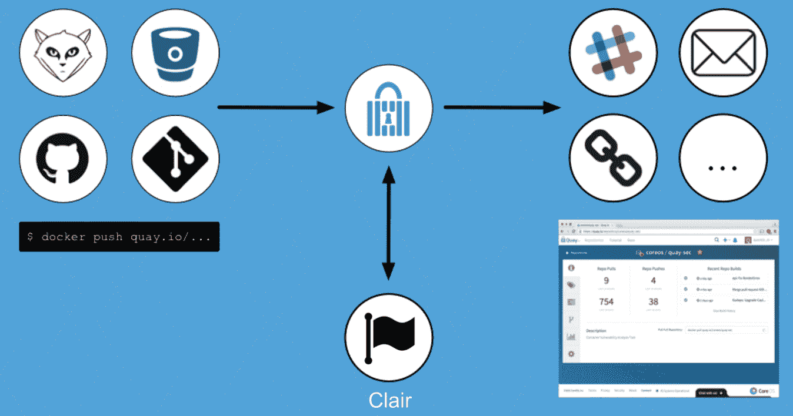

# CoreOS 推出 Clair，一款用于监控集装箱安全的开源工具

> 原文：<https://web.archive.org/web/https://techcrunch.com/2015/11/13/coreos-launches-clair-an-open-source-tool-for-monitoring-container-security/>

# CoreOS 推出 Clair，一个用于监控集装箱安全的开源工具

CoreOS 公司最近在容器上下了很大的赌注，这是一家为数据中心部署提供同名轻量级 Linux 发行版的公司。今天，该公司推出了 [Clair](https://web.archive.org/web/20230326060928/https://github.com/coreos/clair) ，一款用于监控集装箱安全的开源工具——它还将 Clair 集成到其付费的 [Quay 集装箱注册服务](https://web.archive.org/web/20230326060928/https://quay.io/plans/)中，作为测试功能(稍后将支持 Quay Enterprise)。

容器让许多开发人员的生活变得更加轻松，但是就像 Linux 发行版需要定期更新以减少漏洞一样，容器也可能安装了过时的软件包。例如，CoreOS 表示，存储在其 Quay 服务中的超过 80%的 Docker 图像仍然容易受到臭名昭著的[heart bleed bug](https://web.archive.org/web/20230326060928/https://techcrunch.com/2014/04/08/what-is-heartbleed-the-video/)的攻击。

Clair 可以扫描容器中已知的漏洞，然后提醒开发人员潜在的问题。CoreOS 正在从 Red Hat、Ubuntu 和 Debian 的 漏洞数据库 获取这些数据。

“在软件世界中，漏洞总是存在的。Clair 团队今天写道:“良好的安全实践意味着为灾难做好准备——识别不安全的软件包，并准备快速更新它们。" Clair 旨在帮助您识别集装箱中可能存在的不安全包裹."

不过，该团队指出，这些工具仍然相当幼稚。只有当你使用包含这个 bug 的 OpenSLL 包时，Heartbleed 才是一个问题。克莱尔只知道包裹在集装箱里。它不知道你是否真的在使用它。“Clair 不适合这种级别的分析，团队仍然应该根据需要进行更深入的分析，”该团队指出。