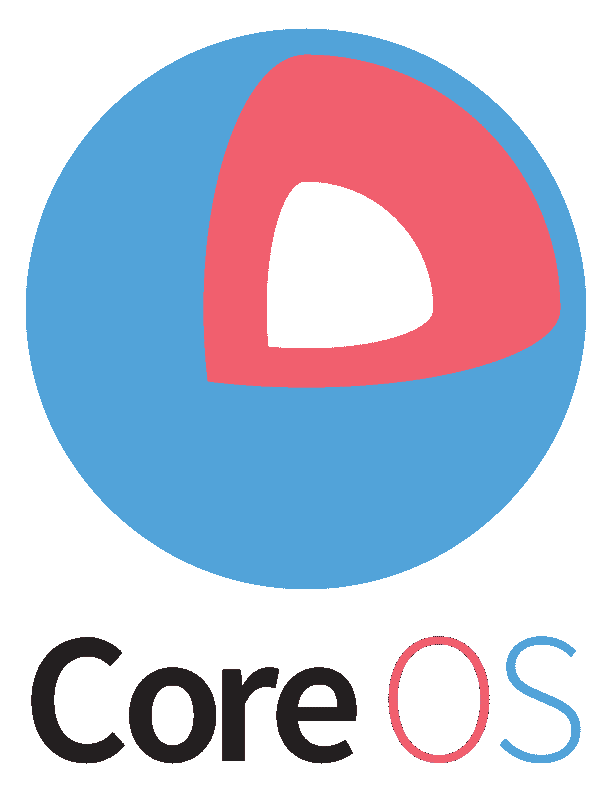

# CoreOS 融资 2800 万美元，由 GV  领投

> 原文：<https://web.archive.org/web/https://techcrunch.com/2016/05/09/coreos-raises-28m-series-b-round-led-by-gv/>

以容器为中心的 CoreOS Linux 发行版和[构造](https://web.archive.org/web/20230322160428/https://tectonic.com/)容器管理服务背后的公司 CoreOS 今天宣布，它已经筹集了 2800 万美元的 B 轮融资，由 GV 牵头，该基金前身为谷歌风险投资。

其他投资者包括 Accel、Fuel Capital、Kleiner Perkins cau field & Byers(KPCB)和 Y Combinator Continuity Fund。该公司目前总共筹集了 4800 万美元。

 正如 CoreOS 联合创始人兼首席执行官 [Alex Polvi](https://web.archive.org/web/20230322160428/https://www.linkedin.com/in/polvi) 告诉我的，新一轮将“为坦克提供更多燃料”他指出，该公司在这一轮中有很多对内的兴趣，但似乎与 GV 合作的决定相当容易。毕竟，GV 已经带领 CoreOS 的附加项目进入了首轮融资，Polvi 将整个过程描述为“快速而简单”(这不是你最近通常听到的 B 轮融资)。

鉴于该公司视其使命为“将谷歌的基础设施带给其他所有人”，或者 Polvi 一有机会就喜欢称之为“GIFEE”，与谷歌密切合作也很有意义。作为这一轮的一部分，全球价值链的普通合伙人戴夫·穆尼切洛也将在 CoreOS 的董事会中占有一席之地。

“过去几年是让 GIFEE 成为可能——现在是我们如何包装它，不仅让开源用户满意，也让只需要解决方案的企业满意，”Polvi 说。“我们希望让这种运营基础设施的方式无处不在。”

为此，该公司计划利用新的资金来壮大其在美国和欧洲的团队。Polvi 指出，这意味着 CoreOS 将扩大其销售和营销团队，这样它就可以更有效地与潜在客户就其付费产品进行互动。

当然，CoreOS 产品系列的核心是 CoreOS 发行版，但是基于 Kubernetes 的[构造](https://web.archive.org/web/20230322160428/https://tectonic.com/)容器管理平台将所有这些努力结合在一起。

“大地构造是一个完整的平台，”波尔维说。“你会看到，我们将继续完善这一点，但也会开发更多在该平台上运行的产品。”他将这一过程比作亚马逊的 AWS 等云提供商如何首先推出其核心计算、存储和网络服务，然后在此基础上构建其他产品。