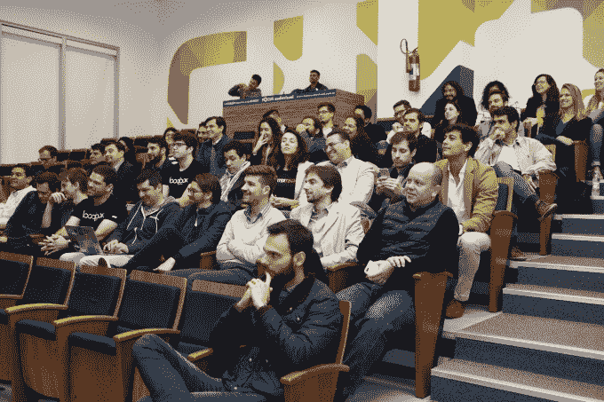

# 随着巨头们加大创业投资，巴西的企业风险投资势头越来越猛

> 原文：<https://web.archive.org/web/http://techcrunch.com/2017/09/15/corporate-venture-in-brazil-gains-steam-as-giants-amp-up-startup-investments/>

安德森·希斯撰稿人

安德森·希斯是

[Redpoint eventures](https://web.archive.org/web/20230328220515/http://rpev.com.br/)

Redpoint 的巴西分公司。

More posts by this contributor

一年的变化真大。自从去年夏天出现科技生态系统成熟的显著迹象以来，在短短 12 个月内，拉丁美洲的企业风险投资开始逐渐增多，其中以巴西为首。

根据 LAVCA 的 [2017 年拉丁美洲创业公司目录](https://web.archive.org/web/20230328220515/https://lavca.org/vc/startup-directory/)，在至少两轮获得 100 万美元以上资金并仍在巴西运营的 144 家早期科技公司中，约有六分之一获得了企业风险投资(CVC)的资金。虽然与硅谷的一半回合相比，这似乎有些害羞，但对该地区而言，这是一个重要的步骤，也是一个明确的迹象，表明企业正迅速从好奇转变为实际行动，参与其中。

全球巨头也开始向巴西和拉丁美洲注入更多风险资本，包括思科、微软和高通等全球创新品牌的 CVC 基金。在 6 月底的，Naspers 和 Innova Capital 总共投资了 5300 万美元来推动 Movile 的增长，Movile 是移动市场的领导者，也是该地区的企业风险投资者，目前的投资包括 [iFood](https://web.archive.org/web/20230328220515/https://www.ifood.com.br/) 。Naspers 是 Movile 的长期投资者，它牵头向该公司再注入 3000 万美元，以加速其在拉美的业务。

今年 5 月，[软银向总部位于巴西的按需乘车订购平台 99](https://web.archive.org/web/20230328220515/https://techcrunch.com/2017/05/24/softbank-adds-brazils-99-to-its-ridesharing-portfolio-with-a-100-million-investment/) 投资了 1 亿美元。这笔新投资是对 T2 1 亿美元 D 轮融资的补充，99 在今年年初完成了这轮融资，由总部位于中国的滴滴出行牵头。 [Founders Intelligence](https://web.archive.org/web/20230328220515/https://foundersintelligence.co/#/) ，一家总部位于英国的专业数字机构，为大型企业和机构投资者提供战略和转型方面的建议，最近开设了巴西办事处。该集团是[创始人论坛](https://web.archive.org/web/20230328220515/https://ff.co/#/)的一部分，这是一个由最成功的企业家、风投、学者和精选的、鼓舞人心的首席执行官组成的全球社区。

> 巴西的企业风险投资正在弥合当地和全球巨头与该地区较小、较弱的初创企业之间的差距。"Cubo 董事总经理 Flavio Pripas

当地企业在该地区的投资也在增加。例如，今年 5 月，巴西市值最大的银行 [Itaú](https://web.archive.org/web/20230328220515/https://www.itau.com.br/sobre/) 同意以 20 亿美元收购巴西第三大经纪公司[XP](https://web.archive.org/web/20230328220515/https://institucional.xpi.com.br/clientesinstitucionais/en/institutional-broker.aspx)49.9%的股份，并随着时间的推移逐步增持股份，同时拥有购买全部控制权的选择权。据彭博报道，人们将 XP 与查尔斯·施瓦布公司相提并论，因为它为巴西日益壮大的中产阶级带来了在线投资平台。2016 年前三个季度，XP 占巴西股票交易量的 10.8%，高于 2015 年同期的 9.9%。

“巴西的企业风险投资正在弥合当地和全球巨头与该地区规模较小、更具竞争力的初创公司之间的差距，” [Cubo](https://web.archive.org/web/20230328220515/https://cubo.network/#conteudo1) 董事总经理 Flavio Pripas 说，Cubo 是一家位于圣保罗的技术中心，也是一个旨在培养巴西企业家精神的转型项目。“在过去的两年里，我们已经看到大公司和初创公司之间的协同效应在上升，企业风险投资也在膨胀。进入 2019-2020 年，我们预计会有更多的投资活动，我们可能会看到更多的大公司出于学习、人才和研发目的收购创业型初创公司。”

## 圣保罗的一个创业中心正在扩张

自 2015 年 9 月推出以来，Cubo 已帮助快速跟踪圣保罗的创业场景，并为巴西最大的城市和拉丁美洲的经济首都提供了一个创业中心，提供与美国创业创始人相同的设置。

8 月 23 日，Cubo 宣布，它正在从目前容纳 250 人或多达 50 家科技创业公司的 50，000 平方英尺的空间扩展到四倍大的设施。2018 年上半年，Cubo 将搬到位于圣保罗创业中心 Vila Olímpia 的一栋 12 层大楼中的新总部，这将使它能够容纳更多更大的初创公司，每天有超过 2000 名访客，210 家常驻公司和超过 1250 名员工在那里工作。Cubo 将成为拉丁美洲最大的创业中心，并成为世界其他创新中心的典范。

最初的 Cubo 将常驻企业家与大公司、学者和政府官员以及一系列旨在促进对话和硅谷式同步性的活动联系在一起，它太受欢迎了，不到两年就发展壮大了。自 2015 年 9 月成立以来，从 Cubo 运营的初创公司已经创造了 650 多个新工作岗位，超过 700 家初创公司申请成为 Cubo 的一部分。合作空间已经成为巴西企业家精神和导师的重心，两年内在 Cubo 举办了 780 多场活动。

“我们在 Cubo 上看到的协同增效的新趋势之一是，越来越多的大公司使用初创公司的技术来改善后台流程，”普里帕斯说。“由于金融危机仍在影响该地区，全球公司都希望降低成本，提高效率。巴西以其官僚作风而闻名，而 SaaS 的一系列创新有助于改善法律、人力资源和 IT 部门的运营。”

## 对企业创新计划越来越感兴趣

根据贝尔梅森集团五月 [CVC Insights](https://web.archive.org/web/20230328220515/http://www.globalcorporateventuring.com/article.php/17032/bell-mason-corporate-venturing-insights-survey) 的一篇研究论文([CVC-Insights-Project-Summary-Findings-and-Analysis-5-17-2017](https://web.archive.org/web/20230328220515/https://techcrunch.com/wp-content/uploads/2017/09/cvc-insights-project-summary-findings-and-analysis-5-17-2017.pdf))，该论文由[全球企业风险投资](https://web.archive.org/web/20230328220515/http://www.globalcorporateventuring.com/) (GVC)赞助，企业风险资本已经成为一种重要的企业创新工具，能够贡献重大的战略价值和财务稳定性。CVC 的章程和授权不断扩大，以应对更大的“做市商机会，CVC 计划的规模和覆盖范围也有所增加，以支持每年 40-60 项投资。”

10 月初，GVC 组织将在圣保罗举办第二届年度巴西企业风险投资大会，旨在让国际投资者(CVC 和 VC)与巴西的企业家建立联系，鼓励更多的企业创新举措。“该活动旨在为投资者探索与巴西创新和风险投资界联系的机会，特别关注农业技术、移动技术和汽车技术，”全球企业风险投资主编詹姆斯·莫森说。

> 巴西的创业公司将受益于全球公司的智慧和硅谷式的协同效应和同步性。

一个相对较新的与巴西企业家合作的例子是 Algar Ventures Open(T1 ),这是一个由 Algar Ventures 于去年推出的开放式创新项目。这是与 Algar Group 的风险投资部门和总部位于纽约市的非营利组织 [Endeavor](https://web.archive.org/web/20230328220515/http://endeavor.org/) 的合作伙伴关系，该组织是全球成长型市场中高影响力创业的先驱。对于那些被选中的人，该倡议将企业家与 Endeavor 网络导师和 Algar 高管联系起来，在为期六个月的项目中与 Algar 进行指导、联网和业务合作。Algar 成立于 86 年前，是一家总部位于巴西的家族控制企业集团，拥有超过 23，000 名员工，专注于旅游业、B2B 技术、农业综合企业、电信和安全系统。

“我们与 Algar Ventures 的目标是支持那些志在成为巴西市场更大玩家的企业和企业家，”Algar 公司战略和创新副总裁[Clau sganzella](https://web.archive.org/web/20230328220515/https://www.linkedin.com/in/clau-sganzerla-970281102/?ppe=1)说。“第一个目标是将选择的初创公司与我们公司的挑战联系起来，创造满足客户需求的商业机会。第二是为 Algar Ventures 寻找最佳的直接早期投资机会，最好是在我们价值链中我们熟悉的领域。我们选择与 Endeavor 合作，以帮助我们的筛选过程和创业指导，因为这是一个在其 DNA 中支持创业的组织。他们可以帮助我们大大加快发现好机会的速度，同时通过我们与最有前途的初创公司的企业家的互动，改善我们自己的企业文化。”

随着巴西的创业生态系统继续显著扩张，该地区更多的初创公司吸引新的资金，并与大公司建立共生关系，拉丁美洲最大的经济体将复苏，获得动力并创造更多就业机会。巴西的创业公司将受益于全球公司的智慧以及该地区近年来出现的硅谷式的协同效应和同步性。这是 CVC 在该地区的一个良好开端，而且显然只是开始。

*披露:Anderson Thees 曾是 Movile 的投资者，同时也是 Naspers 的 LatAm 投资负责人。思科是红点事件基金的投资者和 Cubo 的赞助商。*